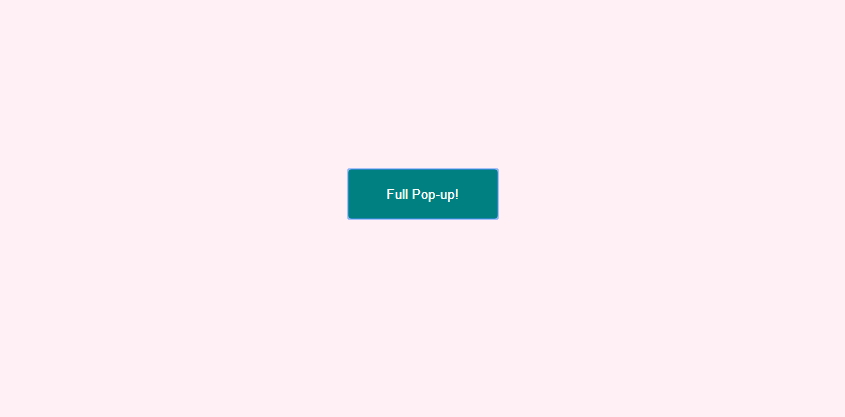
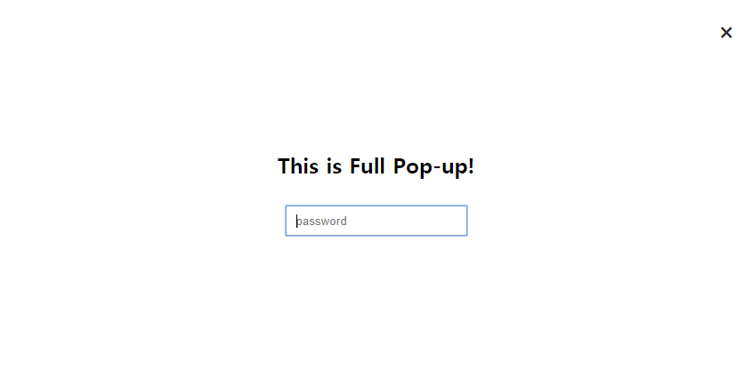

버튼을 클릭하면 화면을 꽉 채운 팝업이 나타나고, 우측 상단의 X버튼을 클릭하면 닫히는 형태의 팝업을 생성했다.

이 때 포커스는 접근성을 고려하여 레이어 안에서만 돌아야 하며, X버튼을 클릭했을 때 팝업 노출을 시켰던 버튼으로 다시 포커스가 돌아올 수 있도록 추가했다.


1. ###### 먼저 html로 레이아웃을 만든다. 

```html
<div class="full_popup">
    <h2>This is Full Pop-up!</h2>
    <input class="input" type="text" placeholder="password">
    <button class="close">×</button>
</div>
<button id="button01" class="button">Full Pop-up!</button>
```


2. ###### script로 넘어와서 팝업 이벤트를 추가할 생성자 함수와 비어있는 객체를 생성한다. 

```javascript
function PopUp (btn, box, close){
    this.btn = btn;
    this.box = box;
    this.close = close;
}
```


3. ###### prototype으로 이벤트를 실행했을 때 적용할 메서드를 추가한다.

```javascript
PopUp.prototype.openPop = function(){
    this.box.fadeIn(300);
    // 바깥 영역 이벤트 무효화
    $('html, body').css({'overflow': 'hidden', 'height': '100%'});
    // 포커스가 pop-up 영역 내에서만 움직인다.
    this.close.focus();
    this.box.on('keydown','button', function(e){
        if (($(this).is(':focus')) && (e.keyCode == 9)){
            e.preventDefault();
            $(this).parent().find('input').focus();
        }
    });
    this.box.find('input:first').focus();
}
```


4. ###### 마지막으로 생성자함수인 PopUp을 호출하여 인스턴스인 fullPopup을 생성하고 테스트한다. 

```javascript
// fullPopup 인스턴스 추가
        var fullPopup = new PopUp($('#button01'), $('.full_popup'), $('.full_popup button'));
        fullPopup.btn.on('click', function(){
            fullPopup.openPop();
        });
        fullPopup.close.on('click', function(){
            fullPopup.closePop();
        });
```


## 결과 





작업물은 추후에 정리해서 codepen에 업로드할 예정이다. 

