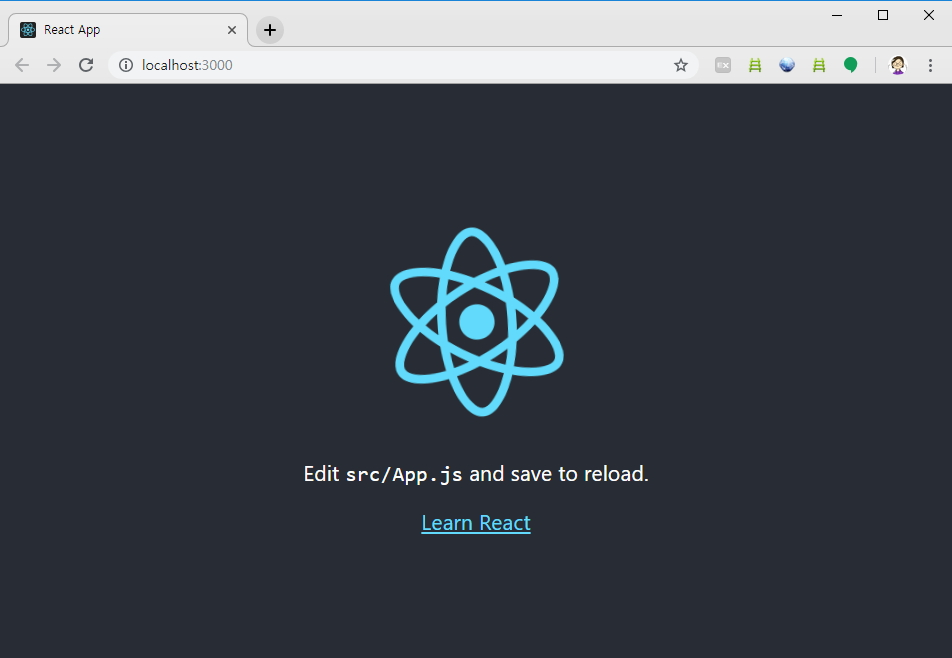
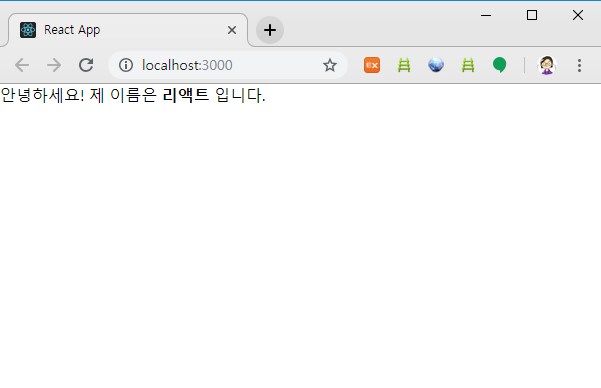
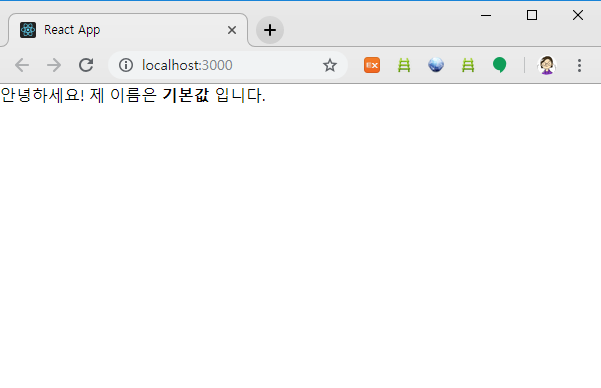
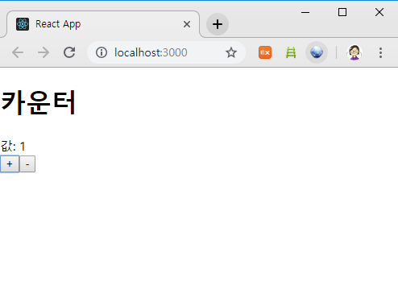

현재 시장에 나와있는 자바스크립트 프레임워크/라이브러리 중 하나를 배워보려고 생각했는데, 원래는 vue.js를 처음으로 공부하려고 생각했다가 [react](https://reactjs.org/)로 마음을 돌렸다. 둘 중 어느 것이 뛰어난지는 초심자인 나로선 실감하기 어렵지만 공부하는 데 있어 react는 라이브러리기에 ES6과 같은 다양한 js 생태계를 조금씩 맛볼 수 있다는 장점이 있다고 생각했기 때문이다. 공부는 저번 달부터 진행한 리액트 스터디와, 책, 그리고 [velopert님의 블로그](https://velopert.com/3613)를 참고해 진행했다.


## 시작하기

jQuery처럼 [cdn](https://react-cn.github.io/react/downloads.html)를 이용해 인라인에 직접 적용하는 방법도 있으나, react의 기능을 충분히사용하기엔 제한적일 수 있다고 하여 개발환경을 컴퓨터에 세팅하기로 했다. 나는 [Node.js](https://nodejs.org/en/)와 [Yarn](https://yarnpkg.com/en/)을 각각 설치헀다. node.js는 자주 들어봤는데 yarn은 생소해서 찾아보니 node.js의 패키지들 관리하는 npm이 있는데, 그 npm과 기능은 동일하나 더 빠른 속도로 원하는 도구를 설치할 수 있도록 돕는 시스템이라고 한다. 


두 도구를 설치했으면 cmd를 켜고 아래의 커맨드를 입력한다.

```powershell
npx create-react-app my-app
cd my-app
npm start
```


npx create-react-app my-app는 my-app 폴더를 생성하고 그 안에 create-react-app 패키지를 설치하도록 하는 명령어이며, create-react-app는 react, react-dom, react-script와 같이 리액트 작업에 필요한 도구들을 한번에 설치하는 패키지이다. 

그리고  cd로 명령어를 실행할 경로를 my-app으로 이동하고,  yarn start를 실행하면 yarn에서 localhost:3000서버에서 react가 실행되는 것을 확인할 수 있다. 




## JSX

my-app/src/App.js 에 들어가보면 익숙한 것 같으면서도 생소한 코드의 조합임을 알 수 있다. 이 때 사용된 코드는 JSX이다. JSX는 JavaScript XML의 약자로, 리액트 컴포넌트를 생성할 때 쉽게 개발하기 위해서 HTML과 비슷한 문법으로 작성하면 이를 자바스크립트 형태로 변환시켜주는 역할을 한다. 몇 가지 규칙만 준수한다면 편리하게 JSX를 사용할 수 있는데 그 규칙은 다음과 같다.

1. 태그는 꼭 닫혀야 한다. 

   ```html
   <div></div> (o)   <br> (x)   (o)
   ```

2. 두 개 이상의 엘리먼트는 무조건 하나의 엘리먼트로 감싸져 있어야 한다.

   ```react
   class App extends Component {
   	render() {
   		return (
   			<Fragment>
                   <div>
                       hello
                   </div>
                   <div>
                   	bye
                   </div>
   			</Fragment>
               
   		)
   	}
   }
   ```

3. JSX안에 자바스크립트 값을 사용할 땐 중괄호{}를 통해 불러온다.

4. 조건부 렌더링을 할 땐 if문 대신 삼항연산자, 혹은 AND 연산자를 사용한다.

5. 주석은 ```{/* */} ``` 를 사용한다.


## props와 state

props와 state는 둘 다 리액트에서 다루는 데이터로 props는 부모 컴포넌트가 자식 컴포넌트에게 주는 값으로, 자식 컴포넌트에서는 직접 수정할 수 없다. 반면에 state는 컴포넌트 내부에서 선언하며 내부에서 값을 변경할 수 있다.

### props

###### src/MyName.js

```react
import React, { Component } from 'react';


class MyName extends Component {
    render (){
        return (
            <div>
                안녕하세요! 제 이름은 <b>{this.props.name}</b> 입니다.
            </div>
        );
    }
}

export default MyName;
```


###### src/App.js

```react
import React, { Component } from 'react';
import MyName from './MyName';

class App extends Component {
  render() {
    return (
      <div className="App">
        <MyName name="리액트"/>
      </div>
    );
  }
}

export default App;
```


###### View




만약 컴포넌트의 props값이 지정되지 않을 경우엔 dsfaultProps값을 설정해 기본값을 입력할 수 있다.


###### src/MyName.js

```react
import React, { Component } from 'react';


class MyName extends Component {
    render (){
        return (
            <div>
                안녕하세요! 제 이름은 <b>{this.props.name}</b> 입니다.
            </div>
        );
    }
}
MyName.defaultProps = {
    name: '기본값'
}

export default MyName;
```


###### View




### state

state는 동적인 데이터를 다룰 때 사용하는 데이터로 class field 문법을 이용하여 정의할 수 있다. 클래스 필드란 클래스 블록 안에서 할당 연산자(=)를 이용해 인스턴스 속성을 지정할 수 있는 문법을 말한다. [JavaScript로 만나는 세상 참고](https://helloworldjavascript.net/pages/270-class.html) 

클래스 필드를 이용한 코드는 다음과 같다.


###### src/Counter.js

```react
import React, { Component } from 'react';

class Counter extends Component {
    state = {
        number: 0
    }
    handleIncrease = () => {
        const { number } = this.state;
        this.setState ({
            number: number + 1
        })
    }
    handleDecrease = () => {
        this.setState(
            ({ number }) => ({
                number: number -1
            })
        )
    }
    render() {
        return (
            <div>
                <h1>카운터</h1>
                <div>값: {this.state.number}</div>
                <button onClick={this.handleIncrease}>+</button>
                <button onClick={this.handleDecrease}>-</button>
            </div>
        );
    }
}

export default Counter;
```

state로 선언한 number 객체 값은 0이며, 버튼을 클릭하면 매칭된 각각의 함수가 호출되며, this.setState 함수가 호출되면 number값이 리렌더링될 수 있도록 하는 코드이다. 이 때 호출 state의 값을 변경하기 위해선 ```this.setState``` 를 꼭 거쳐야 하는데, 리액트에선 이 함수가 호출되면 컴포넌트가 리렌더링되도록 작동하고 있다.


###### src/App.js

```react
import Counter from './Counter';
```


작업한 코드를 App.js에 불러온 뒤 렌더링을 시키면 다음과 같이 나타난다.




## 결론

지금까지 React 설치부터 state까지 공부한 내용들을 정리해봤는데, 확실히 지금은 ES6와 react의 개념이 불분명해서 앞으로 응용을 위해서라도 그 두가지를 구분하고 이해하는 과정이 가장 먼저일 것 같다. 