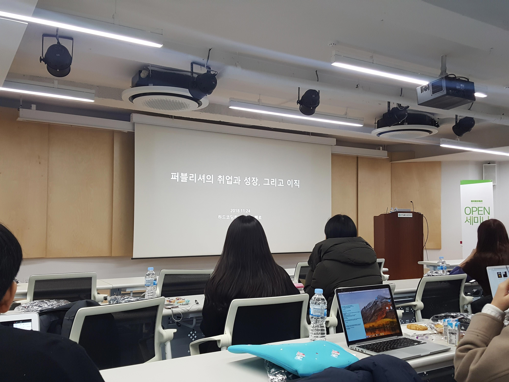

>  일시 : 2018. 11. 24 (sat) / 장소 :  서울특별시 서대문구 연희로 한빛빌딩

퍼블리셔 / 프론트엔드 개발자들이 모인 네이버 카페인 '[하드코딩하는 사람들](https://cafe.naver.com/hacosa) (약칭 하코사)'의 2018 연말 세미나에 참가했다. 세미나 참가는 처음이라 이해를 못하면 어떡하지 하는 걱정이 내심 있었는데, 강연 내용도 모두 유익했고 같이 참가하신 회원 분들과 서로 직업에 대한 이야기도 나눌 수 있어 의미있는 시간이었다.

### 퍼블리셔의 취업과 성장, 그리고 이직

> by.빼로님

퍼블리셔라는 직업에 대해 조금은 정의하기 어려운 생각이 늘 있었는데 강연을 통해 내가 해야 하는 직무가 무엇이며 앞으로 어떤 방향으로 나아가야 하는지에 대한 생각이 보다 명확해졌다. 

##### note

- 퍼블리셔는 브라우저라는 플랫폼에서 컨텐츠를 다루는 사람 => 브라우저 컨텐츠 전문가
- 퍼블 : 퍼블리싱(html, css) + UI개발(비데이터) , 프론트엔드 : UI개발(데이터 입력을 위한 이벤트 핸들링) + 데이터바인딩(템플릿 작업). 같은 언어를 쓰지만 다르다.
- UI기술 없이 프론트엔드로 넘어가면 미싱링크가 생긴다. -> 퍼블리싱 기술으 가진 프론트엔드 개발자의 장점은 UI개발을 훨씬 잘한다는 것. -> 급하다고 UI개발 없이 넘어가지 말 것.
- 이직 : 자사 서비스 기업은 인당 매출/이익률이 높기 떄문에 높은 연봉과 좋은 복지를 유지할 수 있는 기반이 있음.
- 구직 : 기업이 경력직을 채용할 때는 이 사람으로 인해 조직이 긍정적으로 변하기를 원하는 것, 본인이 어필할 수 있는 특성을 쥐어짜내보자. 
- 인생의 기회는 친한 사람이 나이라 애매하게 아는 사람이 준다.

### JavaScript로 할 수 있는 것들

>  by. 김종필님

 강연을 통해 js의 다양한 활용 범위에 대해 알게 되었고, 기존에는 막연히 'js를 배워야지' 라는 생각이었는데 강연을 듣고 난 뒤 'js를 공부해서 이런 저러한 프로젝트를 진행해 봐야지' 로 구체적인 목표를 가질 수 있었다.

##### note

- ES6, ES7, ES8 (async, await, 콤마, Object, values, regexp 등등...)
- json작업할 때 jsonplceholder 사이트를 애용하자.
- 브라우저 표준은 ECMAScript이므로 필수, 나머지는 선택
- React : 자바스크립트의 컴포넌트화
- Vue.js : html, css 그대로 사용 가능, 템플릿으로 묶어서 컴포넌트화, 바벨 필요없음.
- node.js : gist에서 많이 호출하는 npm을 확인할 수 있다. 자스 기반의 개발을 할 수 있게 해주는 역할. express 설치하면 웹 서버 개발이 가능하다.
- Electron : 데스크톱 앱을 개발할 수 있다.
- React native : 리액트 기술을 이용해 모바일 앱 개발을 할 수 있는 프레임워크
- TypeScript : 마소 제작, babel과 유사하지만 조금 다름. ts 확장자를 js 확장자로 변경시켜주는 역할. 바벨은 버전별 다른 것만 바꿔주는 transpiler, ts는 compiler
- 성장에서 중요한 것 : Code Review, Debugging, Blog 

### HTML 5.2 Changes 톺아보기 

> by. 멀더끙님

W3C HTML 5.2 명세를 기준으로 기존 버전에서 바뀐 Changes를 확인해보는 시간이었다. 5.2를 따로 공부해야 한다는 생각은 그다지 없었는데, 앞으로 계속 이 일을 계속하려면 필요한 과정인 것 같다고 생각했다. ~~그리고 영어 공부를 하자...~~

##### note

- 바디 요소 내부에 스타일 요소를 사용할 수 있다. (앵커는 부모 요소에 따라 가질 수 있는 자식이 달라진다.)
- main은 기존에 1개밖에 안되지만 여려개 쓰고 싶다면 hidden attribute를 사용하면 가능하다.
- dl 요소 내부에 div를 넣을 수 있다. 이 때 div 안에는 dt,dd가 함께 들어있어야 한다.
- li 안에 dfn 요소를 삽입할 수 있다. 이 때 dfn요소를 사용한다면 그 뒤에 dfn에 대한 설명이 추가되어 있어야 한다.
- fieldset 내부 legend 안에 heading이 가능하다.  단, 아웃라인을 사용할 경우에
- html 주석 안에서 -- or -의 하이픈을 허용한다.  (브라우저에서는 하이픈이 처리 가능하기 때문)

### 리액트 네이티브로 아재개그앱 만들기!

> by. 부동심결님

리액트 네이티브를 이용해 어플을 만드는 과정을 직접 보여주셨다. 강연을 통해 물론 한계점도 있지만 어플 제작에 대한 허들이 많이 낮아진 것 같았으며, 이후 포트폴리오에서도 단순한 어플 제작을 해봐도 괜찮겠다는 생각을 해봤다. 

##### note

- React native는 npm보다 yarn을 사용하는 것을 권장
- React native stylesheet는 flex 기반으로 진행. (구글에 flexbox help 로 시각적으로 확인해보자)

### 접근성 이슈 장애 유형으로 보기 

> by. 김혜일님

접근성을 지금도 공부하고 있지만, 접근성의 대상에 대해 시각장애인 정도로 한정짓고 있었는데, 이번 강연을 통해 시각장애를 비롯한 다양한 장애의 유형이 있다는 것을 알게 되었고, 그들이 실제 어떤 불편을 겪고 있는지 간접적으로 체험할 수 있는 기회가 되었다. 

##### note

- ★ 버튼의 경우 alt는 즐겨찾기 선택 링크 (X) 즐겨찾기 선택됨 링크 (O) 즐겨찾기 해제하기 링크 (O)
- 레이어 팝업 초점이동은 배경으로 깔린 페이지의 이동을 막아야한다.
- 콘텐츠 블록의 반복적 나열은 콘텐츠의 주제에 대해 파악하기 힘들기 때문에 제목을 제공하는 것이 좋다.
- 우리가 생각하는 시각장애인은 시각이 전혀 안보이는 사람이지만, 사실 70-80%는 저시력 장애
- 확대기능과 시야범위 : 확대가 4x일 땐 전체 페이지의 약 6%밖에 볼 수 없다.
- 색각이상 : 색에 무관한 컨텐츠 인식 - 좌석배치도 / 색각이상ㅇ을 해결하기 위해서는 안에 패턴을 넣거나 기호를 넣을 수 있다. (게임, 지하철에서 색각이상 모드를 잘 확인할 수 있다.)
- 컨트롤의 크기 : 지침에선 가로 세로 9mm 이다.
- 응답시간 조절할 땐 시간연장 버튼 필요.
- 고령자는 사용자경험이 중요한 심볼, 메타포에 대한 이해가 어렵다.
- 장애인도 소비력을 가진 소비자임을 인식해야한다.
- 오프라인의 장애가 온라인의 장애로 되지 않는 it환경을 만드는 것이 우리들의 역할.

## 결론

같은 직종을 가진 사람들의 다양한 의견을 들을 수 있었던 시간이었다. 단순히 세미나에 참가해 듣는 것에서 그치지 않고 이번에 새로 알게 된 내용들을 토대로 내년에는 보다 열심히 공부해야겠다고 생각했다. 세상은 넓고 공부할 것은 많다는 사실을 알게 된 하루였다.

