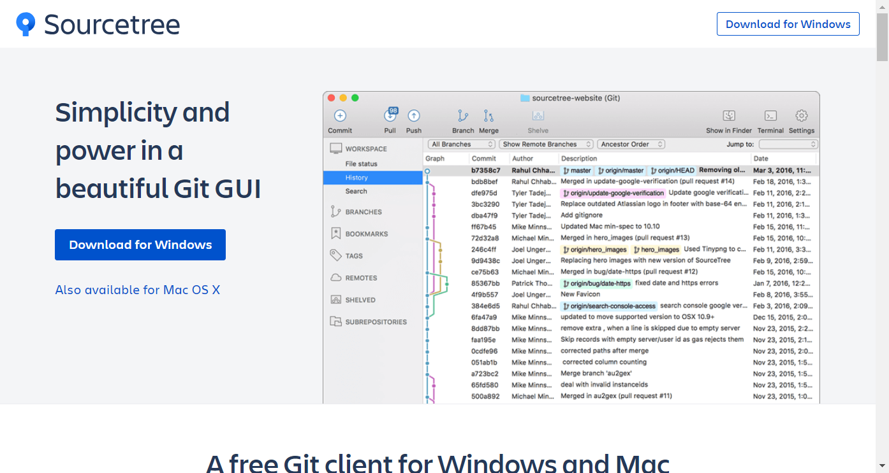
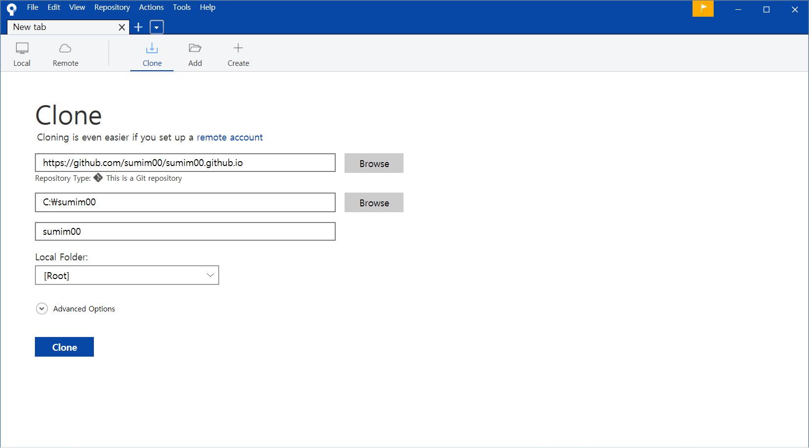
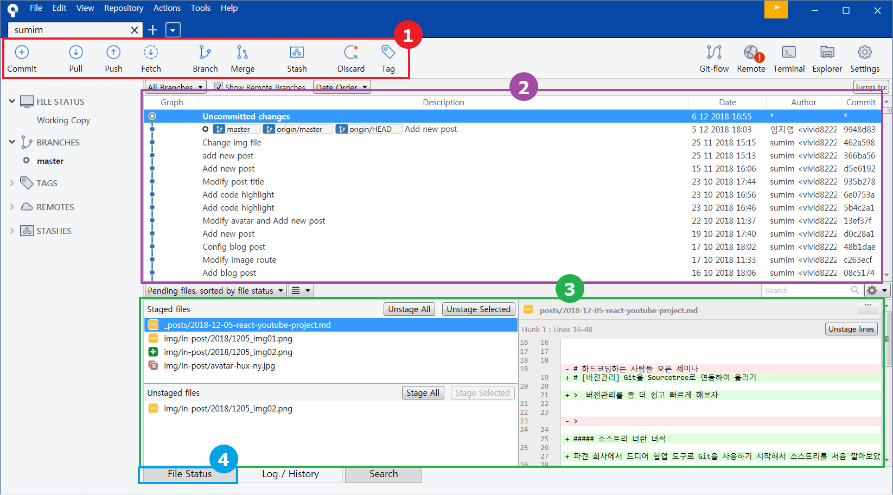
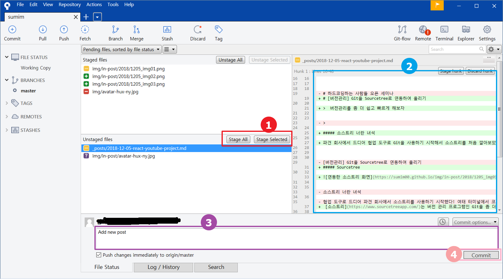
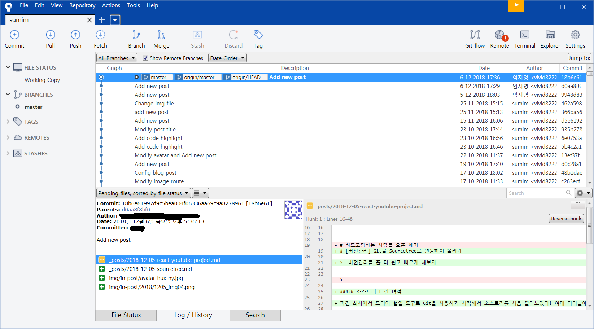

## 소스트리 너란 녀석

파견 회사에서 드디어 협업 도구로 Git을 사용하기 시작해서 소스트리를 처음 깔아보았다! 여태 터미널에서 코드만 입력하며 살다가 깔끔한 인터페이스를 마주하려니 새삼 내가 이렇게 편하게 살아도 되나 하는 생각이 잠시 들었다. 그러나 본디 인간은 보다 편한 것을 추구하기 위해 끊임없이 진화해오지 않았는가. 그런 의미에서 소스트리 또한 나의 커피타임을 위해서 앞으로 친해져야 할 도구인 것 같다. 

## 소스트리로 github 블로그 포스트 커밋하기

 [소스트리](https://www.sourcetreeapp.com/)는 버전 관리 프로그램인 Git을 좀 더 가독성있게 사용하기 위해 만들어진 GUI이다. 메인 상단의 다운로드 버튼으로 윈도우 혹은 OS버전을 바로 다운받을 수 있다. 

모든 설치를 완료하고 프로그램을 실행하면 이렇게 소스트리 화면을 확인할 수 있다. 나는 github의 블로그를 원격 저장소로 하고, C드라이브에 만들어놓은 새 폴더를 로컬 저장소로 지정하고 서로 연결할 계획이라 위와 같이 작성했다. 

클론을 완료하면 해당 프로젝트의 내용이 나타난다. 1번 상단에서는 git 명령어들을 확인할 수 있고 2번 중앙에서는 기존에 작업했던 기록들을 볼 수 있으며, 3번 하단에서는 로컬과 원격의 내용이 동일하지 않은 파일들과, 변경된 부분을 확인할 수 있다. 

지금 동기화되지 않은 파일들의 상태를 확인하기 위해 4번 FIle Status 버튼을 클릭한다.

그럼 스테이지에 올라간 파일과 스테이지에 올라가지 않은 파일로 분리되어 있는 모습을 확인할 수 있다. 1번에서 Stage All 혹은 Stage Selected를 통해 깃허브에 올리고 싶은 파일들을 선택하고, 2번에서 변경되는 부분을 확인한 뒤 3번 textarea 영역에 이번에 추가되는 파일에 대한 설명을 적고, 4번으로 커밋한다. 

이 때 3번 하단에 Push changes immediately to origin/master 를 체크하면 커밋과 동시에 푸시를 할 수 있으므로 빠른 등록을 원할 경우 체크하고 커밋하는 것도 좋다. 나는 혼자 버전관리를 하기 때문에 커밋과 동시에 푸시를 진행했다.

커밋과 푸시를 완료하고 Log/History로 다시 돌아가보면 이렇게 잘 등록되어있음을 확인할 수 있다. 

## 결론

개인적으로 터미널보다 인터페이스가 가독성이 높고,  Commit과 동시에 Push를 할 수 있다는 기능이 유용한 것 같아 앞으로 종종 사용할 것 같다. 

