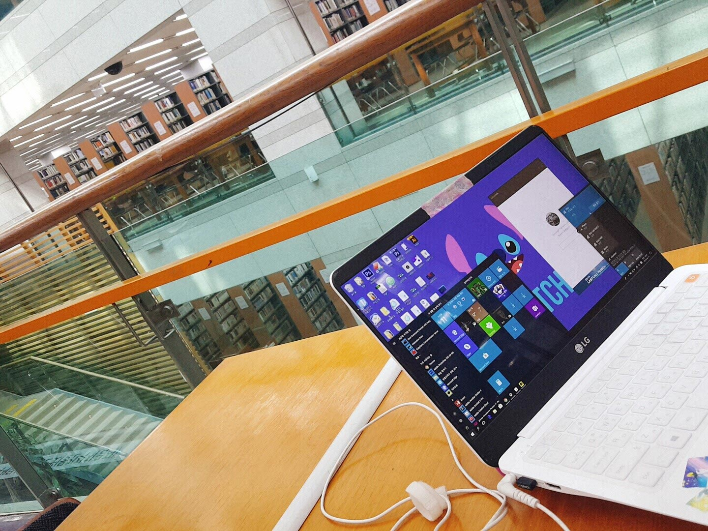
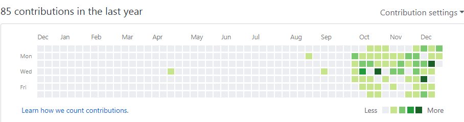
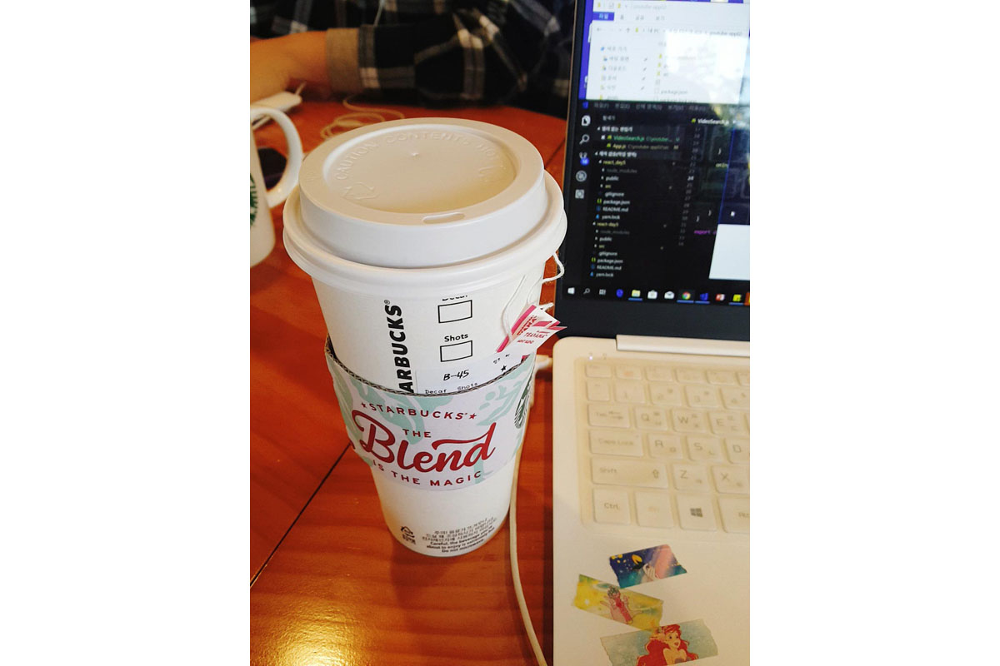
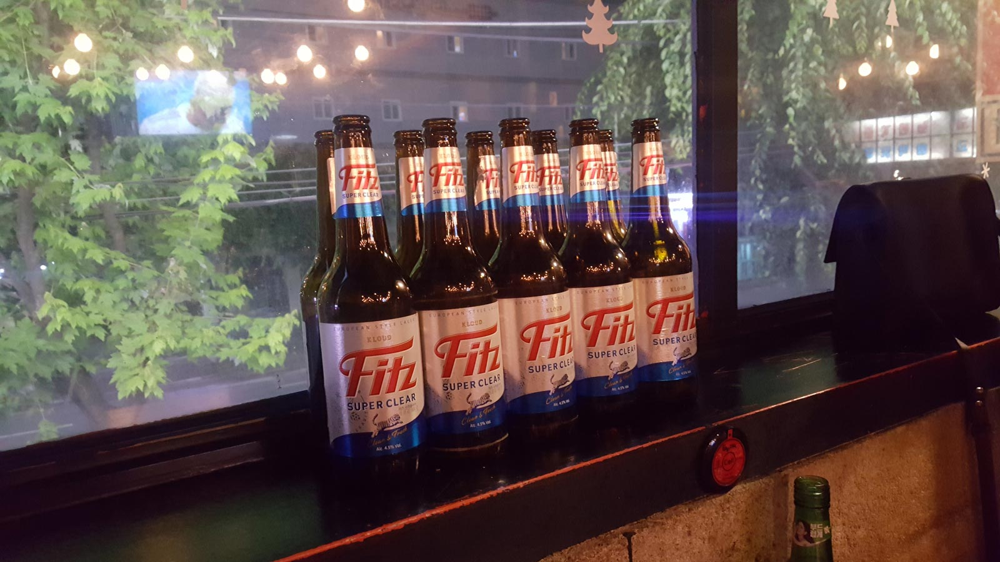
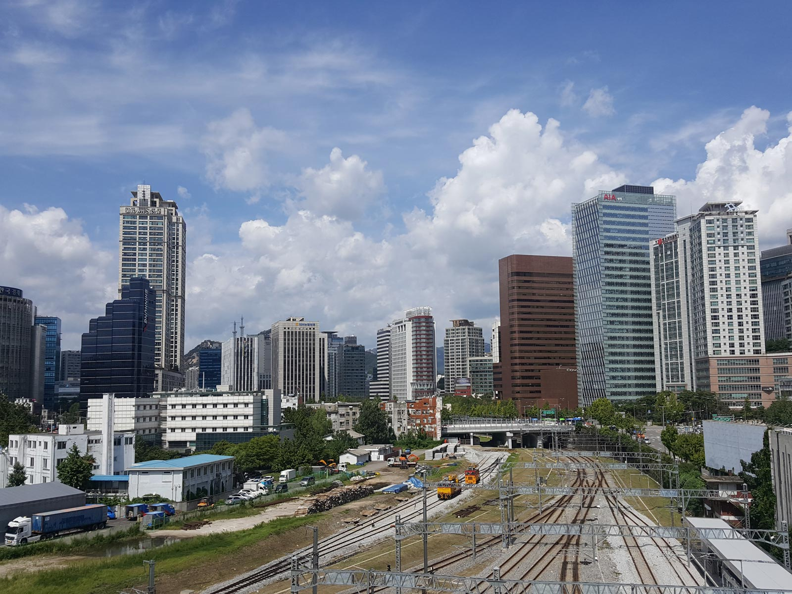

## 취업준비

지금 생각해도 막막해지는 단어라고 생각한다. 2월에 함께 졸업을 했으나 나와 달리 대학원을 가거나 인턴을 하는 친구들을 옆에서 보면서 쓸쓸하게 학교 중앙도서관에서 노트북을 켰다. 물론 개발자의 길을 걷겠다는 다짐을 후회한 것은 아니다. 공부는 힘들었지만 재밌었고 스킬을 익혀갈수록 좀 더 성장한 내가 되는 것 같다는 성취감이 좋았다. 다만 내 진로에 있어 **처음으로 방향을 정하는 순간**이었기에 그 갈피를 잡는 데 있어 많이 고민하고 헤맸던 것 같다.




## 취업

포트폴리오를 만들고 취업준비를 하다보니 5월 중순에 **첫 취업**을 했다. 규모는 중소기업이고 다 같은 직무의 사람들이 모여있는 회사인데, 사람들은 다 좋은 것 같았고 동기들도 또래이다보니 서로 비슷한 감정을 공유하면서 친해진 것 같다. 물론 단점도 있지만 ~~(연봉이라던가 월급이라던가 돈)~~ 아직은 배우고 있는 게 많아서 잘 지낼 것 같다. 


## 공부

취업 당시 할 줄 아는 것이라곤 ```HTML```, ```CSS```, ```JavaScript``` 조금밖에 몰랐던 나에게 있어 올 해 하반기는 어떤 공부를 해야할지 많이 헤맸던 시기였다. 특히 공부 방향을 찾는 경우는 [2018년 웹 개발자가 되기 위한 로드맵](https://github.com/devJang/developer-roadmap) 의 글이 많은 도움이 되었다. 빌드 툴이며 타입스크립트며...별천지같은 기술들을 보며 잠시 정신이 아득해졌지만, 그래도 배울 게 많다는 것은 성장할 기회가 많은 것 아닐까 하는 행복회로를 열심히 돌리면서 적응했다. 올해 맛 본 기술들로는 ```JavaScript ES6```, ```React```, ```npm``` 그리고 ```github```가 있었다. 특히 회사 적응에 필요했던 1~2달을 제외하고 남은 날은 대부분 ```github```와 친해지는 연습을 많이 했다. ```github pages```로 블로그도 만들어보고 레포지토리를 생성해서 스터디 했던 자료들도 푸시해보고, 그렇게 잘 깔아놓은 잔디들이 내가 올 한해 얼만큼 공부를 했는지 알게해 준 중요한 지표가 되었다. 



*지금은 초라한 나의 잔디...*


## 스터디

총 2개의 스터디에 참여했는데 하나는 ```자바스크립트```, 또 하나는 ```리액트``` 스터디였다. 스터디를 하고 나서 가장 크게 느낀 점은 역시 **복습이 중요하다**.  ```리액트 스터디``` 의 경우 첫 주에는 터미널 켜는 방법도 몰라서 구경만 하다가 끝났던 아픈 기억이 있다. 그런데 매주 주말에 카페에서 공부했던 내용을 복습하고 오니까 약 4주차 부터는 스터디할 때 질문거리도 생기고 무엇보다 보는 즉시 이해가 되니까 더 흥미가 생겼다. ```자바스크립트 스터디``` 는 회사 팀원분들과 함께 진행했는데, 가장 큰 장점은 실무에서 바로 적용가능한 스킬들을 우선적으로 배울 수 있었다는 점이었다.


#### 스터디의 장단점

나에게 있어 스터디는 **자발적으로는 공부를 안하는 사람에게 공부할 동기를 만들어주는 역할** 이었다. 스터디에 가고 내 위치가 어느 정도인지를 알고나니 더 열심히 공부해야 겠다는 동기가 생겼다. 만약 내가 집에서 공부만 했으면 주말마다 카페로 나가는 정도의 부지런함은 생기지 않았으리라 확신한다. 그런 의미에서 앞으로 좋은 스터디가 생긴다면 또 참여해볼 생각이다.  




*스벅 그린이 골드가 되기까지...(아련)*


## 내년 계획

내년에 크게는 지금하고 있던 공부들을 잠시 접어두고 정보처리기사 시험 준비를 하려고 한다. 그 시간에 지금 하던 공부를 계속 하는 것이 좋을 것 같다는 생각도 했지만 어디에서 자격증은 **있어봤자 득은 안되지만  없으면 손해 볼 수도 있는 것** 이라는 말을 들었기 때문이기도 하다. 굳이 리스크를 감수하기 보다는 조금 고생한 뒤에 맘 편히 있고 싶고, 다른 한 편으로는 내가 앞으로 개발자로 성장할 수 있을지 나 자신에게 묻는 기회일 수 있다고 생각한다. 

세부적으로는 ```TIL(Today I Learn)```을 시작해서 매일 공부했던 내용을 업로드할 계획이다. 블로그에 올리는 것은 아무래도 어느 정도 분량과 퀄리티를 고려하지 않을 수 없고 그렇다고 원노트에 적자니 성취감이 덜했는데 TIL은 꾸준히 기록할 수도 있고 무엇보다 깃허브에 잔디가 예쁘게 깔려서 내년부터 꾸준히 기록해보면 좋을 것 같다. 마지막으로 수영도 다시 다닐 예정이다. **건강이 1순위....**



*내년부턴 절주도 해야지*


## 마무리

막연히 생각했을 땐 뭔가 정신없이 바쁘게 지나간 것 같았는데 글로 정리해보니 생각보다 별 거 없는 한 해였다. 올 한 해는 **새로움에 적응하는 시간**이었다. 취업을 하고, 사람들과 교류하고, 스킬을 쌓는 것까지 처음 해보는 것이기에 많이 서툴렀고 그래서 부단히 노력했다. 신입이란 처음으로 사회의 쓴 맛을 보는 힘겨운 순간이지만, 동시에 실패와 방황이 사회적으로 용인되는 짧은 순간이라고 생각하기에 앞으로 더 많은 것을 꿈꾸고 다양하게 도전해보고자 한다. 2019년에는 더 성장하고 변화한 내가 되어있기를 바란다.



*점심시간에 다녀온 서울로.*


