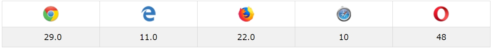
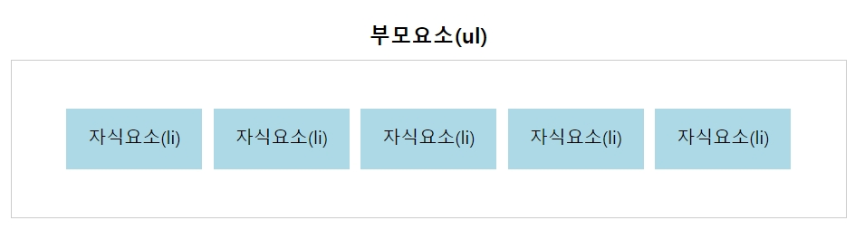
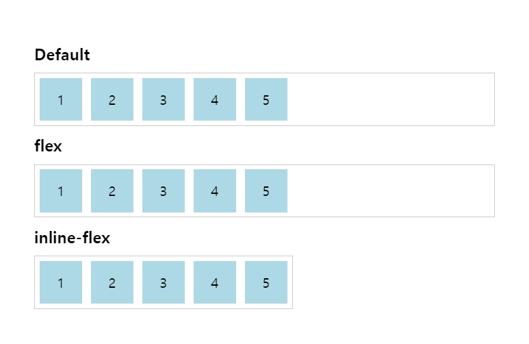
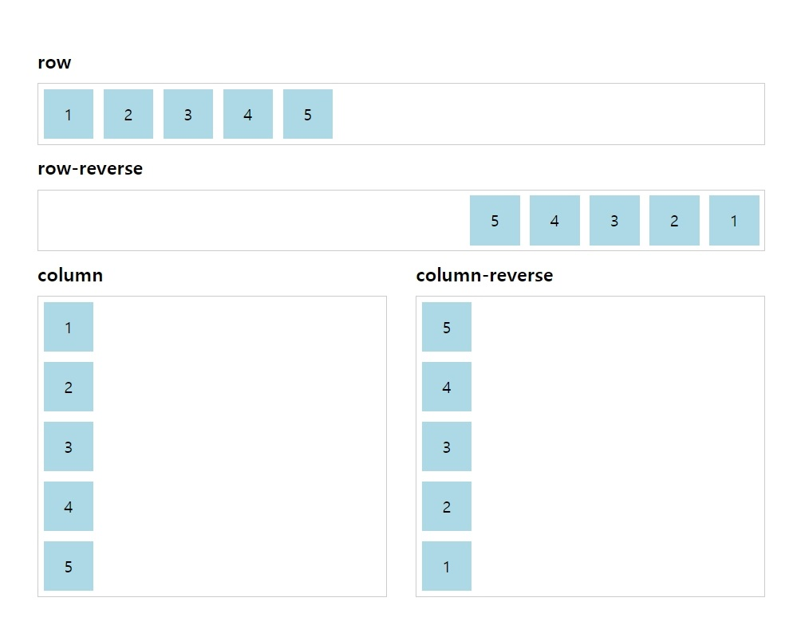
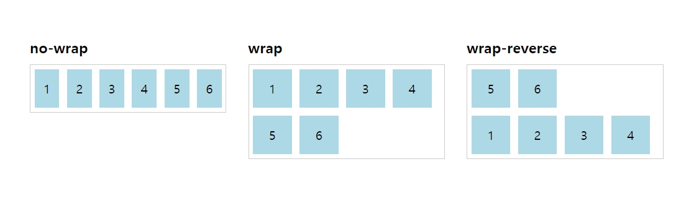
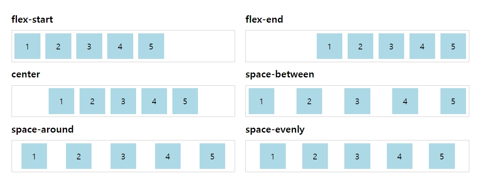
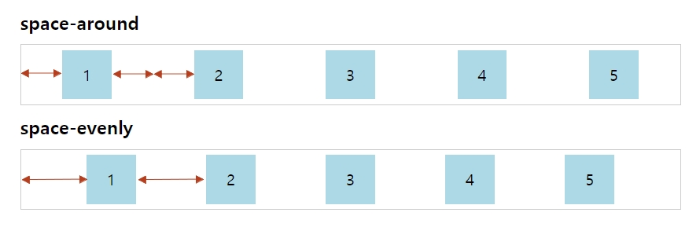
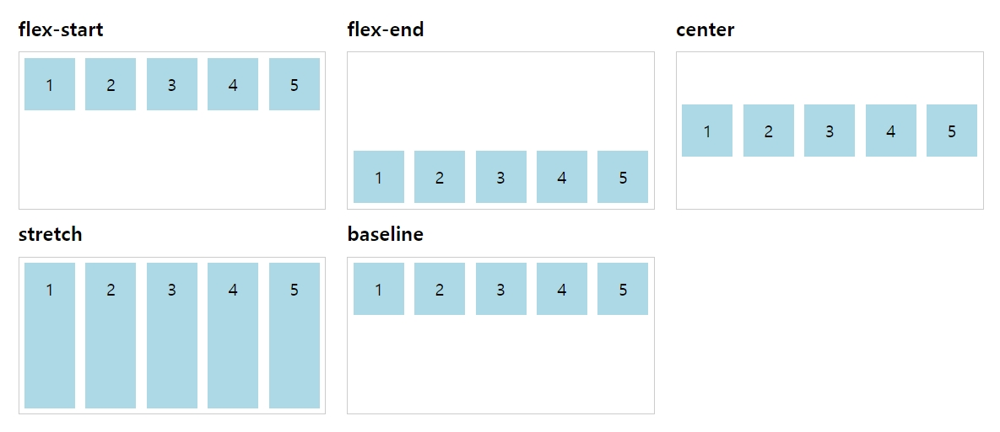
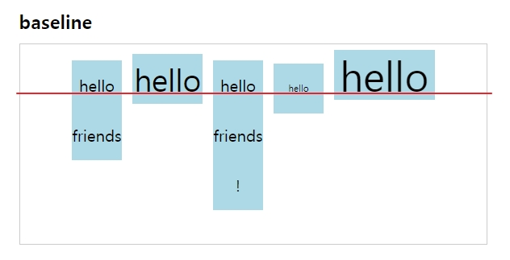
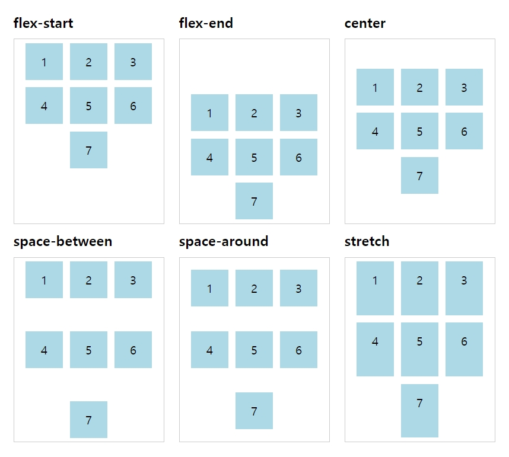

## 정의

Flexbox는 브라우저의 크기 혹은 요소의 크기가 동적이거나 명시되지 않은 경우에 문서 내의 공간에 대한 배치, 정렬 및 분산을 효율적으로 작업할 수 있게 돕는 모델이다. 단순하게 말하자면 반응형 웹과 같이 레아아웃의 유연성이 요구되는 상황에서 필요한 모델이라고 볼 수 있다. 

애석하게도 **ie 11 이상** 호환이 가능하기 때문에 대한민국에서 ie를 놓아주기까지는 보편화에 시간이 걸릴 것 같다. ~~activeX만큼 싫은 ie8호환...~~

 



출처 : [w3schools css3 flexbox](https://www.w3schools.com/css/css3_flexbox.asp)

<br/>

------

<br/>

## 표

Flexbox의 속성들을 간략하게 표로 정리하면 다음과 같다.

| 부모 요소 속성  | 설명             | 자식 요소 속성 | 설명          |
| --------------- | ---------------- | -------------- | ------------- |
| display         | 정의             | order          | 순서          |
| flex-direction  | 방향             | flex-grow      | 증가값        |
| flex-wrap       | 줄 바꿈          | flex-shrink    | 수축값        |
| flex-flow       | direction + wrap | flex-basis     | 기본값        |
| justify-content | 가로 정렬        | flex           | grow + shrink |
| align-items     | 세로 정렬        | align-self     | 세로 정렬     |
| align-content   | 열 간격          |                |               |


표에서도 알 수 있듯이 Flexbox 속성은 크게 박스들을 감싸고 있는 <u>부모 요소</u>에 적용하는 속성과,  그 안에 개별적인 <u>자식 요소</u>들에게 적용하는 속성으로 분류할 수 있다.  따라서 1부에서는 부요 요소 속성, 2부에서는 자식 요소의 속성에 대해 정리해보고자 한다. 



<br/>

------

<br/>

## 부모 요소 속성


### display

해당 요소를 flexbox로 정의할지 설정한다. ```flex``` 는  ```display: block``` 처럼 너비를 100%로 설정하는 반면 ```inline-flex``` 는  ```display: inline``` 자식 요소들의 크기에 맞춰 너비값이 변경된다. 

```css
ul {
    display: flex; 
    /* or inline-flex */
}
```



<br/>

------

<br/>

### flex-direction

flex가 진행될 방향을 설정하는 속성이다. 주의해야 할 점은 아랍어권와 같은 텍스트가 좌 ←  우로 읽히는 환경에서는 기본 direction이 ```rtl```로 설정되어 있기 때문에 flex 또한 이를 고려해서 설정해야한다.

```css
ul {
    flex-direction: row | row-reverse | column | column-reverse
}
```

- row (defalut) : ```ltr``` 환경에선 좌 →  우,  ```rtl``` 환경에선 좌 ← 우
- row-reverse : ```ltr``` 환경에선 좌 ← 우,  ```rtl``` 환경에선 좌 → 우
- column : 위 → 아래
- column-reverse : 아래 → 위




<br/>

------

<br/>

### flex-wrap

부모 요소의 공간이 자식 요소의 너비를 더 이상 포함할 수 없을 때, 한 줄로 유지할 것인지 여러 줄로 분리할 것인지 정하는 속성이다.

```css
ul {
    flex-wrap: no-wrap | wrap | wrap-reverse;
}
```

- no-wrap (default) : 모든 자식요소를 한 줄로 유지
- wrap : 자동으로 여러줄로 분리 (위 → 아래)
- wrap-reverse : 자동으로 여러줄로 분리 (아래 → 위)




<br/>

------

<br/>

### flex-flow

```flex-direction``` 과 ```flex-wrap```  값을 합친 약칭 속성이다. 앞에는 direction값, 뒤에는 wrap값을 작성한다.

```css
ul {
    flex-flow: row no-wrap; /* default */
}
```


<br/>

------

<br/>

### justify-content

자식 요소를 정렬하기 위해 사용하는 속성이다.  

```css
ul {
  justify-content: flex-start | flex-end | center | space-between | space-around | space-evenly;
}
```

- flex-start (default) : 시작점으로 정렬
- flex-end : 끝점으로 정렬
- center: 중앙정렬
- space-between: 자식요소 첫번째 요소와 마지막 요소는 양 끝에 배치하고, 사이에 있는 여백을 균등하게 분배
- space-around: 모든 요소의 좌우 여백을 균등하게 분배
- space-evenly: 모든 여백을 균등하게 분배





space-around와 space-evenly의 경우 요소의 좌우 여백이 대상인지, 아니면 여백 자체가 대상인지에 따라 너비가 분배되는 것을 확인할 수 있다.




<br/>

------

<br/>

### align-items

자식 요소의 세로정렬을 정의한다.

```css
ul {
    align-items: flex-start | flex-end | center | stretch | baseline;
}
```

- flex-start : 시작점으로 정렬
- flex-end : 끝점으로 정렬
- center : 중앙정렬
- stretch (default) : 부모 요소의 높이에 맞춰 늘어남 (단, 자식 요소의 높이값이 지정되지 않은 경우)
- baseline : 폰트의 기준선에 맞춰 정렬





```baseline``` 의 경우 모든 요소의 스타일이 같을 경우 ```flex-start```와 동일하게 보여지나, ```font-size```가 제각각인 경우 폰트의 기준선에 맞춰 정렬됨을 확인할 수 있다.




<br/>

------

<br/>

### align-content

```align-items```가 자식 요소 각각의 세로정렬을 정의했다면 ```align-contents```는 flex된 요소들이 여러줄일 경우 행간의 여백을 정의하는 속성이다.

```css
ul {
    align-content: flex-start | flex-end | center | space-between | space-around | stretch
}
```

- flex-start : 부모 요소의 시작점에 맞춰 정렬
- flex-end : 부모 요소의 끝점에 맞춰 정렬
- center : 부모 요소의 중앙에 맞춰 정렬
- space-between : 첫째 줄은 최상단, 마지막 줄은 최하단에 배치되고 남은 여백을 균등하게 분배
- space-around : 모든 줄의 상하 여백을 균등하게 분배 
- stretch (default) : 부모 요소의 높이에 맞춰 늘어남 (단, 자식 요소의 높이값이 지정되지 않은 경우)




<br/>

------

<br/>

## 참고

https://www.w3schools.com/css/css3_flexbox.asp

https://css-tricks.com/snippets/css/a-guide-to-flexbox/

https://www.vobour.com/1-flexbox-%EC%9D%B4%ED%95%B4-%EB%8B%B9%EC%8B%A0%EC%9D%B4-%EC%95%8C%EC%95%84%EC%95%BC-%ED%95%A0-%EB%AA%A8%EB%93%A0-%EA%B2%83-understa