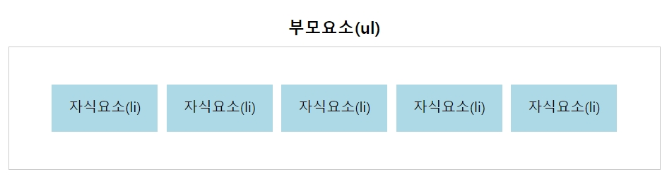
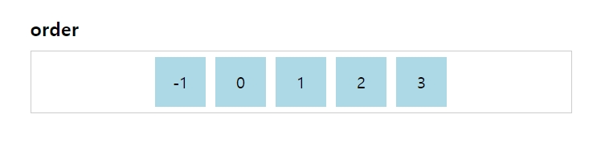
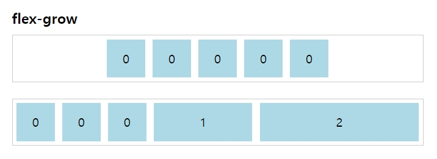
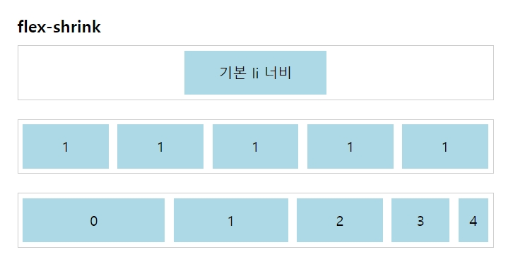
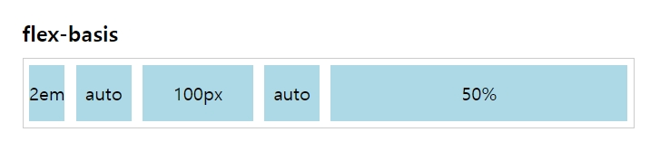
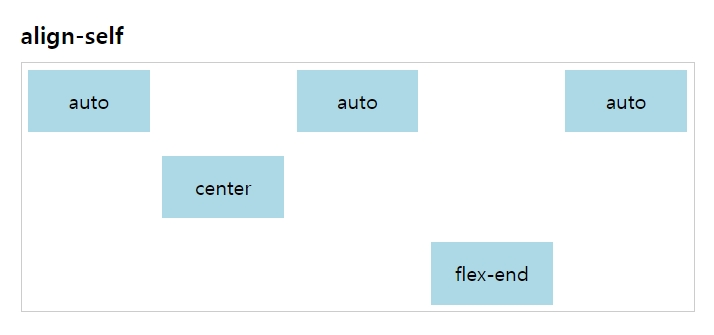

> 지난 포스트 : [[CSS] Flexbox 정리 (1) 부모 요소 속성](https://sumim00.github.io/css/2018/12/29/css-flexbox-1/)

<br/>

------

<br/>

## 서론

앞서도 언급했다시피 Flexbox 속성은 크게 박스들을 감싸고 있는 부모 요소에 적용하는 속성과,  그 안에 개별적인 자식 요소들에게 적용하는 속성으로 분류할 수 있는데, 이를 정리하면 다음의 표와 같다.

| 부모 요소 속성  | 설명             | 자식 요소 속성 | 설명          |
| --------------- | ---------------- | -------------- | ------------- |
| display         | 정의             | order          | 순서          |
| flex-direction  | 방향             | flex-grow      | 증가값        |
| flex-wrap       | 줄 바꿈          | flex-shrink    | 수축값        |
| flex-flow       | direction + wrap | flex-basis     | 기본값        |
| justify-content | 가로 정렬        | flex           | grow + shrink |
| align-items     | 세로 정렬        | align-self     | 세로 정렬     |
| align-content   | 열 간격          |                |               |


지난 포스트에서 ul에 해당하는 부모 요소에 대한 정리를 포스팅했다면, 이번 포스트에서는 li에 해당하는 자식 요소에 적용하는 속성에 대해 정리하고자 한다. 

**참고로 flexbox의 자식 요소들에게는 ```float``` , ```clear``` , ```vertical-align``` 속성이 적용되지 않으므로 사용에 주의하자.**




<br/>

----

<br/>

## 자식 요소 속성


### order

자식 요소 간 순서를 정의할 수 있다. 기본값은 0이며 ```z-index```와 동일하게 값이 작아질수록 최상단에 위치한다.

```css
li {
    order: 0; /*default*/
}
```



<br/>

------

<br/>

### flex-grow

부모 요소에 여분의 공간이 있을 때, 자식 요소의 너비를 확장할 것인지 아닌지 정의하는 속성이다.  기본값인 0일 땐 너비를 확장하지 않으며, 0보다 큰 숫자를 입력할 경우 너비를 확장한다. 또한 숫자가 크면 클수록 상대적으로 너비를 더 크게 가져갈 수 있다.

```css
li {
    flex-grow: 0 /* default */ | 임의의 정수값;
}
```





<br/>

------

<br/>

### flex-shrink

```flex-grow``` 속성과 반대로 부모 요소에 여분의 공간이 없을 때 자식 요소의 너비를 축소하는 속성이다. 기본값은 1이고, 0이면 줄어들지 않고 본인의 너비값을 그대로 유지하며, 1보다 큰 숫자를 입력하면 숫자가 클수록 더 많이 축소한다.

```css
li {
    flex-shrink: 1 /* default */ | 임의의 정수값;
}
```




<br/>

------

<br/>

### flex-basis

자식 요소들의 기본 너비를 정의한다.  부모 요소의 크기에 따라 자동으로 변경되는 ```auto```가 기본값이며 px, em, %와 같은 임의값를 지정하면 해당 값만큼 요소들의 크기가 설정된다.

```css
li {
    flex-basis: auto /* default */ | px, em, %...;
}
```



<br/>

------

<br/>

### flex

```flex-grow``` 와 ```flex-shrink```  , 그리고 ```flex-basis``` 의 값을 합친 약칭 속성이다. 첫 번째 ```flex-grow``` 를 제외한 나머지 속성은 생략이 가능하다. 

```css
li {
    flex: 0 1 auto /* default */ | none
}
```

<br/>

------

<br/>

### align-self

부모 요소의 ```align-items``` 속성과는 무관하게 개별적으로 세로 정렬값을 정의할 수 있다.

```css
li {
  align-items: auto | flex-start | flex-end | center | baseline | stretch;
}
```

- auto (default) : 부모 요소의 속성에 따라 자동 정렬
- flex-start : 시작점으로 정렬
- flex-end : 끝점으로 정렬
- center: 중앙 정렬
- stretch : 부모 요소의 높이에 맞춰 늘어남 (단, 자식 요소의 높이값이 지정되지 않은 경우)
- baseline : 폰트의 기준선에 맞춰 정렬




<br/>

------

<br/>

## 참고

https://www.w3schools.com/css/css3_flexbox.asp

https://css-tricks.com/snippets/css/a-guide-to-flexbox/

https://www.vobour.com/2-flexbox-%EC%9D%B4%ED%95%B4-%EB%8B%B9%EC%8B%A0%EC%9D%B4-%EC%95%8C%EC%95%84%EC%95%BC-%ED%95%A0-%EB%AA%A8%EB%93%A0-%EA%B2%83-understa

