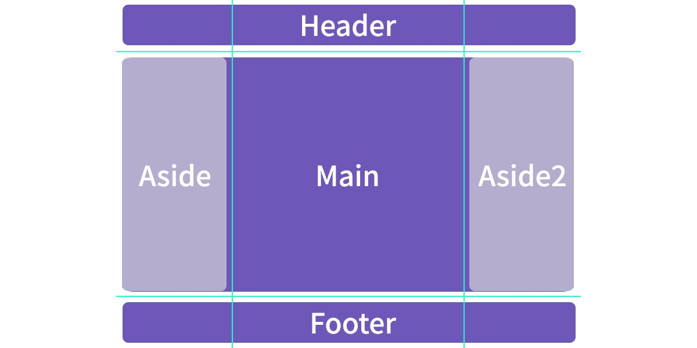
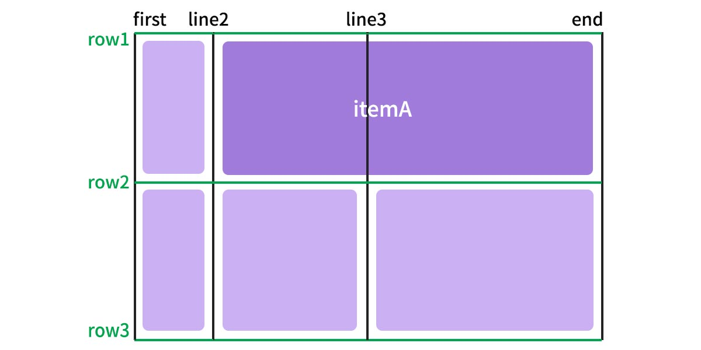

## 정의

Grid 레이아웃은 Flexbox 다음으로 등장한 새로운 레이아웃 모듈이다. 겪어온 바로는 현업에서는 하위 브라우저 호환 때문에 Flexbox 사용도 조심스러워 하는 실정이지만, 해외에서는 이미 다양한 실무에서 사용하는 것 같아 미리 정리해보고자 한다.

<br/>

### Cross Browsing


출처 : [w3schools css3 grid](https://www.w3schools.com/css/css_grid.asp)

<br/>

### Flexbox랑 다른 점

그리드의 매력은 기존에 1차원적으로만 이루어졌던 화면 구성을 **2차원까지도 가능하게끔 확장**시켰다는 점이다. 막연하게 2차원이라고 생각하면 어려운데 ```flexbox```의 예로 비교해보면 이해하기 쉽다. 

<br/>



<br/>

지금 보는 레이아웃은 일반적인 pc웹 레이아웃과 동일하나, 좌우 aside 영역이 content의 앞으로 겹쳐져 있다는 점이 특징이다. 이런 경우에 flexbox 모듈로만 구성하기엔 한계가 있으며 나의 경우엔 ```position``` 과  ```z-index``` 속성을 사용함으로써 aside 영역을 띄우는 방식을 사용할 것이다.

<br/>

그러나 grid는 다음과 같은 코드로 이러한 2차원 레이아웃 구성이 가능하다. 

```css
.grid-container {
    display: grid;
    grid-template-columns: repeat(4, 1fr);
  	grid-template-rows: 80px auto 80px;
    grid-gap: 10px;
}
.grid-main {
    grid-column: 1 / 5;
    grid-row: 2;
}
.grid-aside {
    grid-column: 1 / 2;
    grid-row: 2;
}
.grid-aside2 {
    grid-column: 1 / 2;
    grid-row: 2;
}
```

이처럼 이전에는 여러 속성을 번갈아 사용해야만 가능했던 레이아웃을 그리드만으로 가능하게 되었음을 알 수 있다. 해당 코드는 grid 속성에 대해 알고 난 뒤 마지막으로 확인해보자.

<br/>

### 표

Flexbox의 속성들을 표로 정리하면 다음과 같다.

| 부모 요소 속성             | 자식 요소 속성        | 기능          |
| -------------------------- | --------------------- | ------------- |
| display                    | grid-column-start/end | repeat()      |
| grid-template-columns/rows | grid-row-start/end    | minmax()      |
| grid-template-areas        | grid-area             | fit-content() |
| grid-auto-columns/rows     |                       | span          |
| grid-auto-flow             |                       | fr            |
| grid-gap                   |                       |               |

**1부**에서는 부요 요소 속성, **2부**에서는 자식 요소의 속성으로 정리할 계획이다.  

<br/>

------

<br/>

## 부모 속성

### 1. display

grid 속성을 정의한다. 

```css
.container {
    display: grid | inline-grid;
}
```

<br/><br/>

### 2. grid-template-columns/rows

grid 내 행과 열의 개수 및 위치를 정의한다. 속성값은 px단위로 고정값을 입력하면 해당 값만큼 지정되고, ```auto``` 로 임의값을 입력하면 container에서 남는 공간만큼 크기가 늘어난다.

<script async src="//jsfiddle.net/sumim/eaqsr3jc/13/embed/html,css,result/"></script>

위의 코드를 예시로 들자면, 열은 총 3열이며 크기는 순서대로 100px, 자동, 50px로 지정된다.

그리고 행은 총 2행이며 순서대로 100px, 100px 로 지정된다.

<br/>

#### repeat()?

repeat() 함수는 ```repeat(n / x)```  의 형태로 사용하며 x값을 n번 반복하는 함수이다. 예를 들어 ```grid-template-rows``` 의 값이 ```repeat(3, 100px)``` 라면, 그리드는 3행이며 각각 ```100px 100px 100px``` 의 값을 가지고 있게 된다.

<br/>

#### minmax()?

minmax() 함수는 ```minmax(최소값, 최대값)``` 의 형태로 사용하며 셀의 최소값과 최대값을 지정할 수 있는 함수이다. 

```css
grid-template-columns: minmax(100px, auto) minmax(50px, 1fr);
```

이 경우에 총 2열이며 첫 번째 열은 최소 100px, 최대 auto값을 가지고 두 번째 열은 최소 50px, 최대는 전체의 1/2비율을 갖게 된다.

```css
grid-template-rows: minmax(min-content, 100px) minmax(50px max-content);
```

<br/>

#### fr?

fr은 분수(fraction)의 약자로 container의 크기에서 n만큼 나눈 값을 일컫는다. 만약 ```grid-template-columns``` 의 값이 ```1fr 1fr 1fr 1fr``` 라면, 그리드는 4열이고 각 컬럼 값은 ```1/4 1/4 1/4 1/4 ``` 의 비율임을 알 수 있다.

<br/>

#### min-content, max-content?

```grid-template-columns/rows``` 의 속성값으로는 fr처럼 비율을 입력할 수도 있고,  ```min-content``` ```max-content``` 처럼 최소값 최대값을 지정할 수도 있다.

- min-content: ```overflow```같은 인위적 기능이 없을 때, 내부 컨텐츠의 최소 크기.
- max-content: ```overflow```같은 인위적 기능이 없을 때, 내부 컨텐츠의 최대 크기.

두 속성값은 모두 셀 안의 컨텐츠 크기를 기준으로 하며, 만약 셀 안에 이미지가 300px로 고정이라면, min-content를 사용할 경우 최소 300px이며, max-content를 사용할 경우 최대 300px이 되는 것이다.

자세한 내용은 [CSS Grid Layout: How to Use minmax()](https://www.hongkiat.com/blog/css-grid-layout-minmax/) 글에서 *The min-content, max-content, and auto keywords*  부분을 참고하여 이해했다.

<br/>

#### 라인의 이름 명시하기

더불어 만약 라인의 이름을 명시적으로 지정하고 싶다면, ```[이름]``` 의 형태로 속성값 안에 넣을 수 있다.

```css
.container {
    grid-template-columns: [first] 40px [line2] 50px [line3] auto [end];
	grid-template-rows: [row1] 100px [row2] 100px [row3];
}
```

만약 위와 같이 스타일이 작성되었다면 라인 이름은 다음과 같다. 



라인 이름을 규정해놓을 때 장점은 소위 단축키를 누르는 것 처럼 라인을 이름만으로 불러올 수 있다는 점이다. 만약 itemA의 column값을 지정하고 싶을 때, 기존에는 ```grid-column: 2 / 4;``` 로 입력했다면, 라인 이름을 정의한 뒤에는 ```grid-column: line2 / end;``` 처럼 특정 라인 명만 입력해도 크기를 지정할 수 있게 된다.

<br/><br/>

### 3. grid-template-areas

자식 요소에 ```grid-area``` 로 지정된 이름들을 참조하여 템플릿을 정의하는 속성이다. 속성값은 레이아웃을 간략하게 시각화한 형태이다.

빠르게 예시를 살펴보자.

<script async src="//jsfiddle.net/sumim/eaqsr3jc/29/embed/html,css,result/"></script>

예시에서 보이듯 ```grid-area``` 에서 지정된 고유의 이름들을 가지고 일련의 도식화를 한 상태임을 확인할 수 있다. 쌍따옴표(" ")를 통해 행을 구분하며, 이름을 반복해서 적으면 반복된 횟수만큼 해당 셀의 영역을 확장한다.

<br/>

#### 마침표(.)?

마침표(.)는 빈 셀을 의미하며 한개를 찍든 여러개를 찍든 상관없다. 다만 ```grid-template-areas``` 는 띄어쓰기로 각 영역을 구분짓기 때문에 ... ... 는 두 셀을 ...... 는 한 셀을 비우는 것임을 잊지말자.

<br/><br/>

### 4. grid-template

`grid-template-rows/columns` 와 `grid-template-areas` 의 축약형이다.

```css
.container {
    grid-template: none | <grid-template-rows> / <grid-template-columns>; 
}
```

none 혹은 rows / columns 의 순서로 사용 가능하다.

<br/><br/>

### 5. grid-column-gap / grid-row-gap

grid의 행과 열 사이의 간격값을 지정할 수 있다.

```css
.container {
    grid-column-gap: 열간 여백 크기;
    grid-row-gap: 행간 여백 크기;
}
```

예시는 다음과 같다.

<script async src="//jsfiddle.net/sumim/eaqsr3jc/48/embed/html,css,result/"></script>

<br/><br/>

### 6. grid-gap

`grid-column-gap` 과 `grid-row-gap` 의 축약형이며 다음과 같이 사용한다.

```css
.container {
    grid-gap: <grid-row-gap> <grid-column-gap>;
}
```

<br/><br/>

## Reference

https://css-tricks.com/snippets/css/complete-guide-grid/

https://developer.mozilla.org/en-US/docs/Web/CSS/CSS_Grid_Layout

https://www.hongkiat.com/blog/css-grid-layout-minmax/

https://www.w3schools.com/css/css_grid.asp