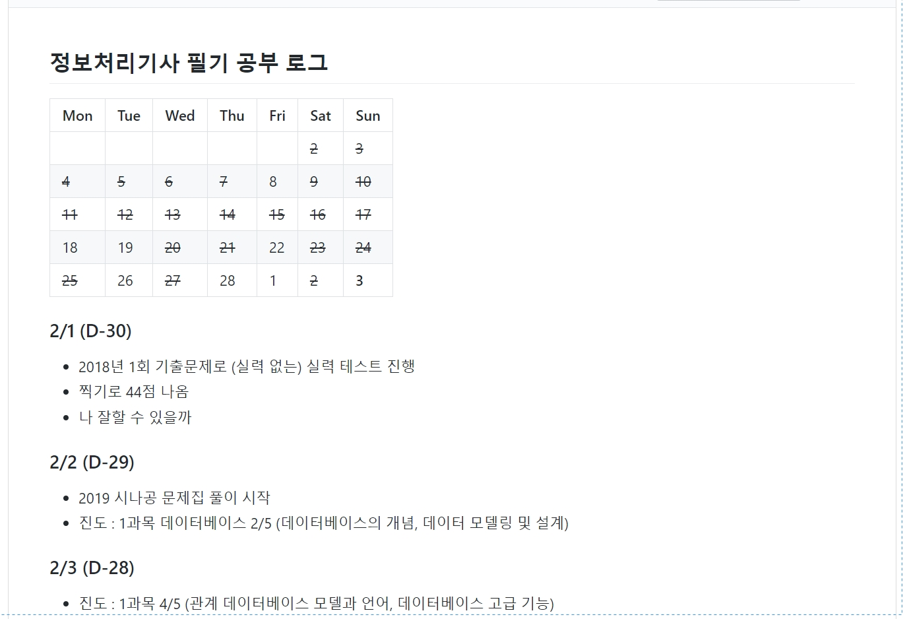
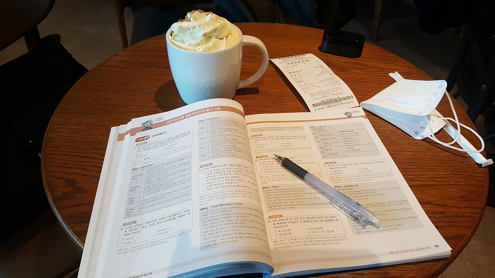
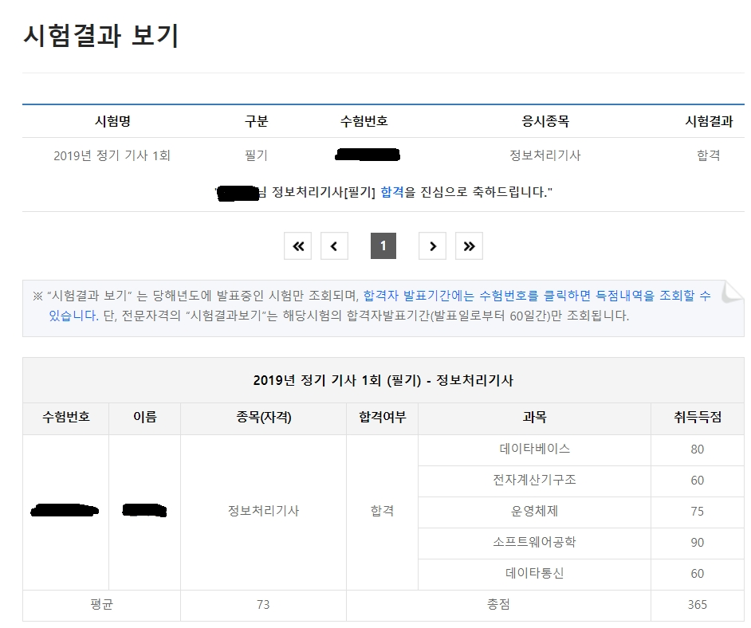

### 시작한 계기  

2019년에 이루고 싶은 목표들을 정하면서 가장 첫 번째로 생각했던게 **정보처리기사 자격증 취득** 이었다. 비전공자로 IT업계에 종사하면서 전공자는 어떤 공부를 하는지 개략적으로나마 이해해보고 싶었고, 앞으로 계속 이 분야에서 있으려면 필요한 자격증 중 하나라고 생각했기 때문이었다. 따라서 3월 3일에 진행한 2019년 1회 정보처리기사에 응시했다. 

  

### 공부방법  

> 조금이라도 꾸준히를 목표로. 별도 인강 없이 책만 풀어도 가능

비전공자인 것과 더불어 회사 출퇴근과 병행하여 진행해야 했으므로, 공부 기간은 여유있게 **30일**로 잡았다. 그리고 구글신으로 사전조사를 한 결과 대다수가 독학으로 시나공 책을 추천했기에 나 또한 **시나공 2019년 개정판**으로 구매했다. **평일에는 퇴근하고 1~2시간, 주말에는 카페나 집에서 4~5시간 정도 공부했다.**

굳이 책을 안사고 이기쥬히나 CBT만 풀어도 충분하다는 후기들이 있었는데, 불필요한 도박은 하고 싶지 않아서 그냥 샀다. 공부해본 결과 나같은 무지렁이도 이해할 수 있게끔 챕터별 정리도 잘 되어있고, 이 부분은 꼭 외워야 하며 여기는 넘어가도 된다는 등의 첨언이 있어서 공부방향이나 공부량을 잡기에도 유용했다. 만약 나와 비슷한 상황이라면 **책을 사는 것을 추천**한다.

또한 개인적으로 기록하는 것을 좋아하다 보니 **깃허브 TIL 레포지토리**에 매일 얼마나 공부했는지 진도랑 과목별로 한줄 후기를 적었다. 아무래도 깃허브에 올리게 되면 커밋한 기록이 남기 때문에 꾸준히 공부할 수 있도록 동기부여가 되었다.

*깃허브에 적은 기록들. 이런 형식으로 시험당일까지 적었다.*

  

### 공부과정  

> 2과목 죽어라. 5과목 너도 죽어라

총 공부기간 중에서 2/3은 문제집을 차례대로 풀었고, 남은 1/3은 기출문제를 풀고 오답을 정리했다. 

출제되는 분야가 다양한 만큼 모든 내용을 100% 이해하긴 힘들었다. 따라서 문제집을 통해선 최소한의 개념은 이해할 수 있을 만큼 학습하고, 나머지는 기출문제를 풀면서 감을 익히는 데 집중했다. 실제로 시험장에서 2과목을 풀 때 아는 100% 문제는 소수였고 긴가민가한 문제들이 많았는데, 결과적으로 긴가민가한 문제들을 맞힌 덕분에 합격했다. 

다만 문제집을 풀 때는 모든 과목을 다 하루 1챕터씩으로 동일하게 풀었는데, 그 때문인지 2과목 전자계산기가 끝까지 발목을 잡았다. 기출문제를 풀 때에도 2과목이 과락 점수인 40점을 못 넘겼고, 시험장에서 푼 시험문제도 2과목이 헷갈려서 가채점 전까지 과락으로 떨어지는 줄 알았다. 

**다들 2,5과목을 집중적으로 풀라고 하는 데엔 다 이유가 있었다.** 

*슈크림라떼와 함께.*

  

### 결과 및 작은 조언 

결과적으로 **평균 73점으로 합격**했다. 1회는 비교적 쉽게 출제된다는 이야기를 들었는데, 정말이었는지 1과목부터 5과목까지 전체적으로 난이도가 낮았다. 2과목 또한 쉽다는 생각을 했다. 내가 그 쉬운 수준을 풀지 못했을 뿐이지.

그래서 약 1시간만에 풀고 나왔다. 슬픈 마음으로 2회 필기 신청기간을 알아보고 있다가 2시에 가답안이 나와서 채점하는데 예상보다 동그라미가 많이 나왔다. 확인해보니까 이거면 맞겠지 하고 찍은 문제들이 정답인 경우가 많았다. 

내 기준에선 1달이라는 공부 기간이 충분하지 않다고 생각하다보니, 문제에 대한 100% 이해보단 어떤 유형의 문제가 나오는지 눈에 익히는 과정에 더 집중했는데, 결과적으로 그런 방법 효과가 있었던 것 같다.

 

#### 작은 조언 

- 개인적인 난이도 :  **2** > **5** >>>>> **3**  > **1**  >  **4**

- 어려운 2과목, 5과목에는 충분히 이해할 수 있을 만큼의 공부시간을 가지는 것이 좋다.

- 필기는 인강 없이도 문제집으로 독학이 가능하다. 오답만 잘 정리하면 기출만 돌려도 가능할 듯.
- 어떤 시험이든 비슷하겠지만 **찍을 수 있을 정도의 개념 이해** + **기출문제를 통한 오답정리**가 포인트.