작년에 이어 올해도 **월드 IT쇼** 가 삼성 코엑스에서 열렸다. 올해는 4월 24일부터 27일까지 개최했는데, 나는 일 때문에 마지막 날인 27일 토요일에 관람했다. 

행사 한 달 전쯤부터 공식 홈페이지에서 사전예약을 받기 때문에 그 때 신청하면 무료로 입장할 수 있으니 참고하자.

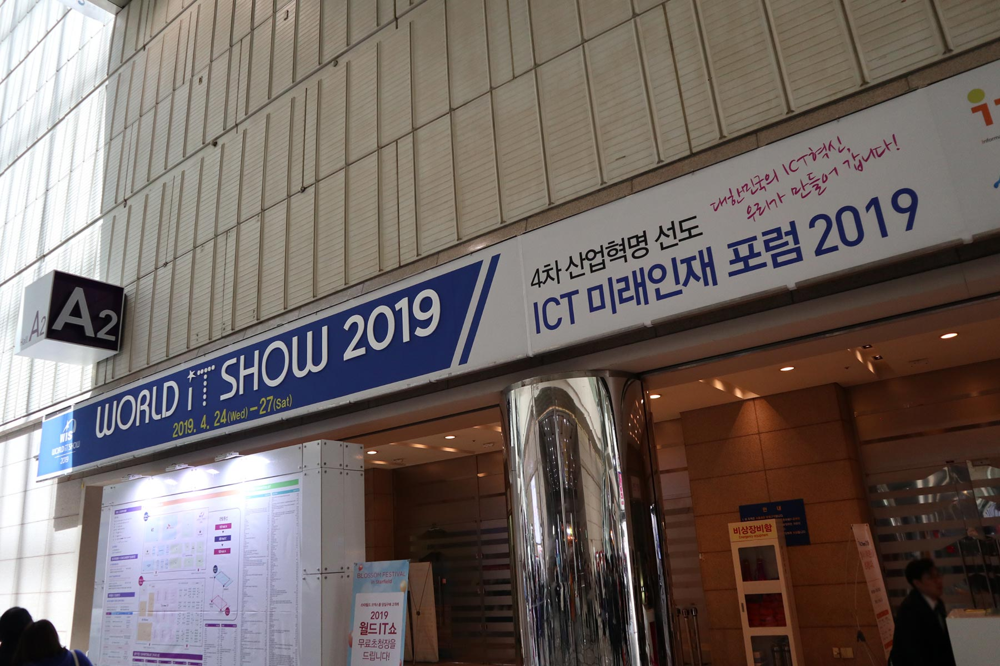

1층인 A홀에서는 주로 벤처기업과 같은 중소규모 회사의 제품 홍보 및 대학별 연구 결과물이 전시되어 있었으며, 2층인 C홀에서는 주로 대기업의 제품 및 기술 홍보가 주를 이뤘다.

 

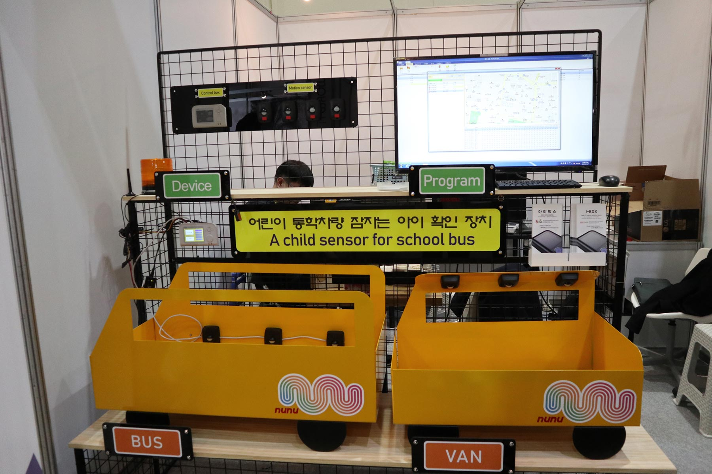

관심있게 본 전시들이 일부 있었는데, 위의 경우는 유치원 통학 차량에서 움직임이 감지되는 경우 유치원 및 학부모들에게 즉시 구조요청을 할 수 있는 **아이박스** 라는 장치다. 

 

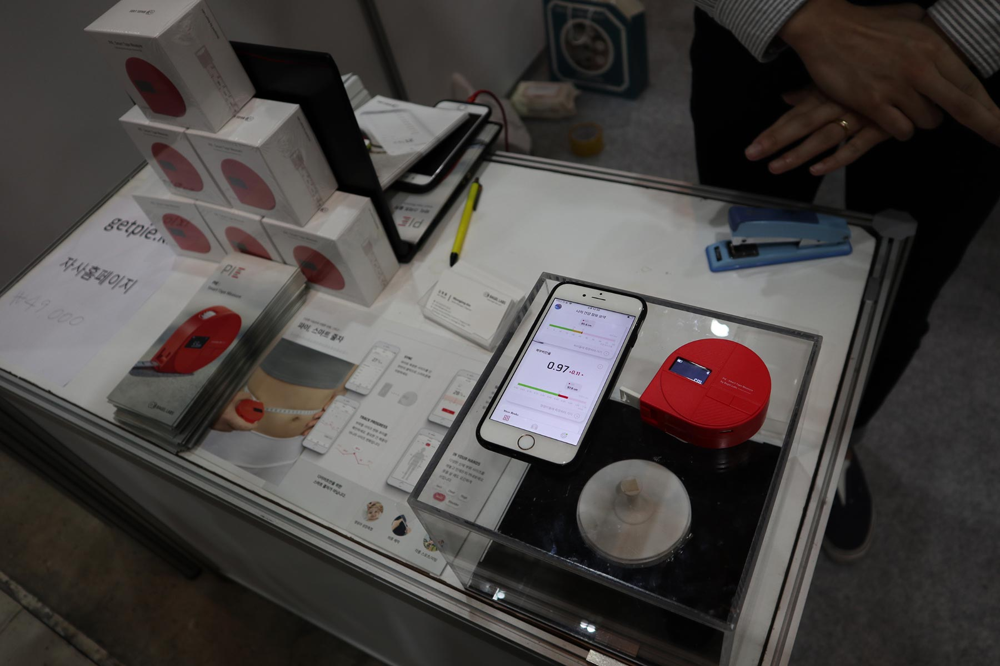

허리둘레를 줄자로 재면 자동으로 어플에 기록해주는 체지방 줄자 **파이.**

 

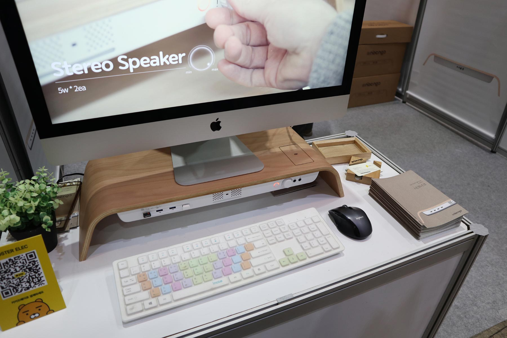

업무 시간 및 자세를 실시간으로 모니터링하고 바른 자세를 유도하는 모니터 받침대 **너크너크.**

 

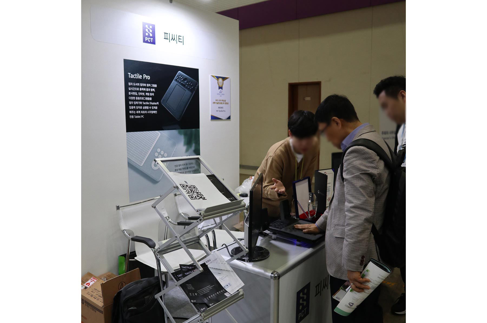

그림을 태블릿에 내장된 점자에 출력하여 손바닥을 통해 인지할 수 있는 시각장애인용 태블릿 PC **Tactile Pro**.

 

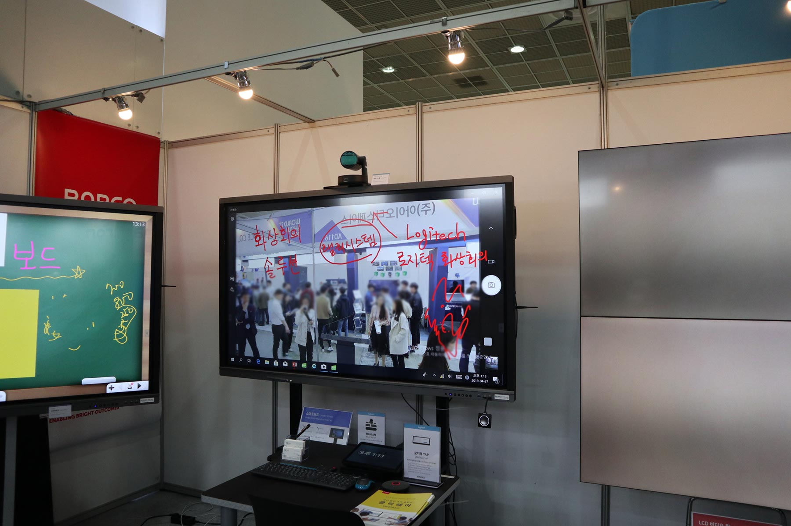

스마트 보드 또한 작년에 비해 올해 유독 자주 본 IoT 기술이었다.  한 번에 여러 개의 움직임을 캐치하는 기능부터 화상 회의 중 실시간으로 필기할 수 있는 기능까지 회사별 차이점 또한 있었다.

 

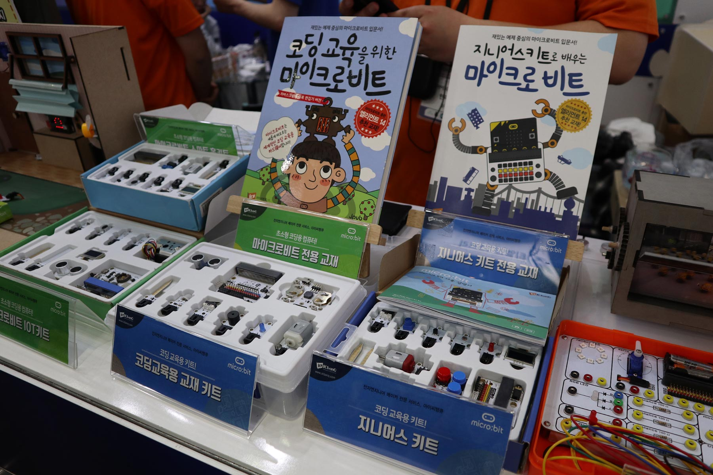

어린이들을 위한 코딩 교육 키트. 이번에는 레고와 호환되는 키트가 있길래 흥미로웠다.

 

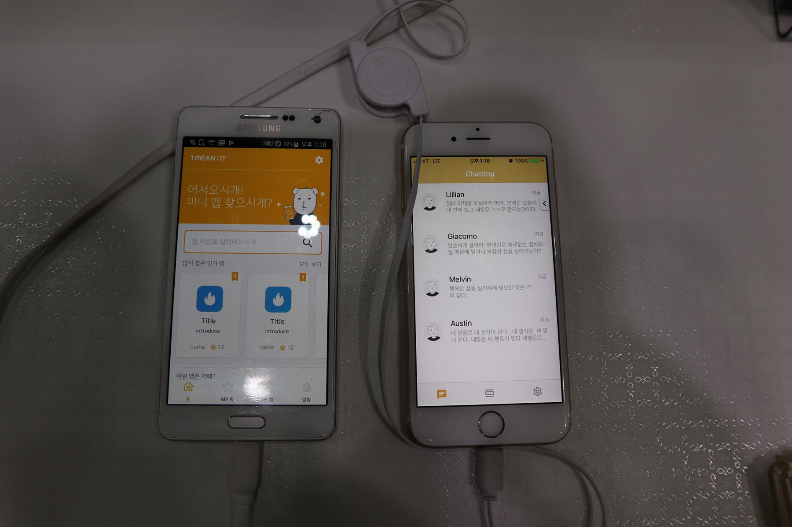

템플릿과 색상 등 사용자가 원하는 타입들을 설정하면 그에 따른 맞춤형 미니앱을 만들어주는 **원미닛** 별도의 개발지식이 없어도 앱을 만들 수 있다는 특징이 이목을 끌었다.

 

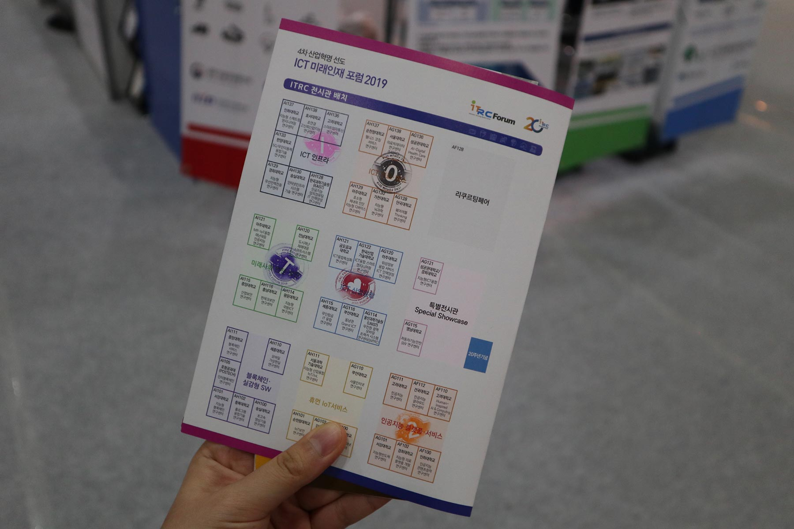

대학별 연구 성과를 발표하는 **ICT 미래인재 포럼 2019** 코너. 테마별로 도장을 찍을 수 있는 장소가 있어서 다 모으면 소정의 경품을 주는 이벤트가 있었다. 나는 4개를 모아서 아이스크림을 먹었다.

 

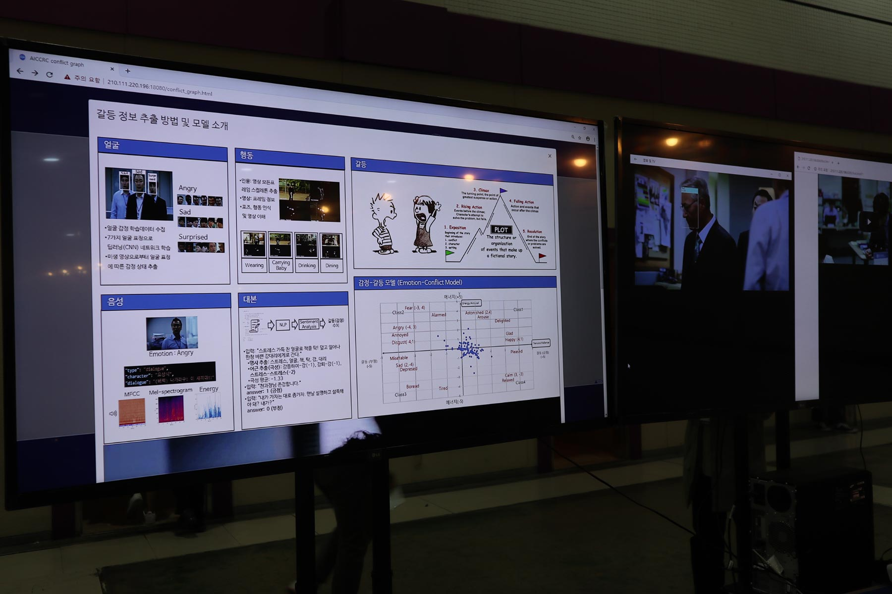

인공지능 플랫폼·서비스 부스에 있던 딥러닝을 이용한 갈등 정보 추출 모델. 이 외에도 다양한 연구들이 있었다.

 

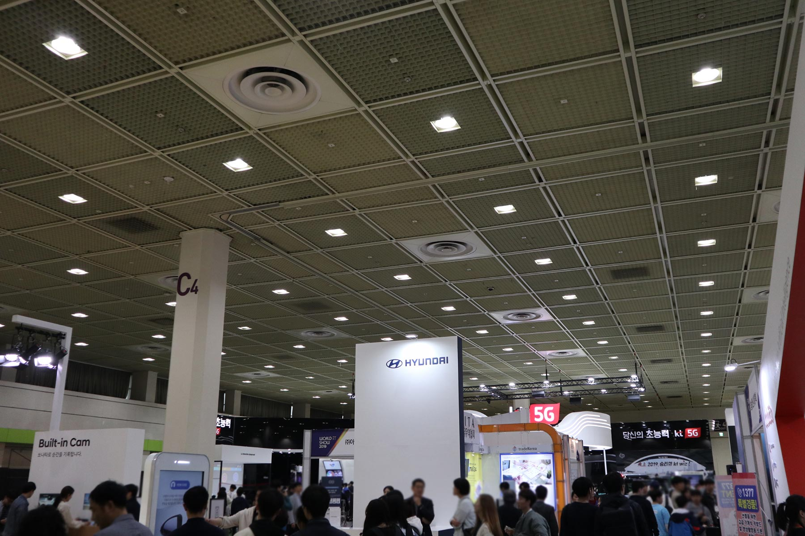

1층을 다 돌아보고, 관계자의 안내를 받아 3층 C관으로 이동했다. 대기업의 경우 여기저기서 기술 홍보를 많이 봤기 때문에 여기서 흥미를 가질만한 요소는 없었다. 그리고 대부분이 체험 위주의 부스여서 놀이공원에 온 기분이었다.

 

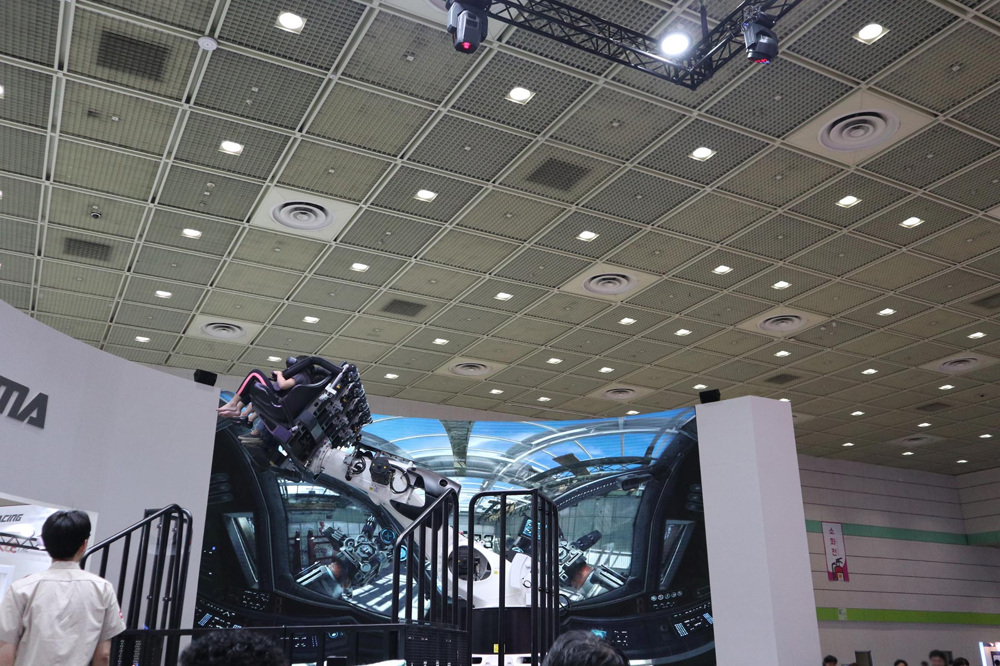

SKT는 진짜 놀이기구 같은걸 가져와서 더 그랬다. 

 

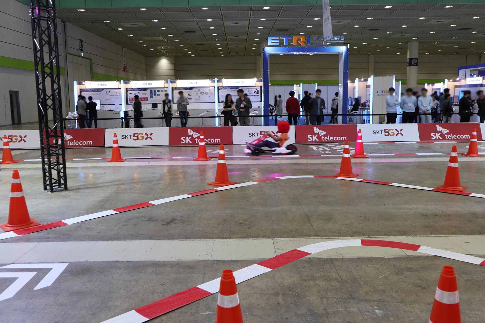

롤러코스터 같은 VR체험은 줄이 길어서 뭐라도 하고 가야겠다는 심정으로 옆에 카트 줄에 섰는데, 그냥 VR게임인 줄 알았더니 배찌같은 모자를 쓰고 저 트랙을 공개처형 마냥 도는 게임이길래 빠르게 줄에서 탈출했다.

 

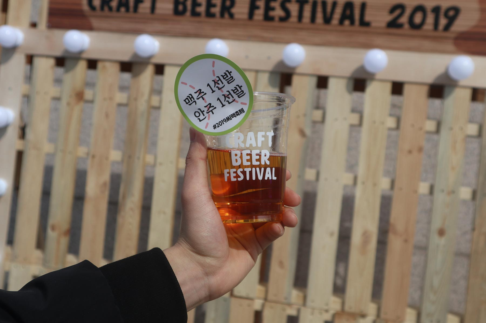

다 돌고 마침 코엑스 밖에서 **크래프트 비어 페스티벌** 을 하길래 맥주 한 잔 하고 집에 왔다. 

 

## 후기

작년에 비해 블록체인 관련 부스가 많이 줄어들었고, 장애인·어린이·노약자 등 사회적 약자를 위한 IoT, 키오스크, 산업용 AR 등이 많이 보였다. 또한 소프트웨어 시스템 보다는 IoT산업이 더 주를 이루고 있음을 알 수 있었다.

웹 분야에 종사하고 있기 때문에 실무와는 다른 분야의 전시회였지만, 현재 IT산업의 동향을 파악하고 이를 내 분야와 어떻게 연관지을 수 있는지 고민하는 것 또한 재미있는 경험이었다.