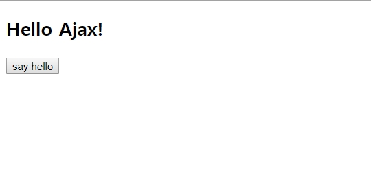

### Ajax란?

Asyncronous JavaScript and XML 의 약자로, 자바스크립트와 XML을 이용한 비동기적인 정보 업데이트 기술이다. 기존의 웹은 서버에 새로운 정보를 전달하기 위해서는 페이지 전체를 리로드 해야 했는데, Ajax는 이러한 리로드 없이 데이터를 부분적으로 교체할 수 있게 했다.


### 장점

- 페이지 이동 없이 부분적으로 데이터를 변경할 수 있다.
- 기존에 부과되었던 서버의 과도한 데이터 처리량을 줄일 수 있다.
- 클라이언트는 빠르게 새로운 데이터에 접근할 수 있다.


### 단점

- 검색엔진같은 로봇이 새로 변경된 정보에 접근할 수 없다.
- 리로드 없이 정보를 교환하므로 보안상의 문제가 생길 수 있다.
- IE와 같이 지원되지 않는 브라우저는 별도의 처리가 필요하다.


### 사용방법

사용방법은 jQuery로 쓰는 경우, 순수 JavaScript로 입력하는 경우, 마지막으로 fetch API를 사용하는 방법 등이 있다.


#### index.html

```html
<!DOCTYPE html>
<html lang="ko">
<head>
    <meta charset="UTF-8">
    <script src="https://ajax.googleapis.com/ajax/libs/jquery/3.2.1/jquery.min.js"></script>
    <title>Ajax Ex</title>
</head>
<body>
    <p id="title"></p>
    <input type="button" id="button" value="say hello" onclick="sayHello()"/>
</body>
</html>
```


#### hello.html

```html
<h2>Hello Ajax!</h2>
```


#### script 1. JavaScript

```javascript
function sayHello(){
    var hello = new XMLHttpRequest();
    hello.onreadystatechange = function(){
        if(this.readyState == 4 && this.status == 200){
            document.getElementById('title').innerHTML = this.responseText;
        };
    }
    hello.open('GET', './hello.html');
    hello.send();
});
```


#### script 2. jQuery

```javascript
function sayHello(){
    $.ajax({
        type: 'GET',
        url: './hello.html',
        dataType: 'text',
        error : function(){
            alert('Error!');
        },
        success: function(data){
            $('#title').html(data);
        }
    })
});
```


#### script 3. fetch API

```javascript
function sayHello(){
    fetch('./hello.html')
    .then((response) => {
        if(response.ok){
            return response.text();
        } else {
            alert('Error!');
        }
    }).then((text) => {
        $('#title').html(text);
    })
});
```


### Result




#### 다음에 공부할 것

PJAX = 웹페이지를 리로드 하지 않고도 부분적으로 데이터를 교체, 검색엔진 같은 로봇이 정보에 접근하는 것을 방해하지 않는 기술.

PWA Progressive Web Apps = SPA가 AJAX 기반, PWA는 SPA를 기반으로 만들어진 웹 + 오프라인에서도 동작하는 특성, SPA는 오프라인에서 동작하지 않음. 웹(언제나 최신 상태를 유지한다)과 앱(오프라인에서도 동작 가능)의 장점을 모은 소프트웨어를 만들 수 있음.


#### Reference

생활코딩 AJAX <https://opentutorials.org/course/3281/20435> 

