## 서론

봄이 끝났다고 느낄 즈음 휴가를 내서 제주도로 여행을 갔다. 일정을 정하던 중 컴퓨터 박물관을 갈지 다음 본사를 갈지 고민하다가 박물관을 가기로 정하고, 첫째날 바로 다녀왔다.

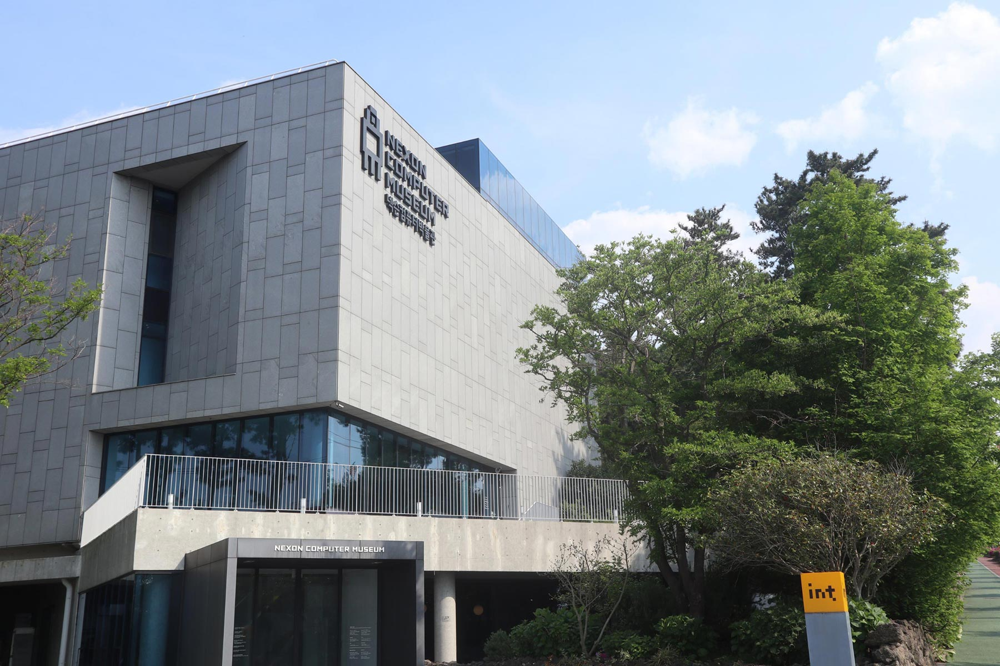

제주도 제주시에 위치한 [넥슨 컴퓨터 박물관](<http://www.nexoncomputermuseum.org/> ). 아시아 최초의 컴퓨터 박물관이라고 한다.

 

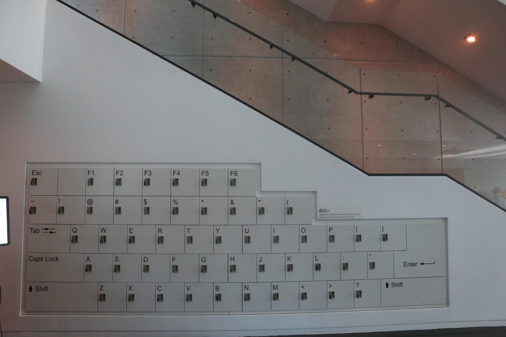

사물함을 키보드의 형태로 디자인 한 모습이 참신해서 찍었다. 이외에도 소소한 인테리어부터 이후에 설명할 전시 구조까지 컴퓨터 박물관이라는 이름에 걸맞게 고민한 흔적을 볼 수 있었다. 

 

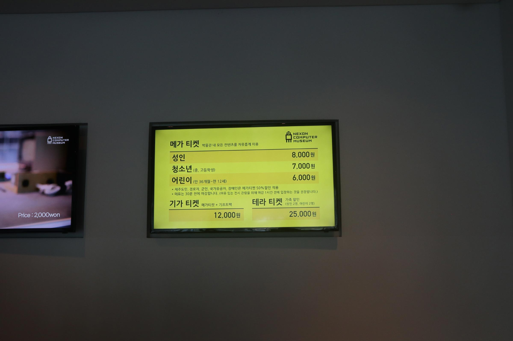

가격은 현장에서 구매하면 성인 8,000원이지만 온라인 구매가 더 저렴하다는 얘기를 들어서 네이버 예약에서 7,500원에 구매했다. 

 

 

## 1F : Welcome Stage

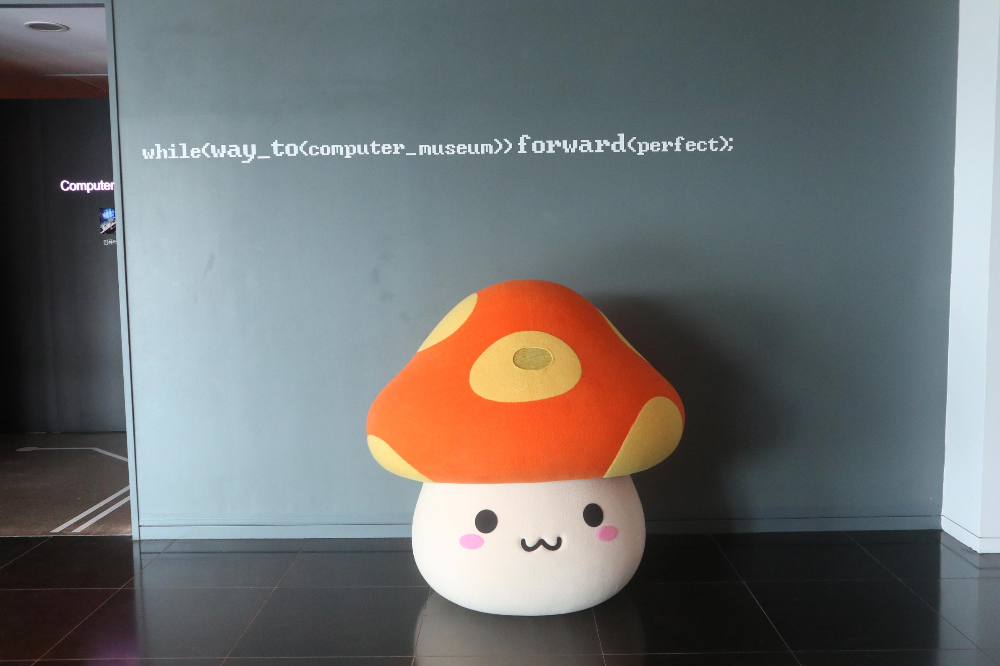

입구에서 친숙한 주황버섯이 반겨주는 1층 전시장은 컴퓨터 마더보드에 연결된 기기들의 발전사를 확인할 수 있으며, Apple Ⅰ이 전시되어 있다. 

 

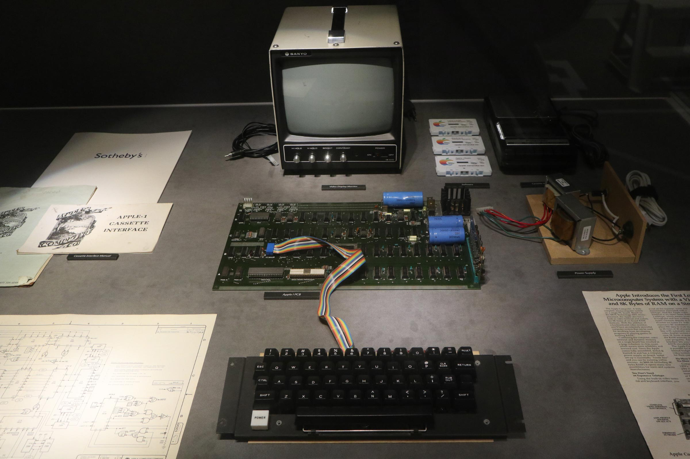

전 세계에 6대 밖에 없다는 작동 가능한 Apple Ⅰ의 모습. 모니터의 상단에 손잡이가 달려 있는 모습이 신기했다. 

 

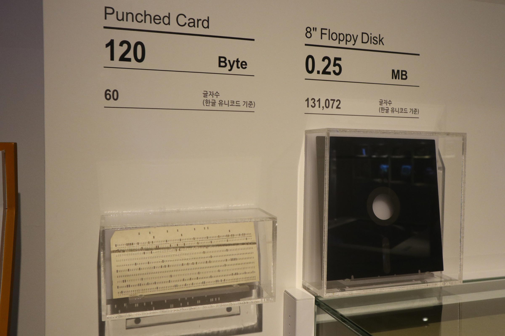

플로피 디스크 이전에 사용했다던 저장장치인 천공카드. 요즘 애들한테 플로피 디스크를 보여주면 이런 기분일까 싶었다.

 

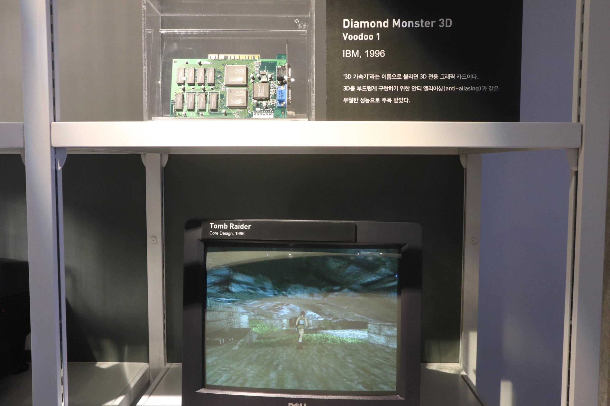

그래픽 카드의 경우 하단에 해당 카드를 사용한 게임도 같이 구현해주었는데, 2D가 3D로 바뀌고 3D가 더 섬세해지는 과정을 보는 재미가 쏠쏠했다.

 

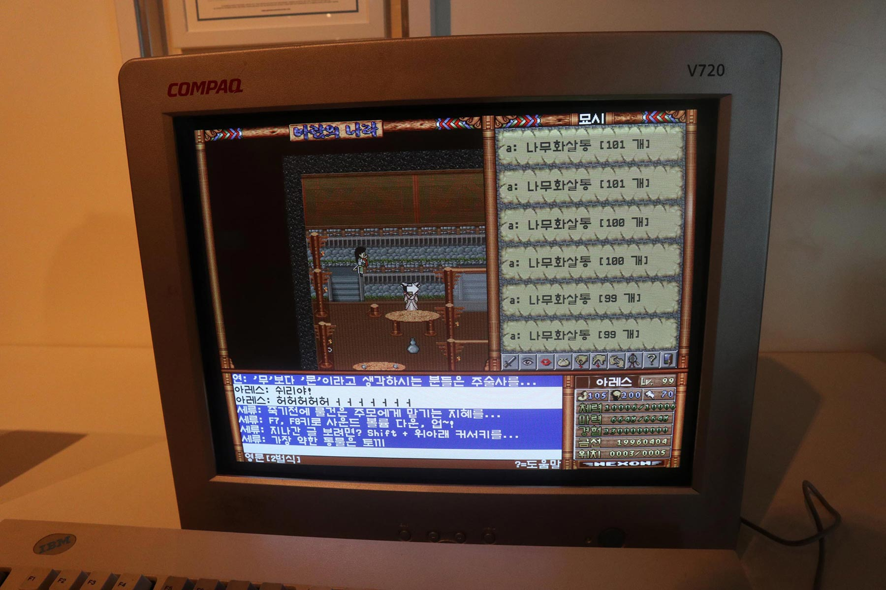

1층의 마지막 부스에선 초창기 바람의 나라를 체험할 수 있었다.

 

 

## 2F : Open Stage

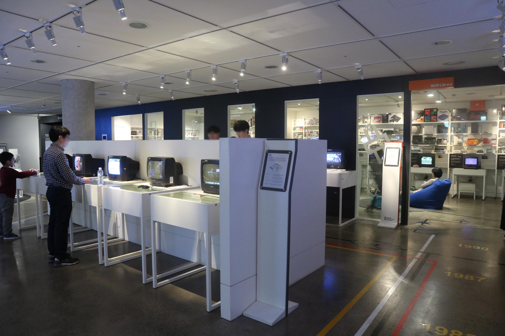

1층 전시장이 컴퓨터의 역사였다면 2층 전시장은 게임의 역사를 보여준 공간이다. 가장 오래된 게임 장르인 슈팅 게임의 과거와 현재를 확인할 수 있으며, 역사상 존재했던 다양한 게임 기기들의 모습까지 볼 수 있다.

 

2층의 경우 대부분이 체험형으로 조이스틱을 이용해 게임들을 직접 플레이할 수 있다.

 

안쪽에 위치한 NCM 라이브러리 부스에서는 과거의 게임팩 및 게임 기기들을 확인할 수 있다.

 

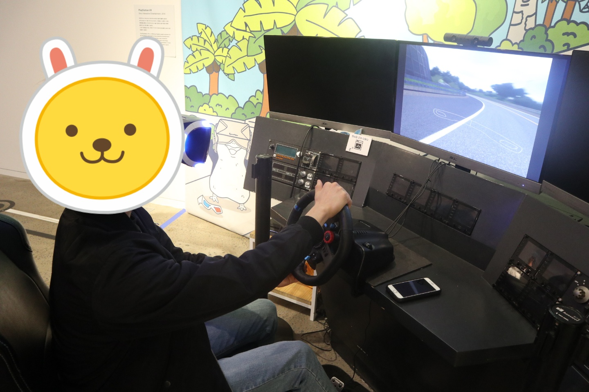

왼쪽에 VR게임 부스도 있는데 시간에 맞게 오면 안내에 따라 체험할 수 있다. 사진에 보이는 레이싱 게임과 사진에는 없는 리듬 게임을 했는데 제대로 꽂혀서 다음에 VR카페를 가야겠다고 생각했다.

 

 

## 3F : Hidden Stage

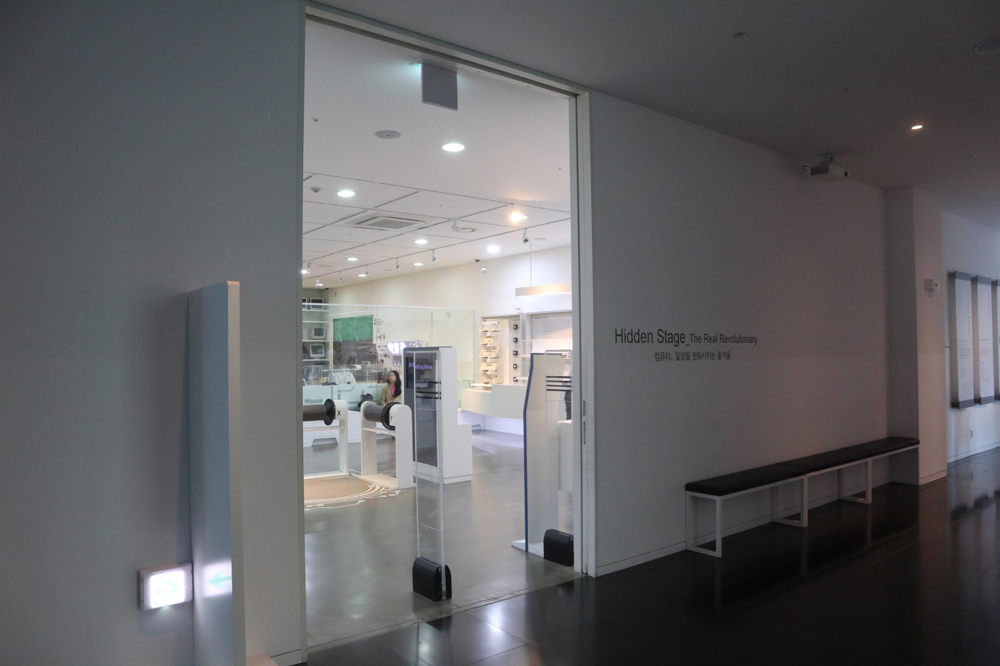

3층 전시장은 키보드와 마우스의 역사를 확인하고, 과거부터 지금까지 존재했던 컴퓨터를 홧인 할 수 있는 오픈 수장고 등으로 꾸려져 있다. 더불어 메이플 스토리 캐릭터를 이용한 코딩 교육도 진행하고 있다. ~~늙은이는 안되는 걸로...~~

 

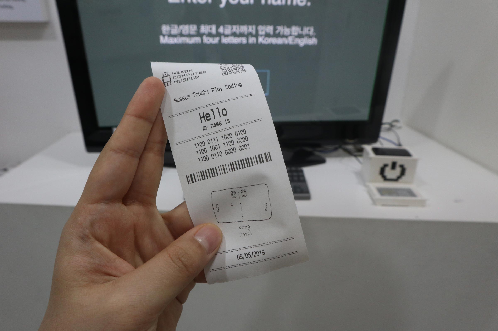

키보드로 이름을 입력하면 이를 컴퓨터가 인식하는 코드로 변환해주는 기기.

 

 

## B1F : Special Stage

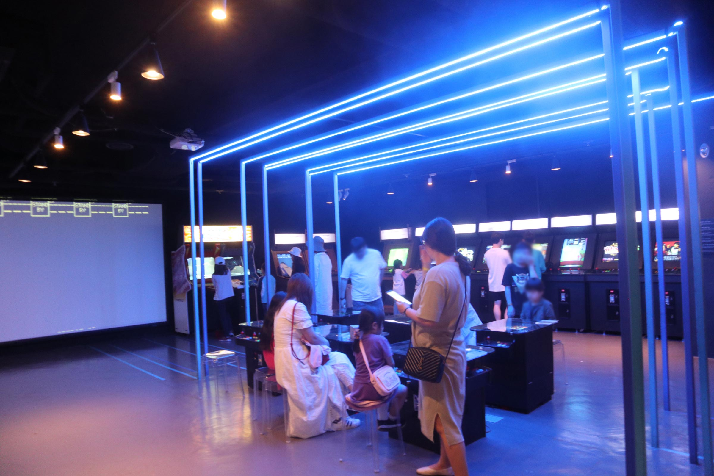

2층이 슈팅 게임 위주였다면, B1층은 아케이드 게임의 역사를 확인할 수 있는 공간이다. 

 

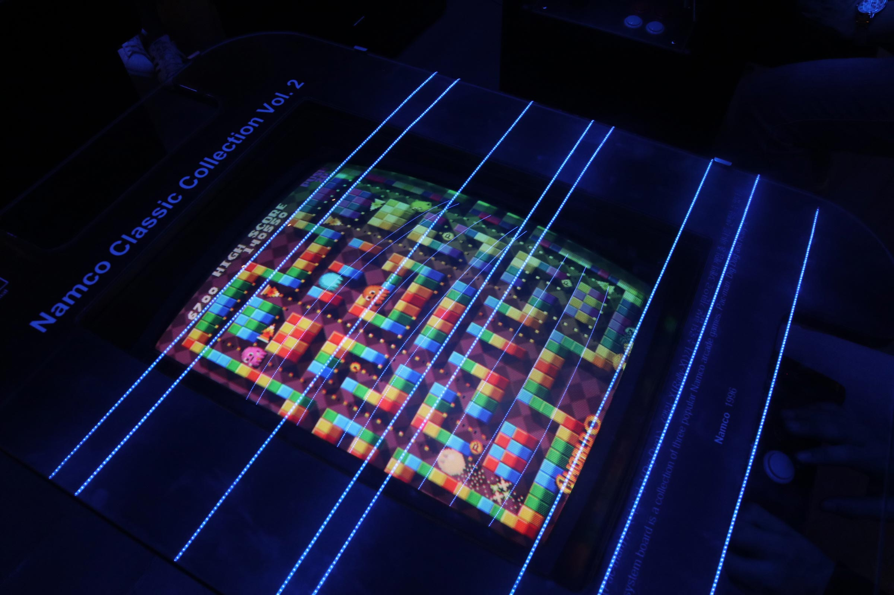

추억의 팩맨. 내 기억보다 그래픽이 많이 좋아져서 놀랐다. 

 

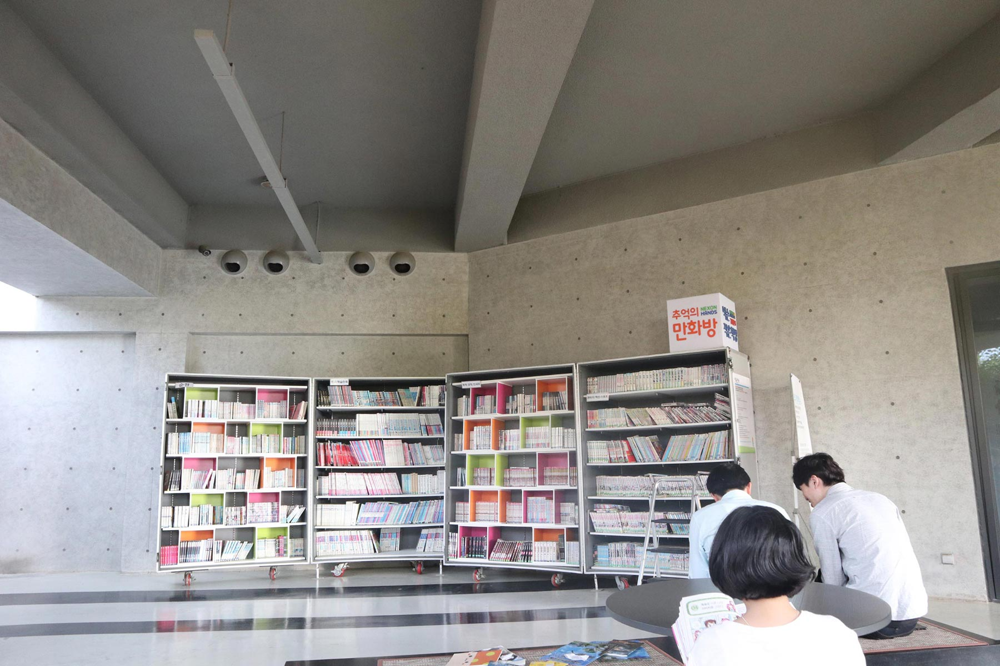

밖으로 나오면 만화책을 볼 수 있도록 꾸며놓았는데 최근에 완결난 코믹 메이플 스토리도 있어서 반가웠다.

 

 

## 후기

어린이날에 가서 그런진 몰라도 내 또래보다는 초등학생 아이들과 함께 온 가족 단위가 많았다. 또한 컴퓨터의 역사가 다른 학문에 비해 평균적으로 짧다 보니, 오래된 전시품들도 대부분 50년을 채 넘지 않았다. 

그러나 역사가 짧다는 것은 다르게 생각하면 박물관을 통해 과거를 추억할 사람들이 많다는 것이고, 그들이 서로 겪은 이야기를 공유하며 벽에 쓰여진 설명 그 이상의 가치를 만드는 모습은 컴퓨터 박물관이기에 가능한 광경 같았다. 

소문의 키보드빵은 여건 상 먹지 못해 아쉬웠지만 제주도를 여행한다면 한 번쯤 들러볼 만한 특별한 경험이었다.