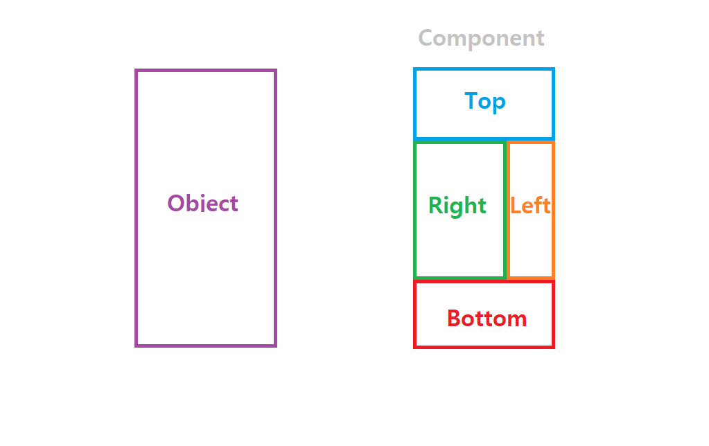

컴포넌트(Component)란 프로그래밍에 있어 재사용이 가능한 각각의 독립된 모듈을 뜻한다. 

그림에서 확인할 수 있듯이 컴포넌트 기반 프로그래밍을 하면 마치 레고의 블록처럼 이미 만들어진 컴포넌트들를 조합하여 화면을 구성할 수 있다.

웹 컴포넌트는 이러한 컴포넌트 기반 프로그래밍을 웹에서도 적용할 수 있도록 W3C에서 새로이 정한 규격이다. 웹 표준을 기반으로 구축되었으며, 최신 브라우저 및 모든 JavaScript 라이브러리, 프레임워크에서도 사용할 수 있다.

따라서 웹 컴포넌트를 이용하여 코드를 작성하면 Vue나 React와 같은 라이브러리, 프레임워크에 의존하지 않고 상호 운용이 가능하게끔 작성할 수 있다.

 

### 웹 컴포넌트의 규격

- **Shadow DOM** : DOM과 스타일을 캡슐화하여 메인으로부터 독립적으로 스크립트와 스타일을 처리할 수 있도록 한다.
- **Custom Elements** : HTML에 새로운 HTML/DOM 요소를 정의할 수 있는 JavaScript API.
- **HTML Templates** : 문서가 처음 로드될 때는 비활성화된 상태이지만, JavaScript를 사용하는 런타임에 나타나는 HTML 조각.
- **ES Modules** : 이전 규격이었던 HTML Import를 대체하여 나온 규격이며, 자바스크립트로 구현하는 모듈 시스템.

위의 4가지 규격을 함께 사용하는 것이 가장 이상적이지만, 사용하고 싶은 부분만 선택적으로 사용하는 것도 가능하다. 

 

### 폴리머

[폴리머](https://www.polymer-project.org/)는 대표적인 웹 컴포넌트 라이브러리 중 하나로, 구글에서 제공한다. 폴리머를 이용하면 재사용 가능한 웹 컴포넌트 생성이 가능하다.

 

### Refer

https://www.webcomponents.org

https://d2.naver.com/helloworld/188655

https://developer.mozilla.org/ko/docs/Web/Web_Components

