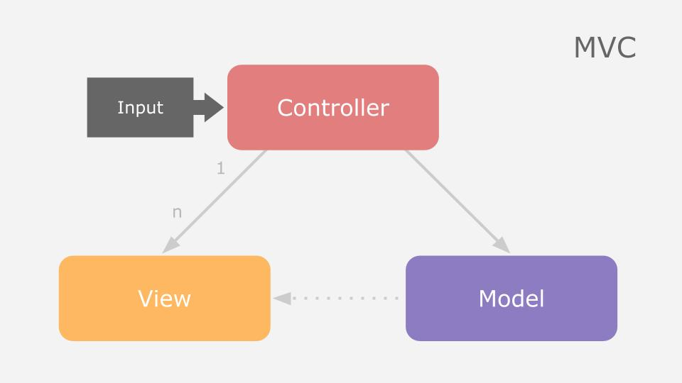
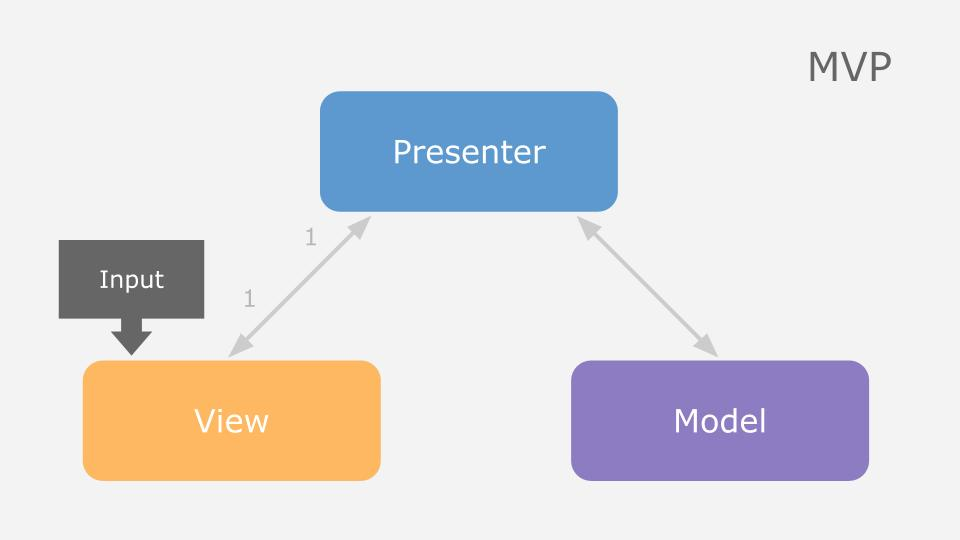
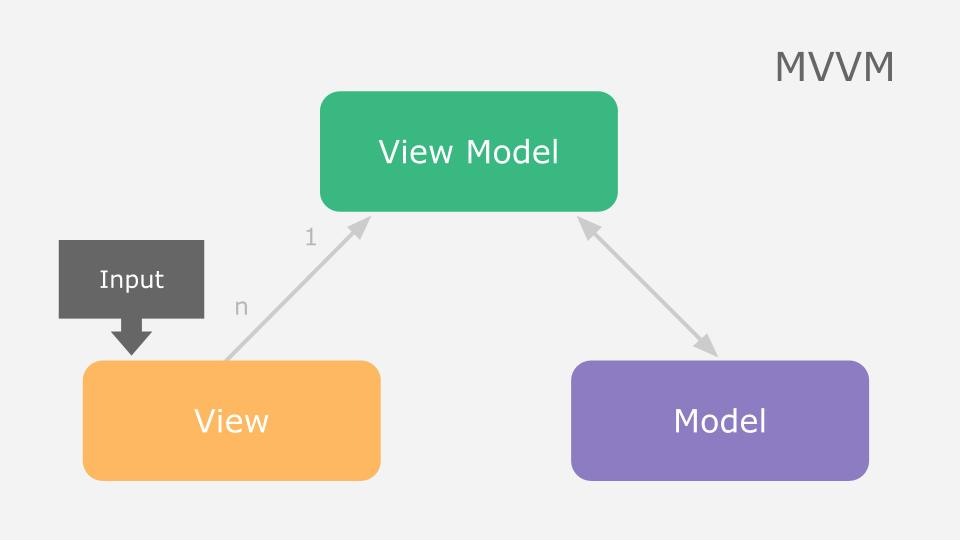

웹 개발을 하면서 만나게 되는 용어 중 하나가 **디자인 패턴**이다. 잘 설계된 디자인 패턴은 역할별로 패턴을 나누어 관리함으로써 개발자로 하여금 유지보수가 편리한 코드를 짤 수 있게 돕는다. 이번 포스팅에서는 디자인 패턴 중 MVC, MVP, MVVM 3가지 패턴들이 어떤 방식으로 동작하는지 알아보고 각 패턴별 장단점을 간략하게 설명하고자 한다.

 

## 디자인 패턴이란

[디자인 패턴]([https://ko.wikipedia.org/wiki/%EB%94%94%EC%9E%90%EC%9D%B8_%ED%8C%A8%ED%84%B4](https://ko.wikipedia.org/wiki/디자인_패턴))이란 소프트웨어 공학에서 사용되는 방법론이다. 건축학에서 건축을 하기 전에 어떤 기법을 사용할 것인지 설계하던 일을 프로그래밍 영역으로 확장한 것으로, 적합한 디자인 패턴의 선정은 개발하는 데 있어 협업 및 유지보수를 용이하게 한다.

디자인 패턴에는 수많은 종류가 있는데, 그 중 2개 이상의 패턴을 결합하여 사용하는 **컴파운드 패턴**(Compound Pattern)이라 부른다. 이러한 컴파운트 패턴 중 가장 많이 쓰이는 패턴이 **MVC**이며, MVC에서 파생되어 나온 패턴이 **MVP**와 **MVVM**이다. 

 

## 사전지식

> 모델(Model) : 어플리케이션의 데이터들을 의미한다.
>
> 뷰(View) : 화면에 보여지는 UI요소를 의미하고, 모델로부터 데이터를 가져와 사용자에게 보여주는 역할이다.
>
> 유지보수가 쉽고 개발의 효율을 높이기 위해서는 각 패턴 별로 역할을 나누어 관리하는 것이 중요하고, 때문에 모델과 뷰 간의 강한 결합을 피하는 것이 좋다.

 

## MVC (Model View Controller)

MVC는 **M**odel **V**iew **C**ontroller의 약자로 어플리케이션을 세 가지 역할로 구분한 대표적인 개발 방법론이다. 

> Controller : 사용자로부터 입력 받은 데이터를 가지고 모델과 뷰의 상호 작용을 관리한다.

 

#### 동작

1. 사용자의 input이 Controller를 통해 들어온다.
2. Controller는 필요한 데이터를 Model에게 요청한다.
3. Model은 데이터가 변경되었음을 Controller에게 전달하고 Controller는 변경을 적용할 View를 선택한다.
4. View가 Model에게 상태에 대한 데이터를 요청하고, 이를 이용하여 UI에 표현한다.

 

#### 장점

Model과 View 모델을 분리하여 서로 간의 간섭을 피하고, Controller라는 중간 관리자를 두어 간접적으로 의사소통을 함으로써 유연한 구조를 설계할 수 있다.

 

#### 단점

Model과 View의 의존성이 비교적 높기 때문에 어플리케이션의 구조가 복잡해질 가능성이 있다.

 

## MVP (Model View Presenter)

MVC의 Controller의 역할을 **Presenter**가 담당하는 패턴이다.

> Presenter : View에서 받은 요청을 토대로 Model 데이터의 상태를 변경하고, 이를 다시 View에 전달하는 역할이다.

 

#### 동작

1. 사용자의 input이 View를 통해 들어온다.
2. View는 필요한 데이터를 Presenter에게 요청한다.
3. Presenter는 Model에게 데이터를 요청한다.
4. Model은 변경된 데이터를 Presenter에게 전달한다.
5. Presenter는 View에게 데이터를 전달한다.
6. View는 받은 데이터를 UI에 표현한다.

 

#### 장점

Presenter가 Model과 View의 중간다리 역할을 하기 때문에 Model과 View 사이의 의존성이 없다.

 

#### 단점

Model과 View 사이의 의존성을 해결했지만, 역으로 Presenter와 View 사이가 1:1로 강한 의존성을 가진다.

 

## MVVM (Model View ViewModel)

Controller와 Presenter를 대신해 **View Model**이 존재하는 패턴이다.

>  View Model : View를 표현하기 위한 Model이다. 

 

#### 동작

1. 사용자의 input이 View를 통해 들어온다.
2. View는 필요한 데이터를 Command 패턴을 통해 View Model에게 요청한다.
3. View Model은 Model에게 필요한 데이터를 요청한다.
4. Model은 View Model에게 필요한 데이터를 응답한다.
5. Data Binding을 통해 View Model의 값이 변하면 View의 정보가 자동으로 변경된다.

 

#### 장점

Command 패턴과 Data Binding을 통해 View와 Model의 의존성을 없앤다.

 

#### 단점

View Model의 설계가 까다롭다.

 

## 결론

세 가지 패턴마다 각기 장단점이 다르듯이 어떤 패턴을 사용할지는 프로젝트의 성향에 따라 다르다. 또한 이번 시간에는 각 패턴의 동작을 간략하게 설명했는데, 다음에는 실제 프로젝트를 진행하면서 어떤 형식으로 View와 Model이 동작하는지 알아보면 좋을 것 같다.

 

## Refer

[MVC, MVP, MVVM 비교-마기의 개발 블로그](https://magi82.github.io/android-mvc-mvp-mvvm/)

[[디자인패턴] MVC, MVP, MVVM 비교-버미노트](https://beomy.tistory.com/43)

[MVC 디자인 패턴-생활코딩](<https://opentutorials.org/course/697/3828>)