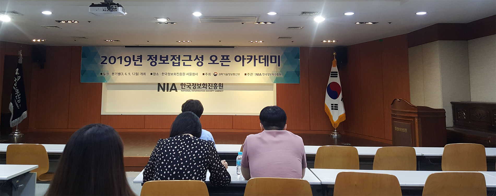
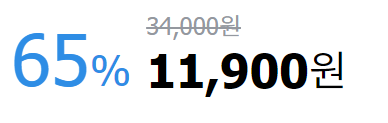
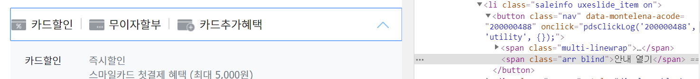
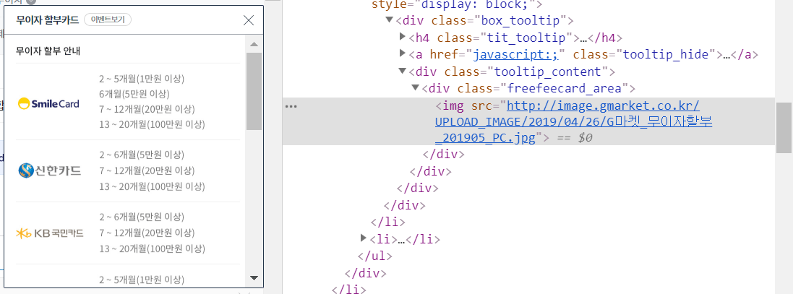
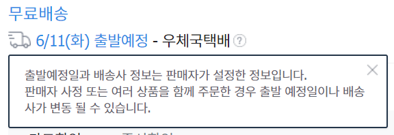
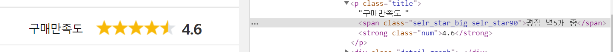
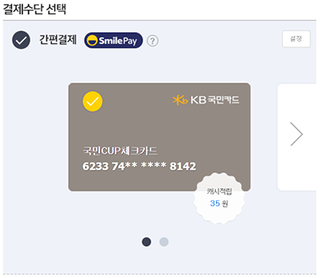
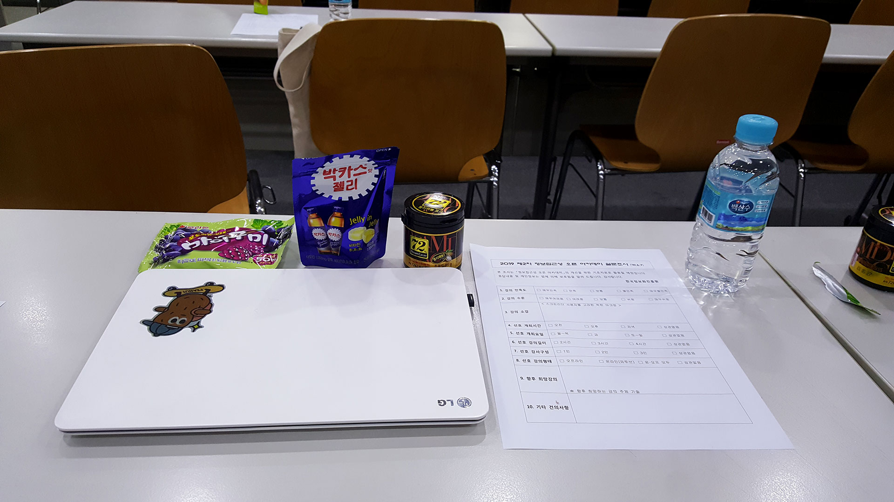

> 일 시 : 2019. 6. 7(금), 19:00~21:00 
>
> 장 소 : 한국정보화진흥원 서울청사(무교동) 지하1층 1회의실




[웹 접근성 연구소](<https://www.wah.or.kr:444/>)에서 주최하는 2019년 제 2차 정보접근성 오픈 세미나에 다녀왔다. 웹 퍼블리셔로 근무하면서 난감했던 업무 중 하나가 웹 접근성 준수였다. 중요성은 인지하지만 어디까지 준수해야 하는지 명확한 규칙이 없으며. 준수하는 방법 또한 작업자마다 천차만별이기 때문이다. 

따라서 이번 아카데미를 통해 미처 고려하지 못했던 잘못된 마크업들을 알아보고, 이를 해결하기 위한 다양한 접근성 준수 방법을 배우기 위해 신청했다.

<br/>

### 시각장애인을 위한 착한 마크업

강의는 실제 운영중인 홈페이지를 선정해 센스리더기를 이용하여 들어보고, 위배된 접근성이 있는지 알아보는 형태로 진행했다.

<br/>

#### 상황 1 : 숫자를 표시하는 경우



문제 : 센스리더기로 읽게 되면 **33% 59,000원, 39,000원** 으로 숫자 그대로 읽어주기 때문에 장애인은 취소선을 확인할 수 없으며 퍼센트(%)가 무엇을 의미하는지 알 수 없다.

해결 : 숨김처리로 '정상가' 59,000원 '할인가' 39,000원 으로 텍스트를 추가하여 정상가가 얼마이며 할인가가 얼마인지를 인지시켜주는 것이 좋다.

```html
<span class="hide">정상가</span>
<span class="normal_price"><s>14,200</s>원</span>
```

<br/>

#### 상황 2 : 열기 대체 텍스트가 변경되지 않는 경우 



문제 : 아코디언이 펼쳐졌음에도 불구하고, 숨김 텍스트가 변경되지 않아 '닫기'가 아닌 '열기'로 읽혀 시각장애인에게 혼란을 줄 수 있다. 

해결 1 : 아코디언이 펼쳐지면 텍스트를 변경하되, 열기는 새 창이 열리는 등의 경우를 기대하기 때문에 '펼침/닫힘' 텍스트로 대체하는 것이 좋음.

해결 2 : area-expanded를 적극 활용하자. ** 버튼이 열렸는지 닫혔는지 알고 싶은 경우  area-pressed를 사용한다.

<br/>

#### 상황 3 : 콘텐츠를 통이미지로 사용한 경우



문제 : 할부 카드 목록을 통이미지로 처리하여 센스리더기로 카드의 내용을 확인할 수 없다.

해결 : alt값을 넣어주거나 통이미지보다는 직접 코딩을 하는 것이 좋다.

<br/>

#### 상황 4 : 마우스가 호버되면 바로 툴팁이 열리는 경우




문제 : 센스리더기 사용자의 경우 의도치 않게 콘텐츠를 확인해야하며, 확대 기능을 사용하여 화면을 보는 사용자의 경우 마우스가 빠지면 툴팁의 모든 내용을 파악할 수 없다.

해결 : hover기능보다는 click기능을 이용해 사용자의 의도대로 툴팁이 열리고 닫이게끔 하는 것을 권장하며, 툴팁의 경우 role="tooltip"을 추가하는 것이 좋다.

<br/>

#### 상황 5 : 별점 콘텐츠



해결 : 별점 콘텐츠를 제공할 때는 별점이라는 설명 + 별점의 현재값 + 별점의 최대값을 함께 제공하는 것이 좋다.

<br/>

#### 상황 6 : 그래프 콘텐츠


해결 : 순서대로 읽히면 시각장애인의 경우 혼란이 올 수 있기 때문에 의미적으로 맞는 순서대로 마크업을 해 주는 것이 좋다.

<br/>

#### 상황 7 : 카드 결제



해결 1 : area-live 속성 사용하여 어떤 카드가 선택되었는지 인지하게끔 한다.

해결 2 : 체크박스, 라디오 버튼 등을 이용하여 스크린리더로 읽고 카드를 선택할 수 있도록 한다.

*캐러셀에서 wai-area를 이용한 예제가 있으니 참고하자.

<br/>

#### 기타

- 영상 플레이어에서 화면에 호버했을 때 컨트롤러가 올라가는 경우 키보드로 접근 가능할 수 있도록 해야 한다.

- 접근성을 위해 숨김텍스트를 추가하는 경우 마크업이 복잡해질 수 있기 때문에, 가능한 area 속성으로 넣어주는 것이 좋다.
- 센스리더기를 구매하는 것이 부담스럽다면 무료 배포중인 MVDA로 테스트 가 가능하니 참고한다.

<br/>



### 후기

회사에서는 대부분 숨김 속성만 이용하다보니 몰랐는데, 생각보다 `area` 속성이 상용화되어 있다는 사실을 알 수 있었다. 더불어 이번에 알게 된 내용들을 토대로 다음 프로젝트에서는 보다 다양한 사람들이 접근할 수 있는 웹을 만들 수 있도록 노력할 계획이다.