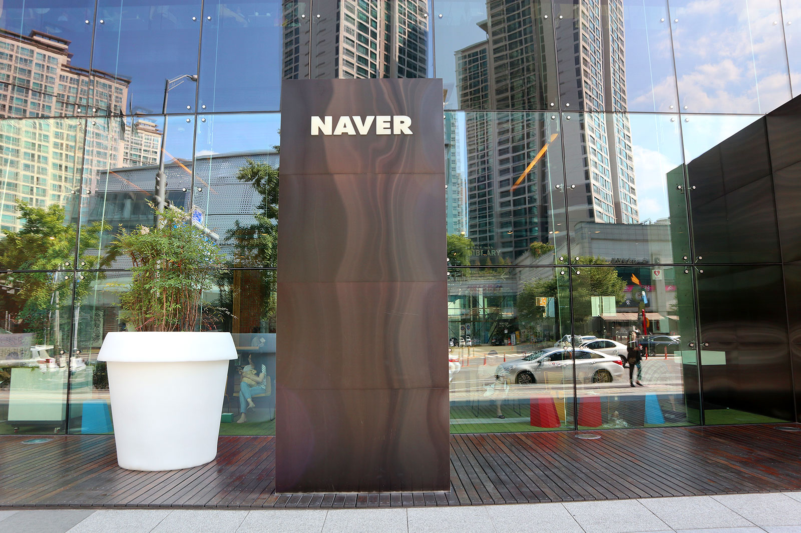
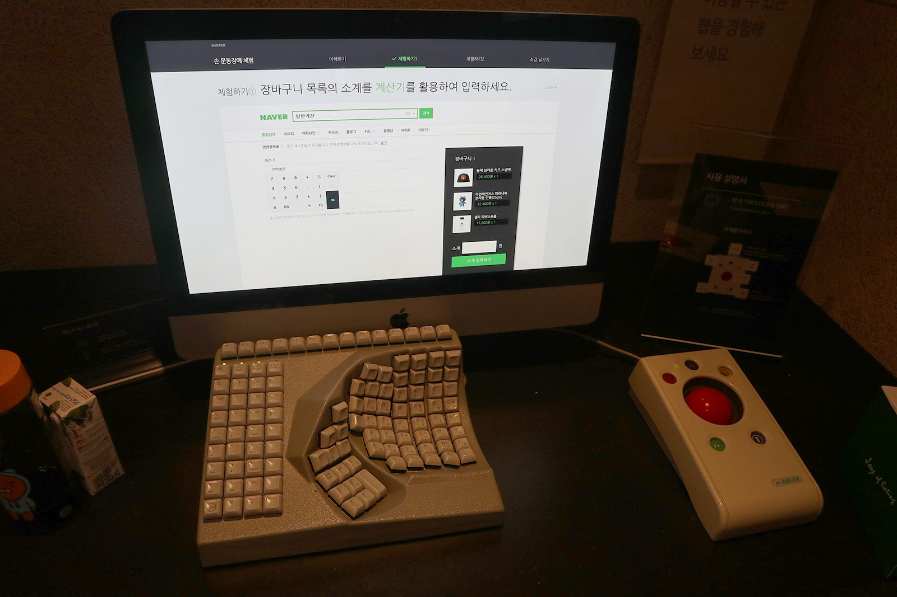

> 일 시 : 2019. 6. 25 (화)
>
> 장 소 : 네이버 그린팩토리 2층 커넥트홀

기회가 생겨 네이버에서 주관하는 제7회 널리 세미나에 다녀왔다. 

이번 주제는 AI & Acessibility with Education 였으며 총 8세션으로 진행되었다. 

당일 작성한 노트를 토대로 세션의 전반적인 내용 및 개인적인 소감을 작게나마 적어봤다.

 

### S1. 모두를 위한 제품 및 서비스 - 구글 웹 프로덕트 및 구글 플레이의 접근성

> 연사자 : 박재훈, 김민구

구글 플레이의 접근성 향상을 위한 프로젝트와 현재 운영 중인 트레이닝 및 컨설팅 프로그램에 대한 강연이었다.

#### 1. 대학생들을 위한 웹 접근성 교육

제작년부터 develop with google이라는 주제로 학생들을 위한 접근성 교육을 실시하고 있다. 연사자분께서 직접 교육 프로그램을 제작하시면서 어떤 이슈가 있었는지 설명해주셨다.

###### [프로그램 리스트]

1. "무엇이 문제일까요?" 퀴즈

   접근성에 문제가 있는 UI를 보여주고 문제점/해결방안 맞히기.

2. 스크린 리더 체험하기! - 조별미션

   글씨/배경을 모두 흰색으로 칠한 쇼핑몰 웹사이트를 제공하여, 스마트폰에 내장된 스크린 리더로만 읽을 수 있게 함.

   

#### 2. 구글 플레이의 접근성 프로젝트

구글 플레이 앱 개발사들과 협력하여 접근성을 개선하는 접근성 프로젝트 또한 2019년 4월부터 시작했다.

###### [구글 플레이의 접근성 리뷰 방법]

1. 토크백, 선택하면 읽어주기, 돋보기, 실시간 자막.

2. 접근성 검사기 어플리케이션.

3. 스위치 버튼을 사용하여 안드로이드 폰을 컨트롤

   => 컨설팅에서 발견된 50% 이상의 문제들은 쉽게 수정 가능.

4. 구글 플레이 사전 출시 리포트에 접근성 파트 추가. 구글 플레이 앱 출시한 사람들은 누구나 ai가 발견한 피드백을 받을 수 있다.

 

### S2. AudioBook! AudioClip

> 연사자 : 변우식

네이버 오디오 앱에서 제공 중인 AudioBook, AudioClip에 대해 소개하고, 사용자에게 어떤 도움을 줄 수 있는지 살펴보는 시간이었다.

AudioClip은 오디오에 적합한 키즈, 어학, 지식교양 카테고리를 중심으로 DB 확보하고, 이전에 CD로 음원을 제공하던 것을 오디오 클립으로 제공하고 있다.

AudioBook은 AudioClip에서 책을 결합하여 새롭게 시도한 콘텐츠이다. 살인자의 기억법, 노르웨이 숲과 같이 검증된 책을 중심으로 연극배우, 셀럽, 작가 등 다양한 창작자들의 목소리로 책을 들을 수 있도록 제작되었다. 

정보를 습득하는 방법이 다양화되고 있다는 점에선 흥미로웠으나, 다만 아직까지는 사람이 직접 목소리를 녹음하는 방식이 최선이라는 점이 아쉬웠다. 

 

### S3 : WCAG 2.1 Reflow 성공 기준에 대응하는 우리들의 자세

> 연사자 : 지훈

WCAG 2.0 이후 10년만에 발표된 WCAG 2.1 권고안의 기준 중 `Reflow`항목에 대해 탐구하는 시간이었다.

#### 1. 성공기준 1.4.10 리플로우(AA)

저시력 사용자의 경우 각 줄을 읽을 때 좌우를 반복해야하기 때문에 텍스트를 정상적으로 읽는 것이 거의 불가능하다. 따라서 사용자가 콘텐츠 크기를 확대할 때 화면(viewport) 내에서 모든 정보를 보거나 기능을 사용할 수 있어야 한다는 의미에서 **리플로우** 항목이 추가되었다. 

>  콘텐츠는 정보나 기능의 손실 없이 양방향으로 스크롤되지 않도록 제공되어야 한다.
>
> (CSS 픽셀 기준, 너비는 최소 320px, 높이는 최소 256px)

브라우저별 크기가 달라지는 반응형 웹은 일반적으로 성공 기준에 충족한다. 

리플로우의 경우 반영이 확정된 것은 아니며 올 해 하반기에 설문조사를 토대로 최종 반영 여부가 결정된다고 한다. 저시력 사용자의 경우 어떤 방식으로 웹을 이용하는지 알 수 있었고 어떻게 이들을 위한 웹을 만들어야 하는지 알 수 있던 기회였다.

 

### S4 : 비슷하지만 다른 웹과 모바일 접근성

> 연사자 : 이선주

웹에만 있거나 모바일에만 있거나 아니면 동시에 있어서 헷갈리는 접근성 항목들을 다루는 시간이었다.

#### 웹과 모바일이 다른 기능

| 웹                                                           | 모바일                                                       |
| ------------------------------------------------------------ | ------------------------------------------------------------ |
| 키보드 사용 보장                                             | 누르기 동작 지원 (터치기반이므로)                            |
| 컨트롤 대각선 길이 6mm이상                                   | 컨트롤의 크기와 간격가로 세로 각각 9mm 이상                  |
| 반복 영역 건너뛰기                                           | 반복영역 건너뛰기가 없음. (메뉴버튼이 있기 때문에 굳이)      |
| 제목 제공 (title 태그를 이용하는 등, 스크린리더 사용 시 헤딩만 건너뛰는 기능이 있음) | 제목 제공 필수 아님. 그러나 사용자 편의를 위해 제공해주는 것이 좋다. |
| 표의 구성(캡션으로 제목과 요약정보 제공)                     | 표의 구성 X                                                  |

#### 모바일에만 있는 기능

1. 알림 기능 (알림은 시각, 청각, 촉각 중 2가지 이상 방법으로 지원할 경우 준수)
2. 사용자 인터페이스의 일관성 (동일 서비스에서는 동일 UI 제공)
3. 폰트 관련 기능의 활용 (글자 크기를 변경할 수 있도록 제공하는 것이 좋다. 참고로 웹은 없음)
4. 보조 기술과의 호환성 (앱이 잘 실행하다가 스크린 리더 실행 시 앱이 다운되거나 기능이 작동하지 않으면 오류 & "~~버튼", "--링크"와 같이 컨트롤의 용도나 유형 정보를 제공해야 함.)

 

### S5 : 스크린리더 사용자를 위한 PDF 및 PPT 문서 접근성 적용하기

> 연사자 : 김형섭

HTML문서 뿐만 아니라 PDF와 PPT와 같은 문서 플랫폼에 따른 접근성 설정 방법에 대해 공유하는 시간이었다.

#### 문서 플랫폼별 접근성 설정 방법

1. 워드 : 스타일을 적용(제목1, 목록1 등의 컨텐츠가 있음). 수정이 필요할 경우 스타일 수정 메뉴에서 변경.

   표의 경우 제목 부분을 드래그하여 오른쪽 마우스 버튼 > 속성 > 행  > 페이지마다 머리글 행 반복.

   이미지는 오른쪽 마우스 버튼 > 대체텍스트 편집 or 장식으로 편집

   저장은 PDF선택 시 옵션 > 접근성을 위한 문서 구조 태그 체크 후 저장

2. PPT : 홈 > 도형 > 정렬 > 선택 창 가면 위치를 파악할 수 있는데 스크린리더는 맨 아래부터 읽어줌

   이미지는 워드와 동일하게 대체 텍스트 편집에서 수정.

   상태 표시줄에 접근성 조사 필요가 있어 접근성에 위배되는 항목을 파악할 수 있음. => 포커스를 맞추고 권장 작업에서 수정.

   but. PPT를 PDF로 변경할 경우 한글은 띄어쓰기가 다 무시된다.

3. 한글 : 한글은 별도의 접근성 기능이 없음.

   스타일을 워드 형태로 만들어서 다른 이름으로 저장에서 워드로 저장하고 이를 워드에서 다시 PDF로 저장하는 방법이 있음.

4. 인디자인 : 각각의 스타일을 지정하고 태깅하는 기능이 있음.

 

### S6 : 접근성은 별책부록 

> 연사자 : 김혜일

키오스크, AI스피커와 같은 현대 기기들이 대부분 하나의 감각에만 의존하는 맹점을 지적하고, 이러한 문제점을 빅데이터와 AI등의 현대 기술을 이용하여 해소시킬 수 있는 방법을 알아보는 시간이었다. 

##### AI를 이용한 접근성 사례

- Microsoft의 Seeing AI
- SNS에서 지원하는 자동 대체텍스트

별책부록으로 어쩌다보니 얻어지는 접근성이 아니라 장애인들을 진정한 소비자로 대우해주는 접근성의 고려가 필요성을 중심으로 한 강연이었다. 

 

### S7 : 듣고 말하는 서비스로 발전하는 네이버 어학사전의 접근성 개선

> 연사자 : 방설주

현재 제공 중인 네이버 어학사전 내 접근성과 다양한 개선사례들 살펴보는 시간이었다.

연사자는 네이버 어학사전에서 접근성을 담당하시는 분이셨는데, 중국에도 활동하고 계심에도 이번 강연을 위해 한국으로 오셨다고 들어 인상 깊었다.

##### 어학사전에서 새롭게 개선한 접근성

- 팝업레이어 제공 시 진동과 함께 대사 추가
- 음성 인식으로 인한 검색 기능을 제공, 인식 버튼에는 대체텍스트 추가

 

### S8 : 청각장애인 택시 운전기사를 위한 접근성

> 연사자 : 송민표

청각장애인 택시 운전기사와 승객 간의 의사소통 어플리케이션 **고요한 택시** 의 기획과 개발 과정을 공유하는 시간이었다.

장애인이 서비스 제공자가 되는 경우 어떤 문제점이 발생하며 특히 비장애인이 장애인을 위한 앱을 만들 때 겪을 수 있는 다양한 사례들을 알게 되어 의미 있는 시간이었다.

##### 고요한 택시에서의 접근성(기사)

1. 콜이 왔을 경우 깜빡이 제공
2. 버튼식 소통방식 제공 (택시 내에서 정형화되어 있는 의사소통을 버튼으로 옮김)
3. 손으로 쓰는 방식 (청각장애인이 비장애인과 소통 시 필담을 자주 하는 것을 고려)

##### 고요한 택시에서의 접근성(승객)

1. 기사님의 메시지를 음성으로 읽어주는 방식
2. 전달 방식으로 음성, 키보드, 손으로 쓰기 제공.
3. 네비게이션은 탑재 중이나 아직 테스트.

 

## 후기

>  쉬는 시간에 네이버 접근성 부스에서 체험한 기기.

네이버를 비롯한 다양한 웹 분야에서는 몇 년 전부터 접근성에 대해 꾸준히 관심을 갖고 있었다는 사실을 처음 알게 되었다. 실제 제공되는 서비스부터 앞으로 기획중인 방향까지 다양한 분야의 접근성에 대해 듣고 공유할 수 있었던 시간이었다.

아쉬운 점은 접근성에 관심이 없다면 이런 세미나가 있다는 것을 몰랐을 정도로 홍보가 적었던 점이다. 또한 쉬는시간에 네이버에서 관리하고 있는 접근성 부스 체험이 가능했는데 부스 자체도 작고 회전율도 좋지 않아서 나같은 경우는 쉬는 시간이 끝나기 5분 전 간신히 들어갔다 나올 수 있었다. 

이런 저런 사족이 있었지만 결과적으로는 내년에 또 기회가 생긴다면 참석할 의향이 있을 정도로 괜찮은 세미나였다. 소중한 경험을 공유해주셨던 연사자분들께 이 자리를 빌어 감사의 말씀을 드린다.

