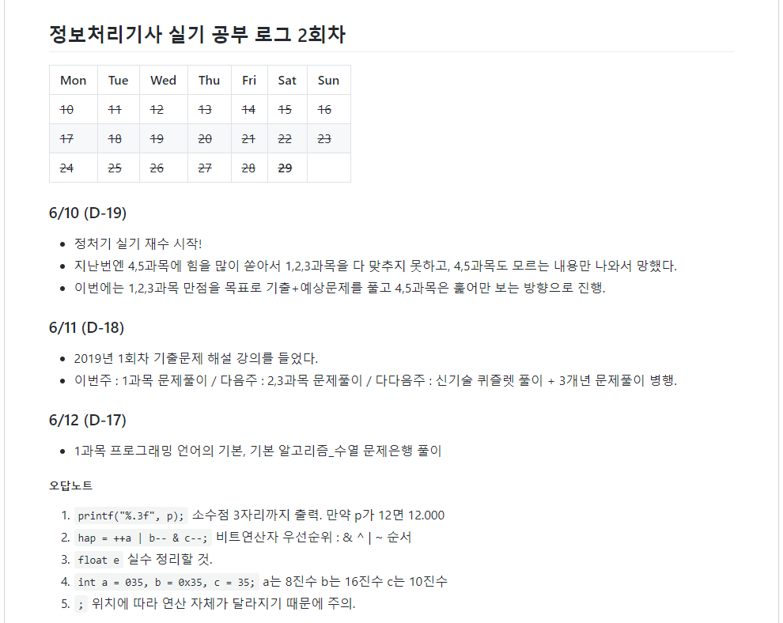
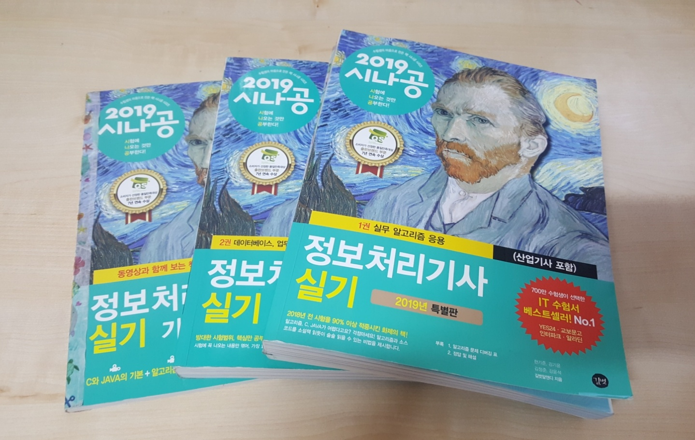
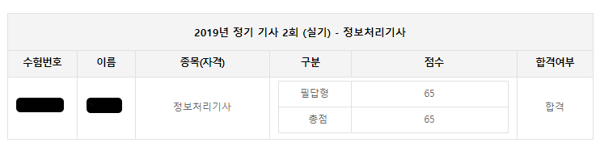

### 뭐든 2회차가 재밌지 

사실 1차 실기를 지원했으나 57점으로 불합격이 나와서(...) 예상치 못한 재수를 시작했다. 마침 퇴사로 인해 시기가 적절해서 기간은 짧았지만 충분히 집중할 수 있었다. 

나처럼 비전공자면서 정보처리기사를 공부하는 분들에게 조금이나마 도움이 되길 바라며 내가 공부한 방법과 과정을 간략하게 적었다.

  

### 공부방법  

> 책, 퀴즐렛, 기록

**하루에 4시간**씩 **3주**간 공부했다. 책은 필기와 동일하게 **시나공 2019년 개정판**으로 공부했고, 시험 3일 전부터는 전년도 기출문제 풀이를 진행했다. 인강을 들을까 고민도 했지만 책에 나와있는 문제들만 다 이해하면 충분할 것 같아 구매하지는 않았다.

3, 4, 5과목은 [퀴즐렛](<https://quizlet.com/ko/mission>)의 도움을 많이 받았다. 단어 어플로 다른 사용자들이 등록한 학습 세트를 이용할 수 있는데, 정보처리기사 학습 세트도 과목별로 다양하게 있어서 틈날 때마다 풀었다.

필기와 마찬가지로 실기도 깃허브 TIL 레포지토리에 당일 공부한 기록들을 올리며 동기부여를 했다.

*깃허브에 적은 기록들. 이런 형식으로 시험당일까지 적었다.*

  

### 공부과정  

> 1, 2, 3과목에 집중. 4, 5는 시간이 나면.

**4,5과목에 무리하게 시간을 쏟은 것이 1회 불합격 요인이었다.** 5주 동안 공부를 했는데 그중 2주를 4,5과목을 풀었으니...단어는 많이 외울수록 이득일 거라 생각했는데 시험지에서는 생전 처음 보는 단어가 절반이었다.

따라서 2회 준비는 1, 2, 3과목에 집중하고 4, 5과목은 시험 일주일 전 3일 정도 훑어보는 것으로 끝냈다. 

1과목 알고리즘의 경우는 디버깅만 잘 해도 대부분은 풀 수 있었는데, 2과목이 문제였다. SQL문은 부분 점수가 없어서 문법 하나라도 틀릴까 노심초사하며 풀었던 것으로 기억한다.

4, 5과목 중 신기술 동향, 전산 영어는 들인 시간 대비 결과가 좋지 않음을 몸소 체험했기 때문에 대신에 출제 확률이 높은 정보 보호 및 보안에만 집중했다. 

*믿어요 시나공.*

  

### 결과

집중한 결과 **65점으로 합격**했다. 참고로 실기는 부분 점수의 영향인지 가채점 결과보다 더 높게 점수가 나온다. 나 또한 가채점 결과는 58점이었다.

실기는 한 번 실패를 맛보고 합격해서 그런지 더 감회가 새롭다. 조금 시간이 걸리긴 했지만 2019년 목표 중 하나를 달성할 수 있게 되어 뿌듯하다:)

