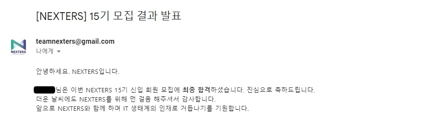
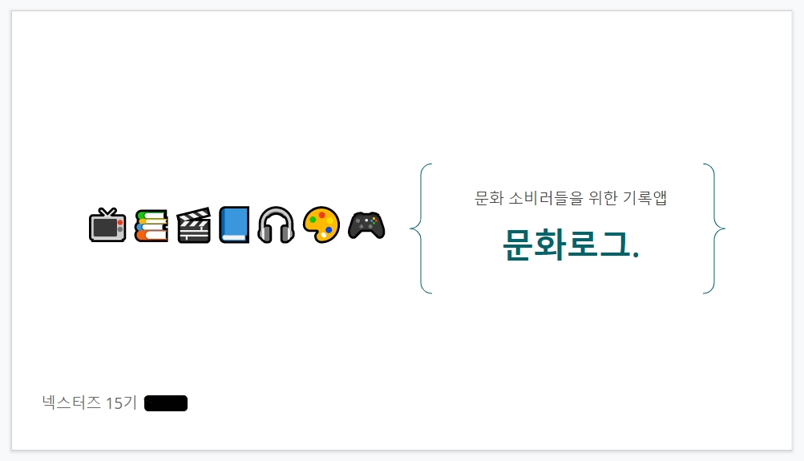
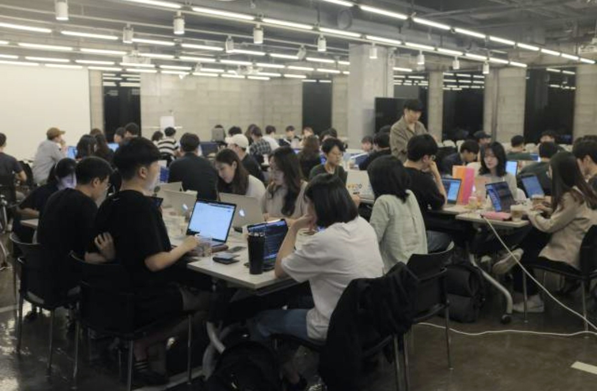
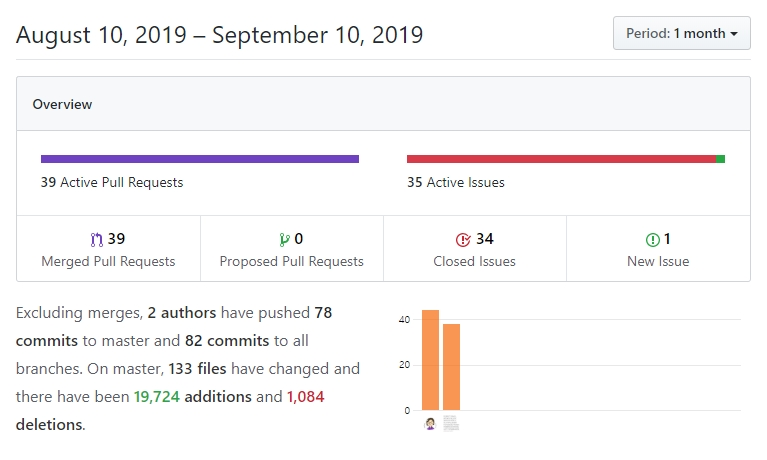
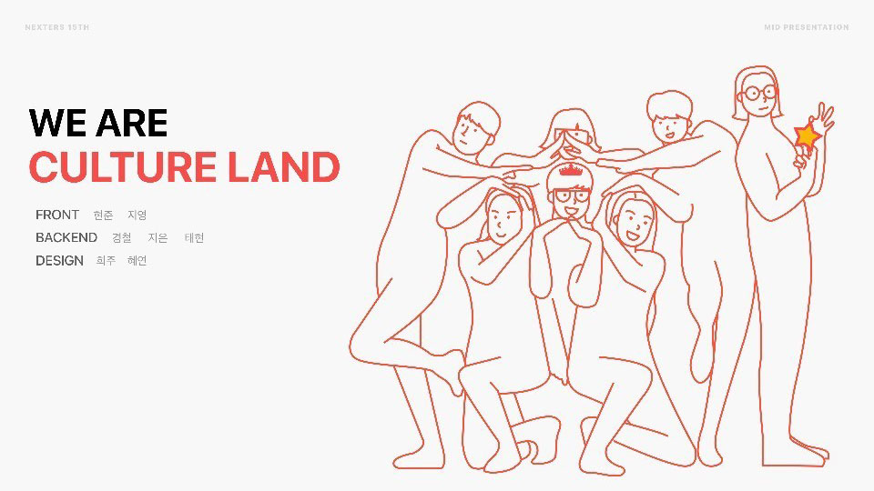

### 지원동기 및 선발과정

실무 경험이 없는 비전공자인 나를 돌이켜봤을 때, 혼자서도 가능한 기술 습득은 노력의 유무를 제외하고는 무리가 없었지만, 내가 기술적으로 어느 정도 위치에 있는지 혹은 기술자들의 협업은 어떤 방식으로 이루어지는지에 대한 이해도는 부족했다. 

**IT 연합 동아리 [NEXTERS](<http://teamnexters.com/>)에 지원하게 된 것이 그 이유였다.** 디자이너와 개발자들이 약 2달 간의 방학 기간동안 하나의 프로젝트를 진행한다는 점이 실제 협업의 과정을 조금이나마 체험할 수 있으며, 또래 개발자들과도 친목을 쌓을 수 있는 기회였기 때문이다.

서류전형에서는 지원 동기, 나의 강점 등 자기소개서에서 자주 보았던 문항들이 있었고, 팀워크가 중요한 동아리이다보니 협업과 관련된 문항도 있었다.

면접에서는 서류와 관련한 질문들과 간단한 손코딩이 있었고, 제대로 답변을 못 해 떨어질 줄 알았는데 합격 메일을 보고는 정말 기뻤다!

*야호!*

 

### 팀빌딩

팀은 활동 회원들의 아이디어 중 투표를 통해 선발하여 **총 10개의 팀으로 구성**되었다. 

내 아이디어도 선발되어 팀빌딩 시간에 다른 사람들에게 아이디어를 어필해야 했는데, 이 때가 제일 긴장되고 힘들었다. 새삼 마케팅은 아무나 하는게 아니라는 사실을 깨달았다.

허점이 많이 보이는 아이디어였는데, 흥미를 갖고 함께 팀이 되어 준 팀원들에게 감사하다:)

*발표에 사용했던 PPT 첫 페이지*

 

### 정규 세션

**매주 토요일에 열리는 정규 세션은 총 8회에 걸쳐 열렸다.**

주로 초청 연사의 강연 및 다른 팀에게 우리 팀의 진행 과정을 설명하는 시간을 가졌는데, 연사 강연은 소프트웨어 아키텍쳐, 협업에 대한 토크쇼 등 전문적인 주제부터 실무에 관한 주제까지 다양했다. 

특이한 점은 하루 종일 코딩만 하는 세션도 있다는 것이었다. 런칭을 앞두고 불태우는 **NEXTERS Night**, 줄여서 넥나잇이라고 하는데 실제로 오후 2시에 모두가 모여 새벽까지 계속 디자인/코딩만 했다. 항상 혼자서만 하다가 다같이 실시간으로 의견을 주고받으며 코딩을 하는데 신기한 경험이었다.

 

### 프로젝트 진행

정규 세션에서는 실제 프로젝트에 관련한 논의를 할 시간이 부족하기 때문에, 일주일에 한 번 팀별로 모여 회의를 하고 진행상황을 공유한다.

약 2주 간은 팀원 모두 모여 아이디어를 구체화하고, 남은 시간 동안 디자이너, 앱 개발자, 백엔드 개발자끼리 맡은 파트를 작업한다.

우리 팀은 **디자이너 2명, 앱 개발자 2명, 백엔드 개발자 3명**으로 꾸려졌고, 나는 **React Native 앱 개발**을 맡았다. 리액트만 써봤지 네이티브는 처음이라 잘 할 수 있을지 걱정이었는데 같이 앱 개발을 맡았던 팀원의 도움을 많이 받았다. 착한 사람...

state관리는 `Redux`와 `Redux-Saga`를 사용했다. 작업 중에는 시간도 오래 걸리고 눈도 아파서 이 번거로운 일을 왜 해야하나 싶었는데, 다 완성해놓고 보니 관리도 편하고 사람들이 왜 쓰는지 알 것 같았다.

마지막 2주는 매일 새벽까지 밥 먹고 코딩만 했다. 살면서 이렇게 코딩에만 매달린건 처음이었다. 

*그때 우린 미쳤었죠...*

 

### 결과

결론부터 말하자면, 아쉽게도 **동아리 세션 종료일까지는 앱을 런칭하지 못했다.** 예상치 못한 기능들로 인한 api의 추가가 주요 원인이었다. 이외에도 리팩토링 및 자잘한 이슈가 있어 이번주까지 개발을 마치고 배포를 진행할 예정이다. 

 

### 후기

IT 동아리 활동은 처음이었고, 또 별도의 교육 없이 바로 작업에 들어가야 했기에 다른 무엇보다 나에게 주어진 몫을 다 할 수 있을지가 가장 큰 과업이었다.

그런 나에게 가장 큰 동기가 되었던 건 다름 아닌 **팀원들의 응원과 격려**였다. 더 좋은 서비스를 위해 밤낮없이 노력하는 모습들을 보며 나 또한 책임의식을 가질 수 있었고, 때문에 맡은 몫을 다 하기 위해 최선을 다했다. 

동아리에 들어와서 새 스킬을 익히고 기술적으로 성장한 일도 중요하지만, 좋은 사람들과 함께 작업할 수 있는 기회를 가졌다는 사실만으로도 기억에 남을 2달이었다.

마지막으로 동아리의 장점을 정리하자면,

1. 2달의 기간 동안 하나의 결과물을 만들 수 있다. (웹, 앱 등)
2. 다른 파트와의 협업을 통해 실무 프로세스를 체험할 수 있다.
3. 평소 관심 있던 기술 스택이나 협업 툴을 시도해볼 수 있다.
4. 다양한 사람들과 소통하는 네트워킹의 장이다.

따라서 **나는 NEXTERS 활동을 추천한다.** 만약 동아리 지원을 망설이고 있다면 이 포스팅이 도움이 되길 바란다:)

