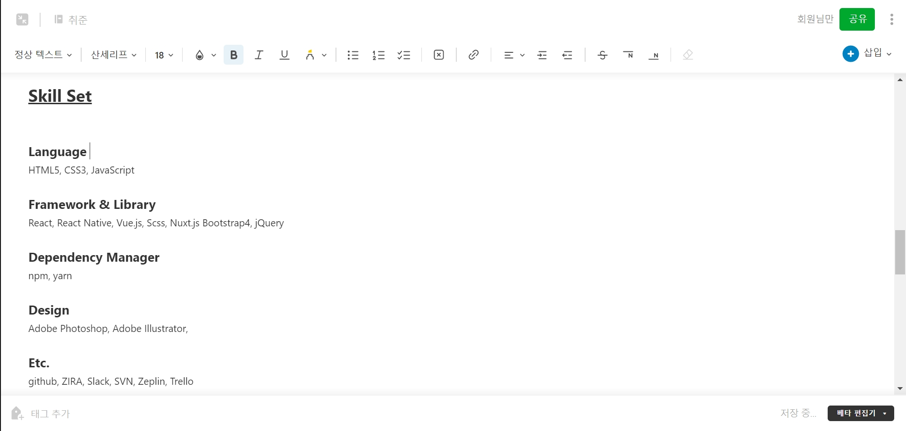
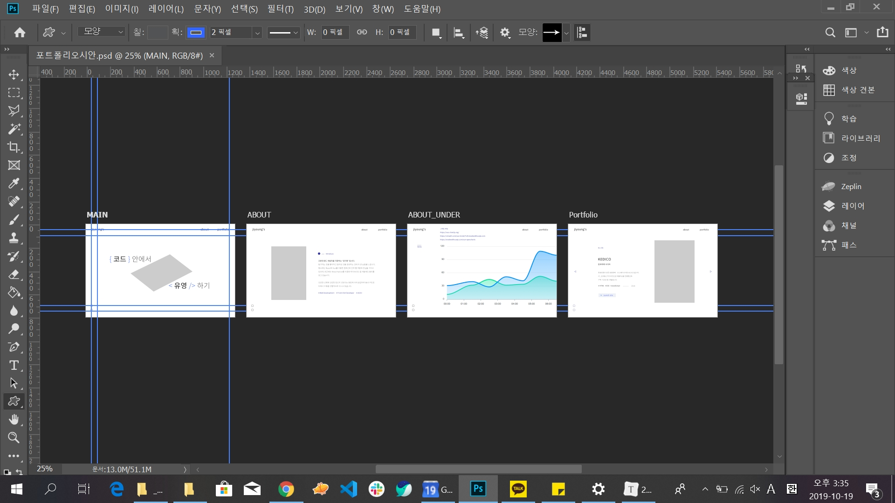
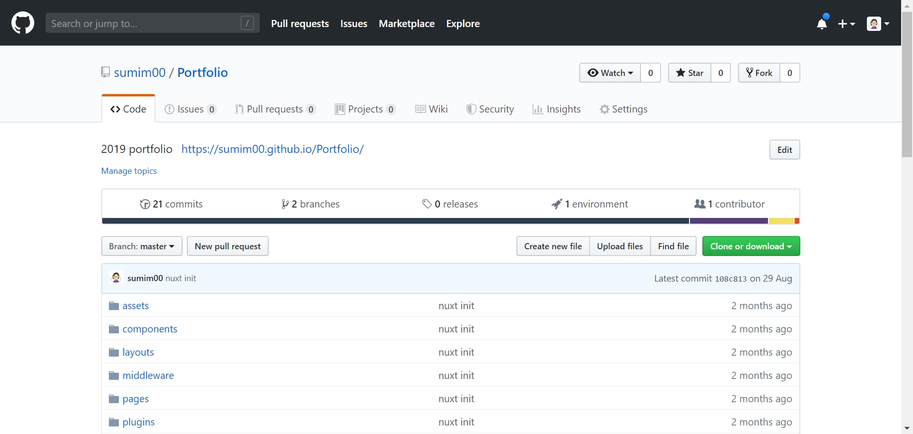
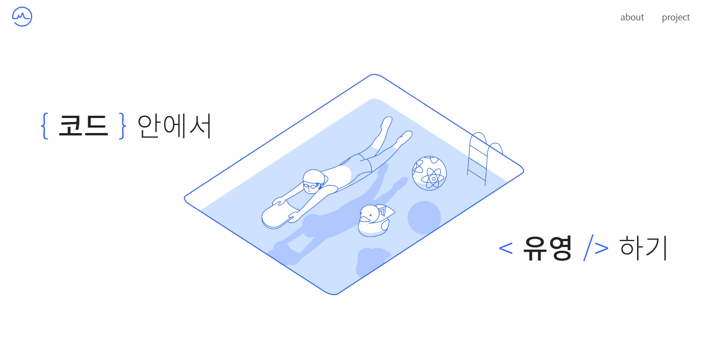

> 작업 기간 : 2달
> 사용 스택 : Adobe PhotoShop CC, Vue.js, Nuxt.js, github pages


<br/>

### 회고 및 기획

> 무엇을 담을까. 무엇을 강조할까. 무엇을 뺄까.

기획에 있어 중요하게 생각한 부분은 **'간략하되 집약적으로'** 포트폴리오를 구성하는 것이었다. 사실 포트폴리오를 만드는 것은 처음이 아니다. 작년에도 취업을 위해 BootStrap4을 이용하여 만들어 본 경험이 있다.

적어도 1년은 일 경험을 해 본 지금의 내가 봤을 때, 2018년의 포트폴리오는 한 마디로 **'아, 너무 복잡한데'** 였다. 

당시에는 내가 할 수 있는 것을 최대한으로 보여주겠다는 것이 목표였고, 그래서 사용자 경험은 생각하지 않은 채 화려한 UI에만 몰두했다. 그 결과 페이지마다 용량도 무거웠고 질적으로도 보여주는 콘텐츠가 제한적이었다.

따라서 이번에는 내가 보여주고 싶은 자세한 스택이나 설명들은 resume나 blog등으로 구별하고, 실제 포트폴리오 페이지는 일종의 사이트맵같은 기능으로 만들고자 했다. 그러나 그것이 자칫 성의없어 보이진 않게 내 정체성을 최대한으로 녹여낼 수 있도록 디자인을 하고 코드를 짰다.


<br/>

### 스토리보드 기획

기획 단계는 다음과 같다.

>  내 이력 정리  → 사용할 이력 선택 → 선택된 이력을 기준으로 스토리보드 및 플로우 구상

이력 정리만큼 번거로운 일도 없다. 자격증은 해당 기관 사이트에 일일히 들어가서 날짜를 확인하고, 프로젝트는 예전 다이어리를 한장씩 찾아봐야 하고, 또 이상하게 증명사진 파일은 찾을 때 없어서 애를 먹는다.

그러나 고생해서 정리하는 만큼 깔끔하게 정렬된 이력을 보면 참 뿌듯하다. 내 경우는 [Evernote](<https://evernote.com/intl/ko>)에 정리해놓고 필요할 때 꺼내 쓸 수 있도록 했다. `.hwp`같이 파일로 저장해놓으면 또 어디론가 사라진다.



이력 정리를 완료하면 포폴에 넣을 내용들을 선택하고 화면을 구상한다.

기획을 통해 정리한 핵심 부분은 다음과 같다.

- 원스크롤보다는 라우터를 사용하여 페이지 간 이동
- 내용 : 2~3줄 정도의 자기소개, 사용 스킬, 프로젝트
- Vue.js 로 작업

이런 개인 프로젝트를 기획하는 데도 많은 시간이 소요되었다. 왜 그 많은 프로젝트의 기획자분들이 밤늦게 회의를 하셨는지 이해할 수 있는 시간이었다. 


<br/>

### 디자인

기획을 했다면 디자인을 하자! 디자인 작업 과정은 다음과 같다.

>  아이덴티티를 보여줄 수 있는 컨셉 및 컬러 선택 → 레퍼런스 탐색 → 시안 제작 → 일러스트 및 아이콘 제작

아이콘은 svg, 일러스트는 svg로 도전했으나, 스킬 부족으로 png로 작업했다. 

오랜 고민 결과 **'코드에서 유영하기'**를 컨셉으로 잡았다. 내가 운동으로 수영을 하기도 하고 활동적으로 움직인다는 느낌이 신입 개발자의  도전적인 이미지를 보여주기에 적합하다고 판단했기 때문이다. 컬러는 바다 혹은 수영장을 연상시키는 코발트 계열 블루로 설정했다. 일러스트는 분위기가 무거워지지 않게끔 라인 일러스트로 잡았고 아이콘 또한 일관성있게 디자인했다. 

로고는 파동을 연상하는 라인으로 만들었는데, 유사한 라인이 사이트 전체에 부분적으로 분포되어 있다. 




<br/>

### 개발

포트폴리오의 하이라이트! 코드 구현 과정은 다음과 같다.

>  사용 기술 선택 → 공부 및 레퍼런스 탐색 → 작업

[Nuxt.js](<https://ko.nuxtjs.org/>)를 사용했는데 그 이유는 다음과 같다. 

- 당시 Vue.js를 공부하고 있었다.
- 러닝커브가 낮아서 바로 적용하기에 좋아보였다.
- SSR을 공부하고 싶었다.

애니메이션을 넣을까 하는 생각도 있었는데, 일정 문제도 있었고 기본에 집중하기 위해 넣지 않았다. 다만, 화면 간 이동이나 첫 로딩 등에는 부드러운 움직임이 수영이라는 컨셉에 어울린다고 생각해서 추가했다.




<br/>

### 배포

배포는 **github pages**를 사용했다. 

이미 블로그로 gh-pages를 사용하여 익숙하기도 하고, 작년에 포트폴리오를 만들어본 경험 상 서버랑 도메인을 하나 만들면 가격도 그렇고 주기적으로 갱신해줘야하는 것도 그렇고 굳이 사용할 필요는 없다고 생각했다.

레퍼런스를 참고하여 Nuxt.js를 gh-pages로 사용하는 방법을 찾아서 진행했다. `package.json`에 다음과 같이 명령어를 만들어 놓으면 `npm run deploy `  명령어 만으로 빠르게 배포할 수 있다.

```json
"deploy": "gh-pages -d dist"
```


<br/>

### 결과 및 수정



자세한 모습은 <https://sumim00.github.io/Portfolio/> 에서 확인할 수 있다.

다른 개발자 선배들이나 친구들에게 보여주면서 피드백을 받았다. 뚝뚝 끊어지는 감이 있어 `transition`을 추가하고, 모바일 사이즈 변경 시 틀어지는 UI는 수시로 고쳤다. 

서툰 감이 있지만 그래도 만족스러운 ~~내 새끼~~ 결과물이 나온 것 같다. 


<br/>

### 느낀점

포트폴리오 제작만큼 취업 준비에 있어 나를 되돌아보는 일은 없는 것 같다. 내가 여태 어떤 경험을 쌓고 어떤 역량을 갖췄는지 확인할 뿐만 아니라 전체 구상을 위해서는 내가 생각하는 내 이미지와 남들에게 듣고 싶은 이미지를 계속해서 생각해야한다. 새로운 나와 마주하는 일은 낯설기도 하지만 재미있다.

애석하게도 포트폴리오를 만들었다고 해서 취업 준비가 끝난 것은 아니다. 공고도 찾고 자기소개서와 면접 준비도 해야 하고 틈틈히 기술 공부도 해야 한다. 더 많은 것을 배우고 느끼는 시간이라고 생각하고 하나씩 준비해가야겠다.