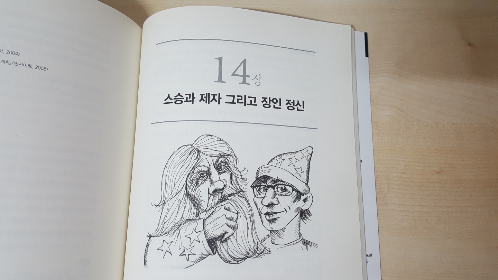

### 책 소개

> 단순 기술자에서 진정한 소프트웨어 장인이 되기까지

로버트 마틴의 Clean Code의 후속작으로 진정한 소프트웨어 장인 정신의 규율, 기법, 도구, 실천 방식을 소개한다.

 

### 문단별 요약

#### 1장. 프로의 마음가짐 

책의 핵심 키워드인 '프로'에 대한 장이다.

- 프로란 명예와 긍지의 상징이기도 하지만, 동시에 책임과 의무를 나타내기도 한다.
- 자신의 코드와 경력에 책임을 갖고 끊임없이 배워여 한다.

#### 2장. 아니라고 말하기

- 프로라면 자신의 목적 달성을 위해 자신이 할 수 있는 최선을 다 해 적극적으로 추진하고 방어한다.

- 불확실한 사실에 대해 두려움 없이 아니라고 말할 수 있어야 한다.
- 노력하겠다는 약속은 추가로 힘을 쏟는다는 뜻이며 즉 지금의 계획은 불충분하다는 의미이다. 따라서 노력하겠다는(trying) 약속은 정직하지 못한 행동이며 거짓말이다. 

#### 3장. 예라고 말하기

- 불확실한 여지를 남기지 않으며 자신의 한계를 명확하게 인지한 채로 정직한 언어를 사용해야한다.
- 예라고 대답할 때는 약속을 뜻하는 언어를 사용해서 내뱉은 말에 모호한 부분이 없도록 해야 한다.

#### 4장. 코딩

저자가 코딩에 대해 개인적으로 세운 규칙과 원칙을 설명한다. 

- 코드는 반드시 동작해야 한다.

- 코드는 고객이 제시한 문제를 반드시 풀어야 한다.

- 코드는 기존 시스템에 잘 녹아들어야 한다.

- 코드는 다른 프로그래머가 읽기 쉬워야 한다.
- 몰입에 빠지면 도취감을 느껴 더 많은 코드를 쓰려 하기 때문에 생산성이 떨어진다. 다만 훈련을 할 때는 반드시 몰입해야 한다.

#### 5장. 테스트 주도 개발

- TDD는 확신, 용기, 오류감소, 문서화, 설계를 향상시키는 원칙이다.
- TDD의 세 가지 법칙
  - 실패한 단위 테스트를 만들기 전에는 제품 코드를 만들지 않는다.
  - 컴파일이 안되거나 실패한 단위 테스트가 있으면 더 이상의 단위 테스트를 만들지 않는다.
  - 실패한 단위 테스트를 통과하는 이상의 제품 코드는 만들지 않는다.

테스트를 만들기 위해서는 먼저 좋은 설계를 고민해야만 한다. 따라서 세 가지 법칙에 따라 테스트를 만드는 일은 의존성이 낮은 좋은 설계를 만드는 힘이 된다.

#### 6장. 연습

이 장에서는 프로그래머들이 기술을 연마하는 방법을 다룬다. 

- 무술에서는 품새(격투 주인 한 사람을 가상해 일련의 잘 짜인 동작을 모은 것)를 통해 몸과 마음을 단련한다.
- 프로그래밍 또한 여러 다른 품새를 익히고 규칙적으로 연습해 기억에서 멀어지지 않도록 해야 한다.
- 볼링 게임과 같은 작은 연습문제를 반복적으로 풀면서 단축키와 코드 관용구 탐색을 익힐 수 있다. 

#### 7장. 인수테스트

- 인수테스트는 요구사항이 언제 완료되는지를 정의하기 위해 이해당사자들과 프로그래머들이 힘을 모아 작성하는 테스트이다.
- 이해당사자와 QA 전문가가 함께 일하며 인수테스트가 완료의 명세를 완전히 아울러야 한다
- 단위테스트가 코드의 구조와 행동을 설명하는 공식 디자인 문서로, 프로그래머가 프로그래머들을 위해 만든다면, 인수 테스트는 사업적 관점에서 시스템의 운영을 적은 공식 요구사항 문서이므로 사업부를 위해 사업부가 작성한다.
- 인수테스트의 목적은 소통, 명확성 및 정밀성이다. 

#### 8장. 테스트 전략

- 프로 개발팀이라면 훌륭한 테스트 전략이 필요하다. 
- 테스트 자동화 피라미드
  - 탐색 테스트 -> 시스템 테스트 -> 통합 테스트 -> 컴포넌트 테스트 -> 단위 테스트
- 'QA는 오류를 찾지 못해야 한다'는 목표를 달성하기 위해서는 개발팀과 QA가 손잡고 단위, 컴포넌트, 통합, 시스템, 탐색 테스트의 계층을 만들어야 한다.
- 테스트를 가능한 자주 실행해 최대한 많은 피드백을 얻고 시스템이 무결점 상태를 계속 유지하는지 확인해야 한다.

#### 9장. 시간 관리

- 개발자는 시간을 영리하게 사용해야 하므로 당장의 이익이나 큰 이득이 없는 회의에는 정중하게 참석을 거부한다. 회의가 지루해지면 적당한 때를 봐서 떠나는 것이 오히려 프로다운 행동이다.
- 집중에 꼭 필요한 것은 적절한 입력과 출력의 균형을 맞추는 일이다. 이러한 집중의 입출력을 관리하기 위해 포모도로 기법을 사용한다. 이는 생산적인 25분의 시간을 확보하고 모든 방해를 적극적으로 방어하는 데 효과적이다.
- 문제의 범위와 복잡도가 점점 커지면서 코드가 요구사항에서 점점 멀어지면 진흙탕에 빠지게 된다. 예상하지 못할 때 시작되는 진흙탕을 경계하고, 최대한 일찍 신속하게 벗어나야 한다.

#### 10장. 추정

- 추정은 프로 개발자가 접하는 일 중 가장 단순하면서도 가장 두려운 행위이다. 
- 사업부는 추정을 약속으로 보기 좋아한다. 개발자는 추정을 어림짐작으로 보고 싶어한다. 어마어마한 차이가 있다.
- 추정을 하는 이유는 얼마나 걸릴지 모르기 때문이며, 따라서 약속과 달리 추정이 빗나가는 일은 전혀 불명예가 아니다. 다만 불행히도 개발자들은 대부분 추정 실력이 형편없다.

#### 11장. 압박

- 소프트웨어 개발자들은 긴 야근이나 촉박한 마감일, 고객의 요구 등 많은 압박을 받는다. 
- 압박을 다루는 요령은 피할 수 있으면 피하고 피할 수 없을 때는 극복하는 것이다.

- 확신이 없는 약속을 피하라.
- 위기상황에서도 편하게 느끼는 규율을 고르고, 그 규율을 항상 따르라.
- 압박을 극복해야할 땐 서두르지 말고 주변의 도움을 받는 것이 좋다.

#### 12장. 함께 일하기

- 팀에 있어 독불장군이나 은둔자는 프로답지 못한 사람이다.

- 본인의 코드에 벽을 두르고 다른 프로그래머들이 건드리지 못하게 하기보다는 팀 전체가 모든 코드의 소유권을 가지는 편이 낫다. 
- 짝 프로그래밍은 서로 아는 것을 주고받으며 효율적이고 효과적인 코드를 만들 수 있다. 

#### 13장. 팀과 프로젝트

- 팀은 일련의 시간을 거쳐 서로 어떻게 협력하는지를 배우며 상호보완적이고 시너지를 발휘하는 한 덩어리가 된다.
- 프로 개발 조직은 이렇게 한 덩어리가 된 팀에 프로젝트를 배정하며, 프로젝트 위주로 팀을 만들지 않는다.
- 프로젝트 위주로 꾸려진 팀은 믹서기에 넣어진 잡탕과 같다. 

#### 14장. 스승과 제자 그리고 장인 정신 

- 소프트웨어 개발 업계에서도 합리적인 훈련과 감독을 받는 실습 기간이 있어야 한다.
- 소프트웨어 직업은 총 3가지 단계로 이루어져 있다. 10년 이상의 경력을 가지고 여러 다른 시스템 작업을 해 본 '장인들', 그 아래엔 5년 정도의 경령을 가지고 팀 내 일을 배운 '숙련공', 마지막으로 숙련된 프로그래머들의 밀착 지도를 받으며 기초를 형성하는 '견습생/인턴'의 단계가 그것이다.
- 장인이란 서두르지 않으면서도 일을 빠르게 처리하며 합리적인 평가를 제공하고 임무를 처리하는 사람이며, 그 장인들이 지니고 있는 가치, 규율, 기술, 자세 등이 바로 장인 정신이다. 
- 장인 정신은 단순히 학교에서 이론을 배워서가 아닌 수년간의 개인적 교육과 멘토링을 통해서 얻는다.

 

### 후기

나는 여행을 갈 때는 항상 꼼꼼하게 계획을 세우는 편이다. 시간 단위로 일정을 짜고 대안은 2개는 더 생각해놓아야 마음이 편하다. 그런데도 항상 현장에서는 예상치 못한 문제가 생긴다. 분명 10시 오픈이라고 구글에 적혀 있던 식당은 11시에 문을 열고, 잘 예약했다고 생각한 기차 편은 출력하고 보니 승차 역과 하차 역이 뒤바뀌어있다. 지금은 당황하지 않고 어떻게든 대응책을 찾아보지만, 첫 여행에서는 말 그대로 패닉이었다. 

개발자로서 살아가는 것 또한 비슷한 맥락을 거친다. 코드만 잘 짜면 되는 줄 알았더니 회의하느라 하루가 다 지나가고, 완벽한 일정을 짜 놓으면 수정 사항이 여기저기서 밀려온다. 이 책은 그런 우리들의 개발여행을 위한 안내서이다. 목적지는 개발 장인이다. 

목적지에 도달하기 위해 저자는 여러 번의 테스트 코드를 통해 코드를 늘 깔끔하게 유지할 것을 제안하며, 새벽까지 이어지는 코딩은 오히려 생산성을 떨어뜨린다고 경고한다. 심지어는 불필요한 회의는 상황을 봐서 빠지는 것이 좋다고 말한다. 

간단해 보이지만 왠지 해내기 어려운 이 지침들을 저자는 본인의 경험과 관련지으며 신빙성을 더한다. 미국 나이 18살에 처음 취업한 이야기, 가정이 있는 상태에서 회사에서 잘린 이야기 등, 천공카드 찍던 시절부터 개발자였던 인생 선배의 고백을 듣다 보면 앞서 이야기한 충고들에 진심이 얹어져 묵직한 울림을 준다.

사실 인생은 누가 알려준다고 해서 다 잘되는 것은 아니다. 그저 발 가는 대로 가기도 하고, 때로는 다치고 돌아서기도 하면서 스스로 요령을 터득해야만 한다. 따라서 나는 이 책을 안내서라고 정의했다. 안내서 그대로 경로를 정할지 아니면 일부만 취할지 그것도 아니면 주머니에 잘 넣어놓고 내 길을 갈지는 본인의 몫이다. 다만, 무엇을 선택하던 우리 모두의 개발 여정이 잘 마무리되기를 바란다.