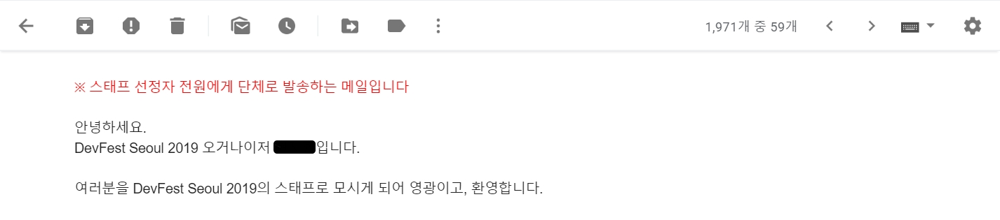
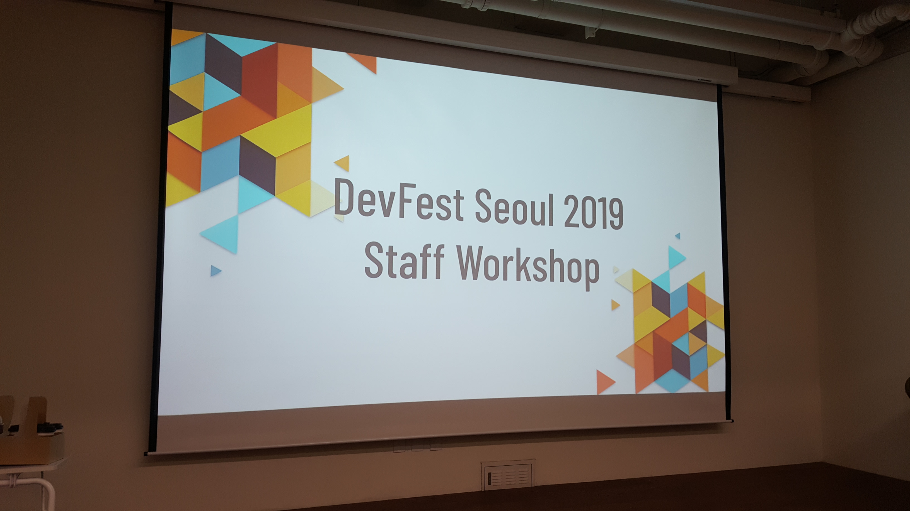
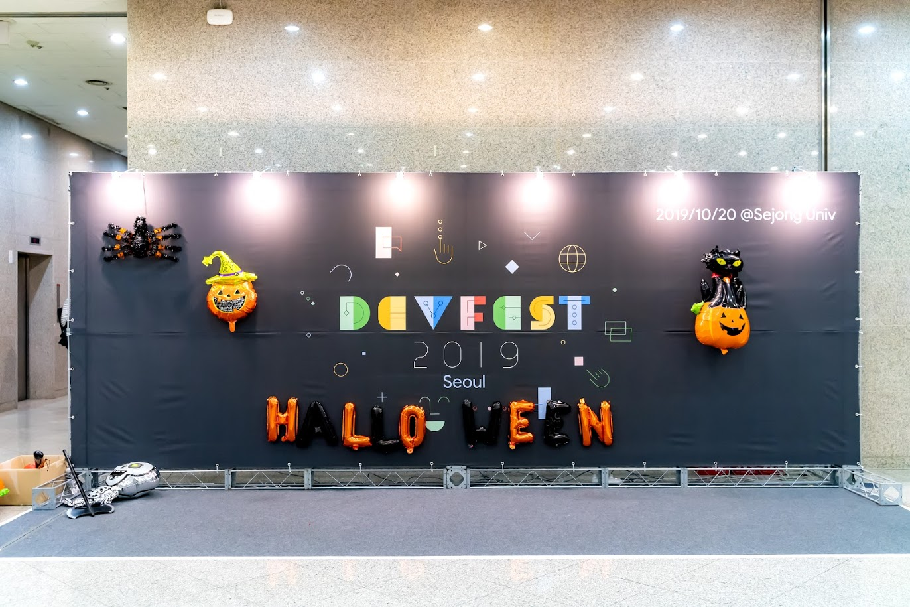
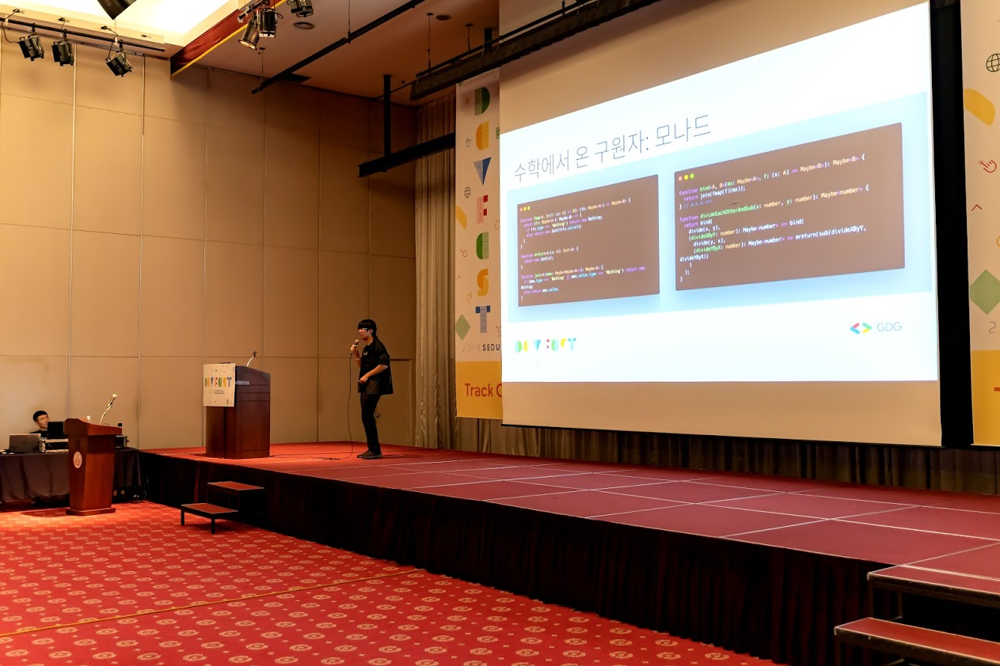
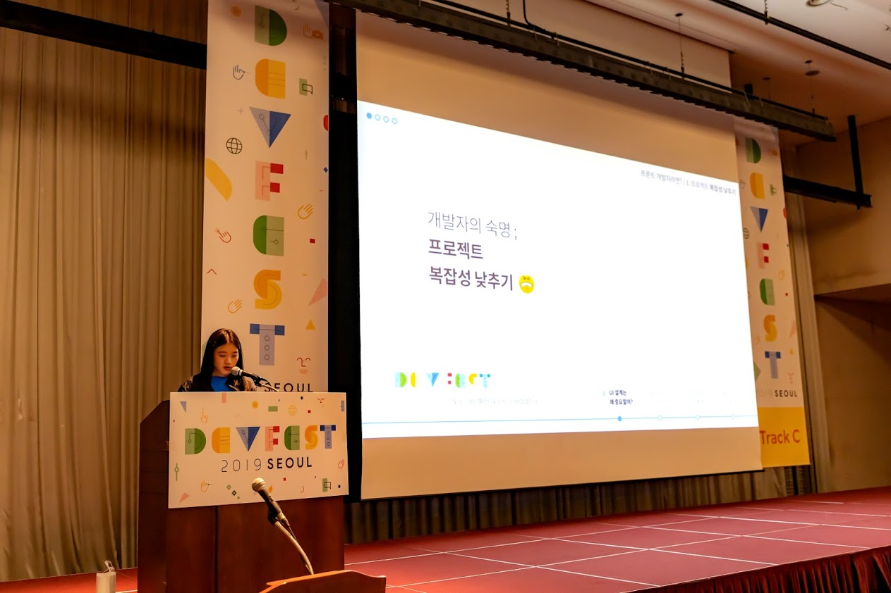
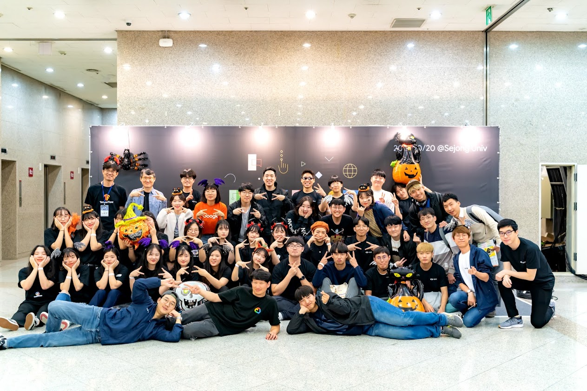

2019년 10월 20일에 진행한 GDG devfest Seoul에 스태프로 참여했다. 스태프를 신청한 계기는 1. 다양한 동종업계 사람들을 만나보고 싶었으며 2. 어차피 행사에 참여할 거 스태프로서 참여하면 더 재밌지 않을까? 하는 이유였다.

결론부터 말하자면 행사도 만족스러웠고 스태프로 활동한 것도 재미있었다. 

 

### 행사 소개 및 스태프 신청

먼저 행사에 대해 소개하자면 주최 측인 [GDG Seoul](<https://www.facebook.com/groups/gdgseoul/about/>) 은 Google에 관심 있는 사람들의 커뮤니티인 Google Developers Groups의 서울 챕터이며, Google I/O Extended, DevFest와 같은 개발 관련 행사를 매년 진행하고 있다. 원래 GDG Seoul 페이스북 그룹에 가입되어 있었는데, 마침 스태프를 뽑는다는 게시글이 올라와 신청했다.

*만세!*

 

### 스태프 워크샵

스태프로 선정된 이후에 크게 준비할 부분은 없었고 17일에 스태프 워크샵이 있어 참석했다. 간식으로 에그드롭이랑 커피를 주셨는데 마침 저녁도 못 먹고 온 터라 맛있게 먹었다. 

워크샵은 오거나이저님의 행사 소개, 파트 별 역할, 행사 당일 대응 방법 등의 미리 숙지해야 할 내용 발표가 있었고, 그 뒤 파트별로 모여 얼굴을 익히고 해야 할 내용들을 공유하는 시간을 가졌다. 워크샵에 교복 입은 분들이 계셔서 의아했는데 미림여고에서 다 같이 참가했다고 하셔서 깜짝 놀랐다. 나는 고등학생 때 뭘 했나...

 

### 행사 당일

당일 9시에 도착해서 짐을 옮기고, 옷을 갈아입었다. 마침 행사 날짜가 할로윈데이 즈음이라 인테리어나 소품들도 할로윈 분위기가 물씬 느껴졌는데, 우리도 할로윈에 맞게 간단한 분장을 했다. 

그 뒤 아점으로 서브웨이를 먹고 바로 맡은 위치로 이동했다. 나는 홀 파트 중에서 C세션을 담당했는데 입장할 때마다 표를 확인하고 음식물 반입 여부를 확인하는 일이 꽤 정신없었다. 그래도 세션 중에는 오고 가는 사람들이 적어 나도 후원사 프로그램에 참여하고 사진도 찍고 놀았다:) 

 

### 세션

우리 홀 파트는 한 사람당 세션을 최대 2개까지 들을 수 있어서 나는 서재원 님의 **프로그래밍의 미래, 함수형 프로그래밍**과 김나영 님의 **아토믹 디자인 패턴으로 디자이너와 소통하기**를 들었다.

함수형 프로그래밍은 원래 관심 있던 주제이기도 하고, 또 연사자께서 중학생이라는 이야기를 듣고 더 흥미가 생겨서 들었는데 정말...**어려웠다**. 모나드의 개념이 자주 언급되었는데 다시 한번 나의 유년시절을 되돌아보며 열심히 필기만 했다.

 

아토믹 디자인 패턴은 원래 알고 있던 개념이었지만 프론트엔드 개발과 연관 짓는다는 발상이 신기해서 들었다. 저번 동아리에서 내가 발표했던 StoryBook도 언급해주셔서 반가웠다. 컴포넌트화의 중요성은 늘 인지하고 있지만 실제 개발 단계에서 적용할 때면 늘 막막한 게 문제였는데 직접 단계별로 범위를 지정하고 폴더를 설정하는 모습을 보여주셔서 머릿속에 잘 들어왔다. 

 

### 마무리

행사는 6시에 끝났고 간단한 뒷정리 후 뒤풀이 장소로 이동했다. 행사 중에는 같은 파트이신 분들을 제외하고는 서로 대화할 시간이 없었기 때문에 대부분의 대화는 뒤풀이에서 이어졌다. 몸담고 있는 업계나 연령대도 다양했는데 이런 사람들이 함께 모여 서로 이야기를 공유한다는 점이 이 행사의 가장 큰 장점인 것 같았다. 더불어 취준생으로서 취업과 관련된 좋은 조언들도 많이 들었다.

 

### 후기

새로운 조직에 들어가는 것은 그 규모와 관계없이 늘 떨린다. 이미 모두가 다 아는 사이인 것 같고 나만 외로운 도토리가 된 기분은 언제 느껴도 낯설다. 그래도 그 불안을 조금만 이겨내면 좋은 사람들을 알게 되고 의미 있는 경험을 쌓을 수 있다. 

이번 GDG DevFest Seoul 스태프 또한 처음에는 불안했으나 결과적으로는 개발을 좋아하는 다양한 사람들을 만날 수 있었고 성공적인 행사를 위해 기여했다는 뿌듯함을 얻을 수 있었다. 스태프 또한 행사의 참여자로서 마음껏 즐겨주시길 바란다는 오거나이저님의 이야기처럼 정말 재미있게 즐긴 축제였다.
