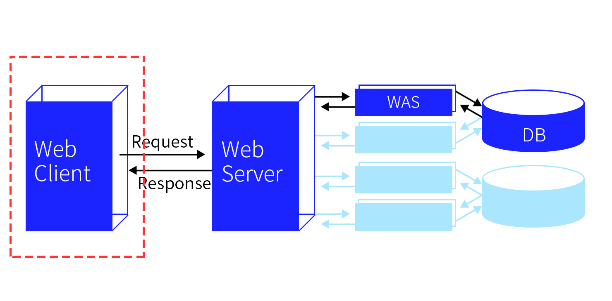
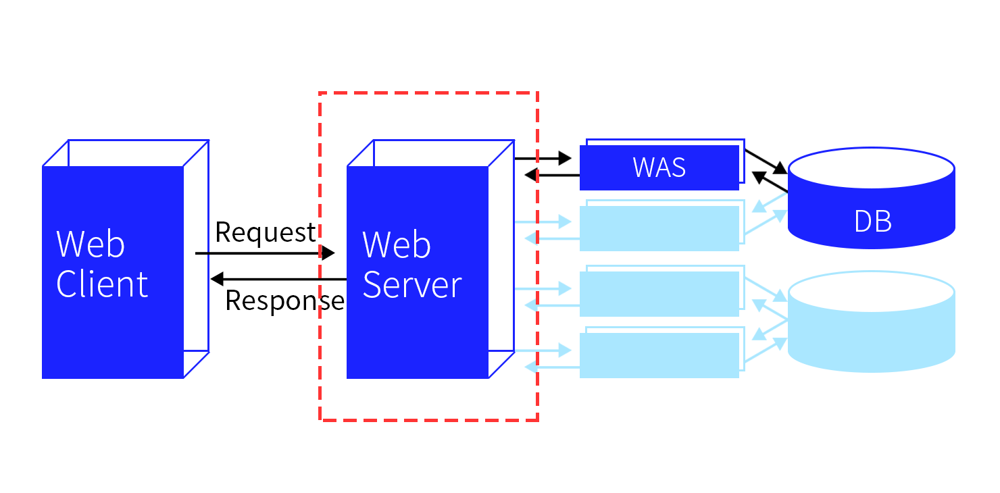
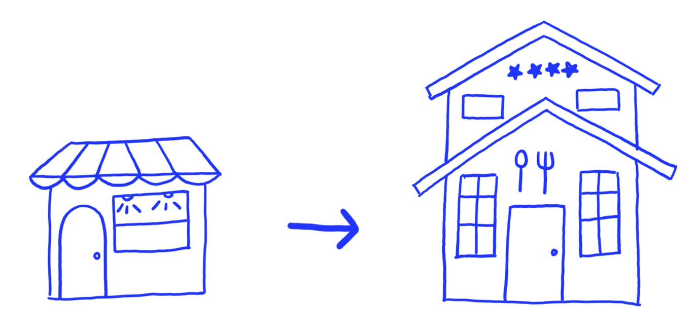
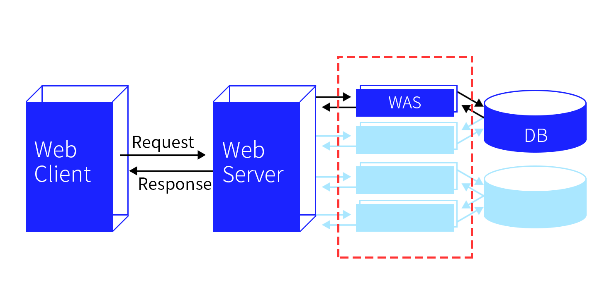
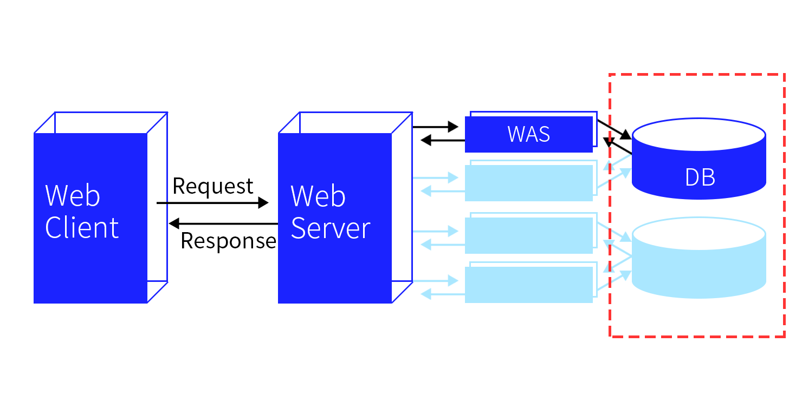

우리가 레스토랑에서 스테이크를 주문한다고 가정했을 때, 우리는 스테이크가 연금술처럼 튀어나오는 것이 아니라 일련의  과정을 거쳐 테이블 앞으로 나타난다는 사실을 알고 있다. 웹 또한 마찬가지다. 주소창에 URL을 입력하고 엔터키를 땅 누르면 페이지가 몇 초 사이에 등장하지만, 그 짧은 순간에 육안으로는 보이지 않는 여러 과정이 거쳐진다. 오늘은 그 과정, 웹의 동작 방식에 대해 알아보자.

> 이 포스팅은 작성자의 주관이 담긴 글입니다.

 

### 웹의 동작 방식

웹의 동작 방식에 대해 검색하면 다음과 같은 문장이 많이 보인다.

> "클라이언트가 서버에 요청을 보내면 서버는 해당 요청에 대해 응답한다."

또한 이를 그림으로 표현하면 다음과 같다.

위의 그림은 웹 동작방식을 한 눈에 정리한 그림이다. 지금은 개념이 낯설 수 있으나 하나씩 포스팅에서 다룰 예정이므로 걱정하지 않아도 된다. 우선 웹 클라이언트와 웹 서버에 대해서 알아보자.

여기 레스토랑에 들어온 손님이 있다. 손님은 종업원에게 스테이크를 주문하고 종업원은 요리사에게 주문서를 전달한다. 그러면 요리사는 스테이크의 레시피에 맞게 조리를 한다. 요리가 끝나면 요리사는 종업원에게 완성된 스테이크를 전달하고 종업원은 손님에게 맛있는 스테이크를 대접한다. 

여기서 종업원을 웹 클라이언트, 요리사를 웹 서버라고 본다면 위의 문장은 다음과 같이 읽을 수 있다.

**손님(사용자)의 스테이크(페이지) 주문을 확인한 종업원(클라이언트)이 요리사(서버)에게 요청(Request)을 보내면, 요리사(서버)는 해당 요청(Request)에 대해 응답(Response)한다.**

흐름이 이해가 되었다면 이제 실제 클라이언트와 서버의 정체를 알아보자.

### 웹 클라이언트 (Web Client)

웹 클라이언트는 사용자가 웹에 접근하는 프로그램을 말한다. 그런데 우리가 육안으로 보는 대부분의 웹은 웹 브라우저에서 실행되기 때문에 일반적으로 Internet Explorer, Chrome 등의 웹 브라우저를 웹 클라이언트라고 한다.

우리가 브라우저 주소창에서 `http://sumim00.github.io` 라고 입력하고 엔터키를 누르면, 클라이언트는 사용자로부터 받은 URL에 대한 정보를 찾아 HTTP 메시지 형태로 서버에게 요청(Request)한다.

 

### 웹 서버 (Web Server)

웹 서버는 웹 페이지, 사이트 또는 앱을 저장하는 프로그램을 말한다.

서버는 클라이언트에서 요청한 HTTP 메시지를 확인한 후, 이에 맞는 데이터를 처리한 뒤에 다시 클라이언트에게 응답(Response)한다. 만약 클라이언트에서 "`http://sumim00.github.io` 블로그의 메인 페이지를 보내줘!" 라고 요청을 보낸다면, 서버에서는 이 요청을 확인하고 페이지를 만드는 데 필요한 HTML, CSS, JS, Image 등을 가져와 클라이언트에게 보내주는 것이다.

대표적인 웹 서버의 종류는 아파치 웹 서버(Apache Web Server), GWS, IIS 등이 있다.

 

### WAS (Web Application Server)

이제 웹 클라이언트와 웹 서버에 대해서는 이해를 했는데 그렇다면 웹 서버 뒤에 있는 WAS는 무엇일까.

다시 레스토랑으로 돌아와서, 만약 레스토랑이 손님 1명만 상대할 수 있는 작은 규모라면 요리사 또한 1명만 있어도 충분하다. 하지만 레스토랑이 손님 100명, 1000명을 상대해야 하는 대규모 프랜차이즈라면?

손님들을 오래 기다리게 하지 않으려면 요리사 또한 여러 명이 있어야 할 것이다. 이 때 조리실 안으로 들어오는 주문을 확인하고 역할을 분배하는 메인 셰프가 웹 서버, 그 아래에서 실제로 요리를 하는 요리사들이 **WAS**라고 볼 수 있다.

앞서 설명했듯이 서버 혼자서 모든 로직을 수행하고 데이터를 관리한다면 간단하겠지만, 서버에서 모든 일을 처리하게 되면 과부하가 일어날 가능성이 크다. 따라서 서버의 일을 돕는 조력자가 생겼는데 그것이 WAS이다. 

WAS는 **웹 어플리케이션 서버**라는 이름에서 보이듯이 사용자 컴퓨터나 장치에 웹 어플리케이션을 수행해주는 미들웨어를 일컫는다. 종류로는 아파치 톰캣(Apache Tomcat), 레진(Resin), 제이런(JRun) 등이 있다.

클라이언트에게 메시지를 받으면 서버는 요청에 필요한 페이지의 로직이나 데이터베이스의 연동을 위해서 WAS에 이들의 처리를 요청한다. 그러면 WAS는 이 요청을 받아와 동적인 페이지 처리를 담당하고 DB에서 데이터 정보를 받아온다. 이렇게 WAS는 DB와 연동하여 데이터르 처리한 뒤, 생성한 파일을 다시 서버에게 반환한다.

WAS의 등장으로 웹 서버의 할 일을 분배하여 서버의 부담을 줄일 수 있고, 빠르게 동적 컨텐츠를 처리할 수 있게 되었다.

 

### DB (Data Base)

마지막으로 DB는 셰프들이 요리를 하기 위해 사용하는 냉장고와 창고 같은 보관소라고 볼 수 있다. 보관소는 요리를 만들 때 필요한 재료를 제공하기도 하고, 아니면 손님의 요청으로 다 만들어 둔 음식을 보관해야할 때도 사용한다. 

이런 다양한 상황에서 자원들을 잘 정리하여 보관하는 것이 보관소, 즉 DB의 역할이다.

데이터베이스는 데이터의 정보를 저장하는 곳이며 WAS에서 데이터를 요청하면 필요한 데이터를 응답한다.

WAS에서 로직을 수행하다가 DB접근이 필요하면 SQL질의를 통해 데이터를 요청하고, DB는 요청사항에 맞는 응답을 보낸다. 만약 사용자가 블로그에 새로 포스팅을 올려서 그 내용을 서버에 저장해두어야한다고 하면, WAS에서 DB에게 해당 내용을 저장하게끔 요청하고, DB는 그 내용을 정리하여 저장한다.

 

### 결론

지금까지 웹 동작방식에 대해 간단히 알아보았다.

사실 웹 클라이언트에서 웹 서버로 데이터를 요청하는 부분은 오늘 설명한 것보다 더 복잡한 과정을 거친다. 그리고 HTTP와 같이 언급은 되었지만 자세히 설명하지 못한 부분도 있다. 따라서 2부에서는 웹 클라이어트와 웹 서버 사이의 과정과 HTTP에 대해서 알아보고자 한다.

 

### Refer

[웹의 동작 방식 - Web 개발 학습하기 | MDN](https://developer.mozilla.org/ko/docs/Learn/Getting_started_with_the_web/%EC%9B%B9%EC%9D%98_%EB%8F%99%EC%9E%91_%EB%B0%A9%EC%8B%9D)

[웹 애플리케이션 동작 원리 :: 훈마로의 보물창고](<https://hoonmaro.tistory.com/26>)

