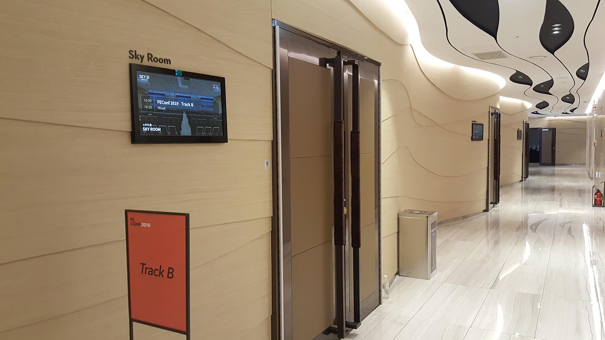
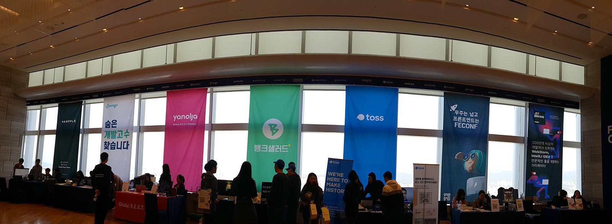
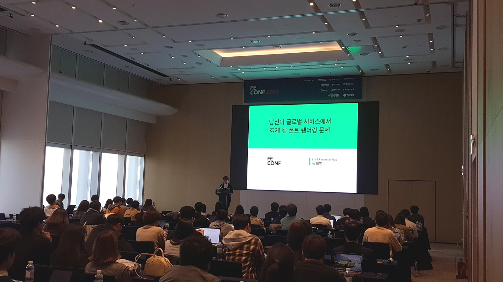
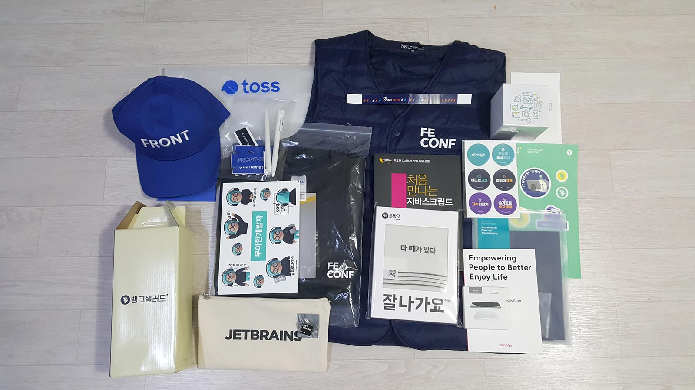

[FE Conference](<https://2019.feconf.kr/>) 는 2017년부터 시작한 프론트엔드 개발자 컨퍼런스로 프론트엔드를 개발하며 마주했던 치열한 고민과 깊은 인사이트를 공유하는 프론트엔드 개발자의 축제이다.

작년에 티케팅에 실패하여 올해는 언제 시작하나 틈틈히 엿보고 있었는데, 마침 스태프를 뽑는대서 바로 신청했다. 경쟁률이 꽤 치열했다는데 내가 된 것도 참 신기하다.

 

### 행사

사전에 별도의 스태프 미팅은 없었고, 대신 Slack을 통해 미리 숙지해야 할 내용들을 공유받았다. 

당일 행사가 10시부터였기에 스태프는 9시까지 롯데월드타워 1층에서 집결했다. 먼저 짐을 정리하고 스태프 단체복인 패딩조끼를 받은 뒤 각자 맡은 파트로 이동했다. 나는 이번에도 홀 안내를 맡게 되었는데 나름 저번에 해봤다고 감이 금방 잡혔다. 

질문도 종종 들어왔는데 홀에 화장실이 바깥에 딱 하나 있다보니 화장실 위치와 관련해서 문의가 많이 들어왔고, 또 세션 장소가 원래 이름이랑 컨퍼런스에서 지정한 이름이랑 뒤섞이다보니 그것과 관련한 문의도 들어왔었다.

 

홀은 세션 시작 전과 후에만 바쁜지라 그 이후에는 자유시간을 가졌다. 듣고 싶은 세션이 없는 경우에는 다른 홀 파트 스태프분과 함께 후원사 부스를 방문했다. 총  7개의 부스가 있었는데, 가서 설명도 듣고 굿즈도 한아름 받다보니 시간이 금방 흘렀다. 

 

### 세션

평소에도 프론트엔드 기술에 관심이 많다보니, 다른 행사보다 듣고 싶은 세션도 많았고 들으면서 이해도 금방 되었다. 아는 만큼 보인다는 주장은 정설이었다. 

스태프다보니 원하는 세션을 모두 듣지는 못했지만, 오거나이저 분들의 배려로 참여자 못지 않게 충분히 듣고 왔다고 생각한다. 

 

#### ES6+ 비동기 프로그래밍과 실전 에러 핸들링 (유인동님)

[강의노트](<https://github.com/indongyoo/FEConf2019>)

비동기 상황에서 정확하게 에러 핸들링을 하는 방법을 소개하는 세션이었다.

독특한 점은 별도의 PPT없이 연사자께서 실시간으로 코드를 짜는 강연이었다는 건데, 에러 메세지를 확인하고 이게 실무였다면 과장님께 한소리 들었다는 등의 재치 있는 애드립이 재미있었다.

###### Note

- 에러가 안나는 것이 중요한 게 아니라, 에러가 정확히 나게끔 코드를 만드는 것이 중요하다.

- 에러 핸들링을 정 확하게 사용하여 좋은 코드를 작성하기 위해서는 `promise`, `async await`, `try catch` 를 잘 이용할 수 있어야 한다.
- 순수 함수에서는 에러가 발생하도록 그냥 두는 것이 좋다.
- 에러핸들링은 부수효과를 일으킬 효과 주변에 작성하는 것이 좋다.

어설픈 에러 핸들링으로 고객에게 에러를 숨기기보다는 차라리 에러를 터트리면서 에러를 고치는 환경을 만들어야 한다는 말씀이 가장 기억에 남는다.

 

#### 3달간 GitHub 스타 3K 받은 Scene.js, Moveable 오픈소스 개발기 (최연규님)

[강의노트](<https://drive.google.com/file/d/1VFOUWWaz9NH_niu3caxJ8yTxgVVTgPMT/view>)

애니메이션 라이브러리인 `Scene.js`와 에디터 툴 라이브러리인 `Moveable` 를 개발하며 겪은 경험담을 들을 수 있었던 세션이었다. 없으면 만든다는 생각으로 실제 사이드 프로젝트를 제작하게 된 과정을 들으니 새로웠다. 

두 라이브러리는 이번에 처음 알게 되었는데, 만드시게 된 계기를 들어보니 다 내가 개발하면서 겪은 불편함이어서 신기했다. 

강연 도중 말씀하신 문서는 다른 사람에게 내 프로젝트를 자랑하고 설득하는 과정이라는 얘기가 인상깊었다. 문서화의 중요성은 늘 인지하고 있지만 막상 시간이 없거나 누가 보겠어 라는 변명 하에 방치하는 일이 많았는데, 이번 세션을 통해 다음부터는 문서를  잘 정리해야겠다고 생각했다.

 

#### 글로벌 서비스를 하게 되면 겪게 될 폰트 렌더링 문제 (곽희범님)

[강의노트](<https://drive.google.com/file/d/1abjV5imziJNg62ZE5dH5LS4VJK0f3nZf/view>)

실제 일본 서비스를 개발하고 계시는 연사자님의 경험담과 함께 실제 서비스에서 폰트가 깨지는 문제와 해결방법에 대해 알 수 있었던 세션이었다.

내가 프로젝트를 진행하며 많이 겪었던 이슈 중 하나가 폰트였기에 공감이 많이 되었다. 받은 디자인과 웹상 폰트가 다르고, 모바일과 PC에서 폰트가 다르고, 또 안드로이드와 애플의 폰트가 달라 골치 아팠던 경험은 아마 프론트엔드 개발을 했던 사람이라면 공감할 일이다. 

그런데 거기에 나라별로 폰트마저 다르다면...상상하기 싫다. 

해결방법은 아래와 같다.

- 웹폰트 사용 : 최적화만 잘 시킨다면 디바이스를 통합시킬 수 있다.
- `lang` 속성을 이용 : 언어별 폰트셋을 사용하는 속성이므로 언어별 다른 css 스타일을 적용할 수 있다.

E2E 테스트 툴인 [cypress](<https://www.cypress.io/>) 로 직접 테스트하는 모습도 보여주셨는데 마치 유저가 직접 움직이는 것처럼 테스트한다는 점이 신기했다. 

 

#### Vue.js 입문자가 실무에서 주의해야 할 5가지 특징 (장기효님)

[강의노트](<https://drive.google.com/file/d/0B3AcM_ZW0sOceDJVNHZYTHR6MlVRbWt2LXRCWVAzLTMyTHNN/view>)

Vue.js를 공부하면서 종종 보았던 5가지 특성에 대해 실제 코드를 보며 확인하고 주의할 점에 대해 알 수 있었던 세션이었다. 

연사자가 무려 프론트엔드를 독학할 때 많은 도움을 주셨던 캡틴 판교 님이셨다. 실제 인프런에서 강의를 하셔서 그런지 강연 또한 수업을 듣는 느낌이어서 필기한 것도 많았고 집중도 잘 되었다.

###### Note

- 반응성
  - 특징 : 생성하는 시점에 없었던 data는 반응하지 않는다.
  - 해결방법 : 체크박스, 라디오 등을 조작할 땐 `this.$set`을 `then` 문구 안에 추가한다.
  - Vue 3.0에서는 proxy 기반으로 진화했다.
- DOM 조작
  - 기존에 화면 조작을 위한 돔 요소 제어 방법은 주로 특정 돔을 검색하거나 이벤트를 기반으로 한 돔 요소 제어이다.
  - 해결방법 : Vue에서 제공하는 `ref` 속성을 이용한다.
  - 해결방법2 : 뷰 디렉티브에서 제공하는 정보를 최대한 활용하자.
- 인스턴스 라이프 사이클
  - 정의 : 뷰 인스턴스가 생성되고 소멸되기까지의 생애 주기
  - 주의할 점 : 뷰 템플릿 속성은 실제 dom엘리먼트가 아니라 버츄얼 돔이다.
  - 따라서 템플릿 속성이 실제로 유효한 시점은 인스턴스가 화면에 부착되고(mounted) 난 후이며 `$nexttick`은 `mounted`가 안될 경우 최종적으로 시도하는 것이 좋다.
- ref 속성
  - 정의 : 특정 DOM 엘리먼트나 하위 컴포넌트를 가리키기 위해 사용하는 속성. `v-for` 디렉티브에 사용하는 경우 array 형태로 정보를 제공한다.
  - 주의할 점 : `ref` 속성은 템플릿 코드를 render 함수로 변환하고 나서 생성한다. 따라서 접근할 수 있는 최초의 시점은 `mounted` 라이프사이클 훅이며, `v-if`디렉티브와 함께 사용하는 경우 해당 영역이 그려지기 전까지 DOM요소에 접근할 수 없으나 이를 `v-show`로 대체할 수 있다.
  - 하위 컴포넌트의 내용에 접근할 수 있지만 디버깅이 어려우므로 남용해서는 안된다. 대신 하위 컴포넌트의 라이프사이클 훅을 이용할 것.
- `computed` 속성
  - 정의 : 간결하고 직관적인 템플릿 표현식을 위해 뷰에서 제공하는 속성
  - 활용방법 1 : 조건에 따라 html 클래스를 추가, 변경할 때
  - 활용방법 2 : `vuex`의 `state`값에 접근할 때
  - 활용방법 3 : `vuei18n`과 같은 다국어 라이브러리를 활용할 때

 

### 굿즈

굿즈는 가히 상상 이상이었다. 나름 큰 백팩을 들고 왔었는데 결국 안에 다 안들어가는 바람에 손에 들고 집에 와야 했다. 동생이 보더니 월동준비 하고 왔냐고 물었다. 

 

### 후기

작년까지 티켓팅에 실패해서 참여하지 못했는데 이번에 좋은 기회가 생겨 많이 보고 듣고 올 수 있었다. 

작지만 알차다는 말이 잘 어울리는 컨퍼런스였다. 

