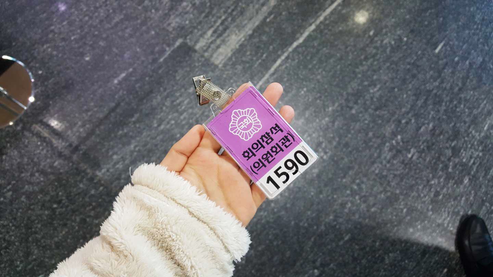
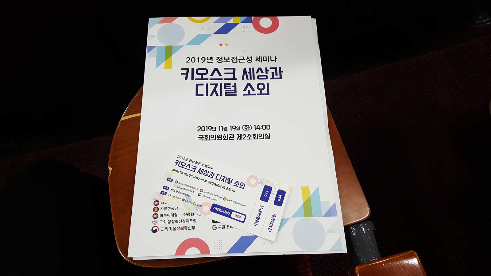
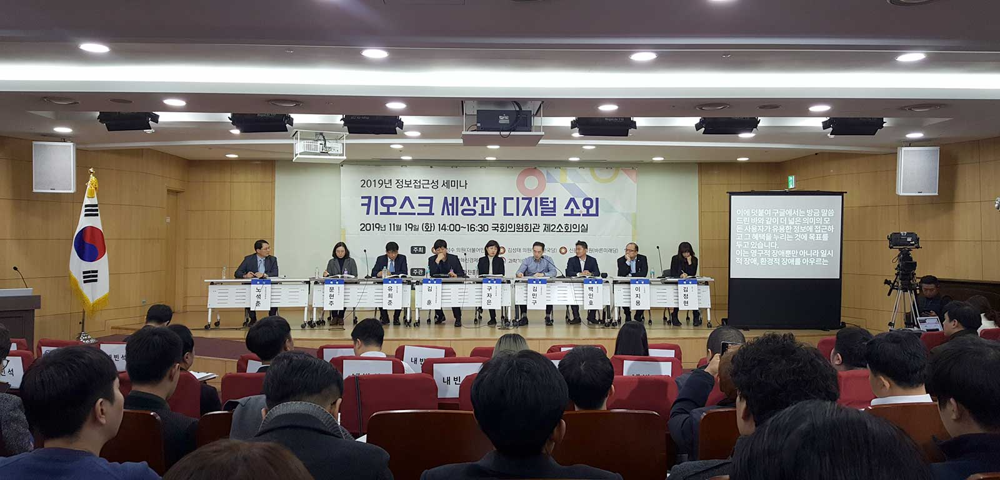
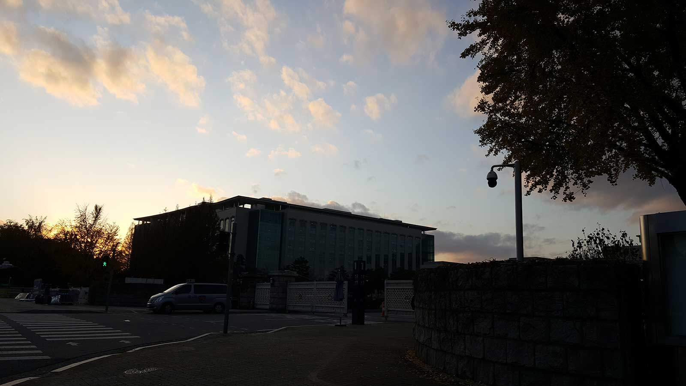

> 일시 : 2019년 11월 19일 (화) 14:00 ~ 16:30
>
> 장소 : 국회의원회관 제2소회의실

 

## 서론

한국정보화진흥원에서 주관하는 2019년 정보접근성 세미나에 다녀왔다. 주최자가 국회의원인 관계로 세미나 장소도 국회의원회관이었다. 나랏일 하는 공간은 TV에서 본 것보다는 평범했다. 

세미나는 주최자 연사, 세션별 강연, 패널 토론 순서로 이어졌다. 아래 강연 파트는 세션별 강연을 들으며 개인적으로 정리한 내용이다.

 

## 강연

### 세션1. 국내 정보접근성 현황

> 노석준 교수 (성신여자대학교)

현재 시행되고 있는 접근성 관련 법령의 운용 현황과, 앞으로의 개정 현황과 개선 방안을 알 수 있었던 세션이었다.

#### Note

##### 웹 접근성 현황 및 문제점

- 법령 개정에 대하 사회의 요구가 급증하고 있음에도 이에 대한 요구를 제때 반영하지 못하고 있음.
- 정보접근성 관련 컨트롤타워 부재 (현재는 정보접근성 관련 업무가 여러 부처에 분산되어 있음.)
- '한국형 웹 접근성 지침 2.2'개정 관련 이슈 미해결로 인한 개정 작업 지연

##### 키오스크 접근성 관련 현황 및 문제점

- 최근 무인화 경향의 급속한 확산으로 키오스크의 활용도는 급증하고 있지만, 고령층·장애인 등 정보취약계층의 정보접근성을 침해 가능성을 높이고 있음.

##### 국내 정보접근성 증진 방안

- 『장애인차별금지법』,『국가정보화 기본법』 및 시행령 등의 조속한 개정을 통한 정보접근성에 대한 법적 근거 마련 필요.
- 정보접근성 관련 부처 및 업무 총관 컨트롤타워 구축 필요. (ex. 정보접근성 업무 총관 부처 순환 제도)

 

### 세션2. 무인단말기 장애인 접근성 사례

> 문현주 초빙교수 (충북대학교)

2018년에 진행한 현장 실태조사 결과를 토대로 실제 어떤 항목에서 위반이 되었는지 점검하는 실무 중심의 세션이었다. 실무자로서 재미있게 들었던 세션이었다.

#### Note

##### 공공단말기 접근성 가이드라인

- 2016년에 제공.
- 설치 환경과 관련한 파트와 기능 및 운용성과 관련된 파트로 나뉘어져 있다.

##### 무인단말기 접근성 사례

- 교통 분야 (지하철, 공항, 철도 버스)의 무인단말기를 대상으로 2018.10 ~ 12 실시.
- 설치 환경 파트 : 빛 반사로 인한 얼비침,
- 하드웨어 파트 : 컨트롤의 위치가 기준치(1,200mm) 초과, 점자 레이블 미제공, 삽입구·배출구의 위치와 모양 미적절,
- 소프트웨어 파트 : 대체 컨텐츠 미제공, 명도대비 기준치(3:1) 미달, 모호한 지시사항, 버튼 간격 기준치 (2.5mm) 미달, 화면 간의 일관성 없음, 개인정보 노출, 오류의 원인 알림 미제공, 

##### 개선 방안

- Universal Design : 모든 사용자를 위한 디자인, 웹 접근성 가이드라인을 준수하는 디자인.
- 개인 맞춤형 UI 제공 : Universal Design에 기술적 제약이 있는 경우 사용자의 상황에 맞게 선택할 수 있도록 제공. (시각장애인 전용 모드, 디스플레이의 높이 조절 기능)
- 간접적 UI 제공 : 모바일 앱 등을 이용하여 키오스크 조작을 개인 모바일 기기에서 하도록 하는 방법.

 

### 세션3. 장애인을 위한 CD/ATM 표준 사례

> 유희준 차장 (한국은행)

은행에서 준수하고 있는 CD/ATM 표준 규격에 대해 알 수 있었던 세션이었다. 우리가 알고 있는 다양한 금융기업들이 동일한 표준 적합성 심사를 거쳐 키오스크를 제작·배치한다는 사실을 처음 알았다.

#### Note

##### 금융산업 표준화 추진체계

- 금융정보화 추진을 위하여 설립된 금융기관 민간협의체 '금융정보화추진협의회'를 발족
- 효율적이고 체계적인 전자금융거래 환경을 조성하기 위한 업무 수행

##### 표준 제·개정 연혁

- 2010년 6월부터 CD/ATM을 설치하고 제·개정 시작
- 가장 최근에는 2018년 7월에 거래처리, 사용자 인터페이스 등의 부분을 전면 수정하고 표준문서를 통합.

##### 표준 구성 및 주요 내용

- 전맹인, 저시력인 및 근접센서에 의한 음성안내 기능 제공
- 영업점당 1대 이상의 CD/ATM 설치 권고
- 부스 10개당 약 1개의 휠체어 사용자용 부스 설치

 

#### 정보접근성 패널 토론

약 10분간의 휴식 뒤 정보접근성 패널 토론이 진행되었다.

토론 주제는 첫 번째로 각 기업 관계자들이 발언하는 각 기업들의 접근성에 대한 노력 및 향후 계획이 있었고 두 번째로 전맹 장애를 갖고 계신 대표자가 발언하는 당사자가 느끼는 국내 정보접근성 현황이 있었다.

우리가 흔히 떠올리는 주제를 가지고 갑론을박을 펼치는 토론 형태는 아니었고 패널 한 사람당 5분 정도로 준비한 발언을 하는 짧은 발표에 가까웠다.

 

## 행사

원래 참여자 기념품으로 샤오미 미밴드가 있었고 세미나 마지막에 경품 추천 시간도 있었다. 그러나 세미나 도중에는 별다른 안내 사항이 없다가, 세미나가 끝나니 주최자가 국회의원이고 선거가 얼마 안 남아 청탁으로 보일 수 있다며 기념품은 물론이고 경품 추첨도 제외했다. 

이런 경우는 처음이라 당황스러웠다. 

 

## 결론

중심 주제가 키오스크였기에 웹 접근성처럼 실질적인 도움이 되는 세미나는 아닐 것이라 예상했다. 하지만 세미나가 끝난 뒤 내가 좁은 의미의 접근성만 생각했음을 깨달았다. 

어떤 서비스든 접근성을 지키는 이유는 동일하다. 바로 정보의 습득의 **equity**, 형평성을 지키는 것이다. 키오스크나 웹, 모바일 모두 세부적으로 차이가 있을 뿐 이 동일한 목적에서 시작되었다. 그러므로 단순 실무 기술의 습득보다 오히려 다양한 서비스의 접근성 현황을 살펴보는 행동이 장기적으로 또 실질적으로 접근성을 고민하는 데 도움이 될 수 있다고 생각했다.

내가 일로써 대면하는 접근성을 넘어 다양한 정보 전달 시스템에서 모든 사용자가 동일하게 정보를 취할 수 있는 방법을 고민해볼 수 있던 세미나였다.

