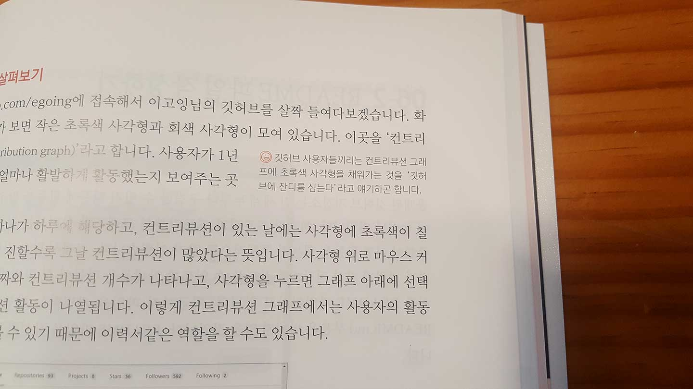

> 본 리뷰는 해당 출판사 서평 이벤트의 서평단으로 책을 받은 후 작성하였습니다.

 

모르는 것을 아는 체하며 넘어갈 때가 있다. 다른 사람들은 왠지 다 아는 것 같고 나만 모르는 것 같은 기묘한 기분을 느낄 때, 당당하게 무지를 밝히기보다는 가만히 고개를 끄덕이고 만다.

 `Git`과 `GitHub`는 나에게 그런 존재다. 쓰고 있는 건 맞지만 정확히는 모르는 상태. 그 소심한 무지를 해결하기 위해 깃허브 입문 책 서평을 신청하게 되었고, 운 좋게 책을 받아볼 수 있었다.

 

#### 책 소개

[『지옥에서 온 문서 관리자 깃 & 깃허브 입문』](<http://www.easyspub.co.kr/20_Menu/BookView/337/PUB>)은 우리에게 생활코딩으로 익숙하신 '이고잉'님의 영상을 토대로 MicroSoft MVP이신 '고경희'님이 재구성하신 책이다. 155개의 생활코딩 깃 관련 영상 중 52개 영상만을 추려 정리한 책이기 때문에 책 두께도 얇고 챕터도 6장이 전부이다.

6장의 챕터 중 3장은 깃, 3장은 깃허브로  구성되어 있으며, 깃 파트에서는 깃이 만들어진 배경과 버전 관리의 원리, 커밋과 브랜치 등을 다루고 있다. 깃 파트에서 정확한 기본 다지기에 중점을 두었다면 깃허브 파트에는 깃허브로 협업하는 방법, 깃허브로 개인 블로그 만들기 등 깃을 이용한 활용 방법에 초점을 두고 있다.

 

#### 소감

먼저 내 깃, 깃허브 사용 실태에 대해 설명하자면 주로 혼자, 작은 프로젝트에서 쓰다 보니 사용하는 방식이 한정적이다. 나름 `GitHub Pages`로 블로그도 만들며 `Git`을 얼추 쓴다고 생각하지만 실상 사용하는 깃 명령어는 `add`, `commit`, `push` 가 대부분이다.

그런 상태인 나는 약 이틀에 걸쳐 이 책을 완독했다. 하루면 끝날 줄 알았는데 생각보다 내가 모르는 기능들이 많다는 것을 느꼈다. 특히 SSH로 깃허브에 원격 접속하는 방법이나 `vim`을 이용하여 `bash`에서 바로 파일을 작업하는 방법 등은 일부러 찾아볼 만큼 궁금한 내용은 아니었으나, 이번 기회에 새롭게 배우게 되어 의외의 재미를 주었다.

가장 열심히 읽었던 부분은 맨 마지막 챕터인 **'Visual Studio Code로 깃 사용하기'** 였다. 마침 VSCode로 깃을 시작한 지 얼마 안 된 상태라 구글을 찾아보며 사용하고 있었는데, 이 책이 많은 도움이 되었다.

 

#### 평가

마지막으로 책에 대해 전반적으로 평가하자면 **'정말 구체적'**이다. `commit` , `branch`와 같은 기본적인 사용방법부터 컨트리뷰션을 잔디라고 부른다는 등의 깨알 같은 팁까지. 꼭 필요한 지식부터 누군가에게 묻기에는 조금 애매했던 궁금증까지 책에서는 말풍선까지 붙여가며 꼼꼼하게 답변하고 있다. 

그러나 내용이 과하지 않다. 약 270페이지를 가진 이 책은 앞장의 커리큘럼에서도 나와 있듯이 이미 깃&깃허브를 사용해본 사람이라면 하루, 처음 사용해본다면 5일이면 책을 마칠 수 있다. 그만큼 꼭 필요한 내용들을 미사여구 없이 실전 위주로 빠르게 풀어나간다는 점이 이 책만의 장점으로 볼 수 있다. 실제로 나 또한 이틀에 걸쳐 책을 완독했으므로 시간이 없는 학생/직장인 또한 충분히 이 책을 통해 빠르게 깃&깃허브를 마스터할 수 있을 것이다.

 

따라서 아래와 같은 사람들에게 이 책을 추천한다.

1. 깃&깃허브를 한 번도 써보지 못한 사람
2. 깃&깃허브를 어쩔 수 없이 쓰고 있으나 잘 모르는 사람
3. 깃허브를 이용하여 다양한 커뮤니케이션을 하고 싶은 사람
4. VSCode를 주로 사용하며 효율적인 깃 활용방법을 고민하는 사람

이번에 좋은 책을 접하게 되어 깃과 깃허브에 대한 궁금증을 많이 해소할 수 있었다. 책을 읽게 될 사람들 또한 이 책을 통해 다른 사람들 앞에서 깃과 깃허브를 잘 알고 있다고 당당히 얘기할 수 있게 되길 바란다.

