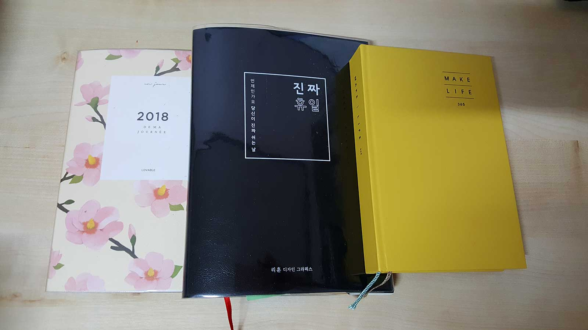
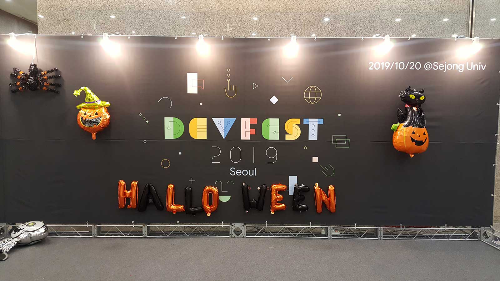
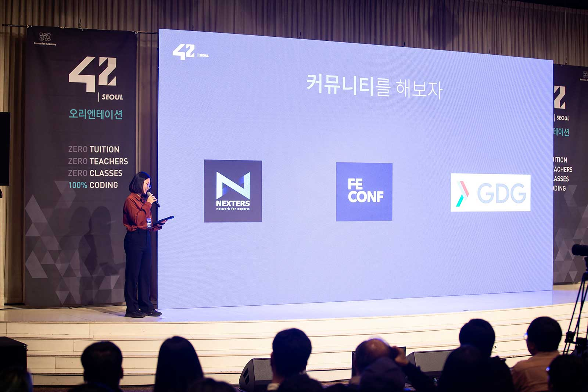
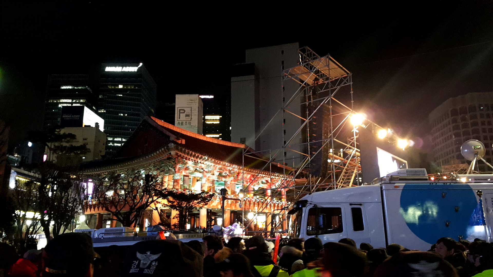

이 나이면 새해를 맞는 일도 싱거울 것이라 생각했지만, 막상 12월 31일이 되어보니 새롭고 특별해집니다. 아마도 연말과 연초는 늘 겪었지만 지금의 나이를 마무리하는 일은 처음이라 그런가 봅니다. 매년 일기용으로 다이어리를 쓰고 있는데, 스타일이 전부 제각각이라 비교하는 재미가 있습니다. 가령 예전의 다이어리는 꽃분홍색 표지에 알록달록한 일러스트가 가득해서 굳이 제가 채우지 않아도 풍성했다면, 올해의 다이어리는 표지부터 검은색에 깔끔 그 자체라 제가 그림을 그리거나 색칠할 공간이 많았습니다. 둘 다 다른 스타일이지만 각자의 매력이 있었죠. 

> 취향이라는게 이렇게 금방 바뀌나봅니다.

 

매 해 마주하는 제 모습도 다이어리와 비슷해보입니다. 모든 게 처음이라 서툴기만 했던, 그래서 더 많은 추억이 떠오르는 20살도 있었고, 첫 연애에 달콤해 했던 21살도 있었고, 어느덧 사회생활에 요령을 갖게 된 25살도 있었습니다. 이제는 2019년도 그 추억 중 하나가 되겠죠.

올 한 해는 도전하는 해였습니다. 과감한 결단과 무모한 도전이 다행히도 좋은 결과를 가져와 준 해였죠. 첫 번째 시도는 퇴사였습니다. 웹 퍼블리셔로 일하며 진정한 적성에 대해 고민하는 시간이 많았고, 더 도전해보기 위해 내린 결론이었습니다. 다닌 것을 후회하진 않습니다. 인생에서 처음으로 가진 직장이었고, 모든 사용자를 위한 UI를 제작하는 일에 보람도 느꼈습니다. 다행스럽게도 좋은 동료들을 만나 크고 작은 사회경험도 할 수 있었고요. 다만 회사에서 저는 제일 어렸고, 평소에도 궁금증이 많았고, 스스로 더 탐험하고 싶다는 의지가 컸기 때문에 안정된 곳에서 벗어나게 되었습니다. 시간이 좀 흐른 지금, 저는 잘한 선택이라고 생각합니다.

> 미지의 것을 알기 위해서는 지금은 알지 못하는 일을 접할 필요가 있다. 지금 알지 못하는 일을 알지 못한다는 이유로 거절하면 알게 될 기회를 잃게 되고, 알게 됨으로써 변화할 수 있는 기회 또한 잃고 만다.
>
> 
>
> 『철학은 어떻게 삶의 무기가 되는가』, 야마구치 슈, 2019

 

그러고는 개발자가 되기 위한 워밍업을 시작했습니다. 정보처리기사도 취득하고, **NEXTERS**라는 IT 연합 동아리에 들어가 생전 처음 보는 `React Native`로 앱을 만들어보기도 했습니다. 그리고 개발 지식뿐만 아니라 개발 생태계 또한 궁금해져서 **FEConf**와 **GDGDevFest Seoul**의 스태프로도 참여하며 개발을 사랑하는 많은 사람들을 만날 수 있었습니다. 또 스태프가 아니더라도 **World IT Show**, **널리 세미나** 등 다른 IT 행사도 꾸준히 참여했고요. 이렇게 보니 뭔가 많아 보이지만 사실 제가 개발을 공부한 시간은 생각보다 짧습니다.

> 마치 축제 같았던 행사였습니다.

 

실제 개발 공부로는 주로 `React`, `Vue.js`를 배웠습니다. 하고 싶었던 직업이 웹 프론트엔드 개발자였기에 `JavaScript`를 기반으로 여러 가지를 접해보자는 생각에서였습니다. 그래서 `Vue.js`로 포트폴리오도 만들고 코딩 테스트도 준비했지만, 취업의 문턱은 생각보다 밟기 힘들더군요. 사실 어느 정도 감내하던 결과였으나, 막상 불합격 문자를 받으니 마음이 약해지는 건 어쩔 수 없었습니다. 약 2달간의 취업 준비 끝에 저는 한 가지를 깨닫게 되었습니다. 지금 제게 필요한 것은 탄탄한 기본기라는 사실을 말이죠.

그러다 **42SEOUL**을 알게 되었습니다. 페이스북에 뜬 누군가의 댓글 한 줄에 검색을 했고, 제가 찾던 기본기를 다질 수 있는 곳이라는 생각이 들어 1차 교육생에 지원하게 되었습니다. 오리엔테이션 발표도 했습니다. 호기롭게 발표 신청을 했으나 정작 학부생 때도 PPT만 만들었지 발표는 한 번도 안 해봤기에 걱정이 많이 되었습니다. 그래서 스크립트도 만들고 스톱워치로 연습도 매일 하며 떨리지 않게 노력했습니다. 노력 덕분인지 아침에 사 둔 우황청심원도 안 먹고 발표를 잘 마칠 수 있었습니다. PPT 잘 만들었다는 칭찬도 받고요. 항상 뒤에서 서포트하는 게 익숙했던 제겐 잊지 못할 스포트라이트였습니다.

> 발표자는 위대하다는 사실을 다시금 깨달았습니다.

 

1월부터는 **C언어 공부**를 시작할 계획입니다. 42SEOUL의 프로젝트 기본 언어가 C언어이기 때문에 미리 예습하고 가야 떨리지 않을 것 같거든요. 또 건강도 챙기며 1월 20일부터 시작하는 라피신을 무사히 마무리하고 그 다음 달 본 교육까지 들어가는 것이 지금의 제 목표입니다. 주어진 기회를 놓치기엔 정말 하고 싶은 일이 되었거든요. 

> 2018년 12월 31일에 찍은 제야의 종, 벌써 1년이나 지났습니다.

 

며칠 전 구매한 2020년 다이어리는 샛노란 표지에 하루에 한 페이지씩 쓸 수 있는 넉넉한 만년 노트입니다. 매년 새로워지는 다이어리 만큼이나 내년은 또 얼마나 놀라운 순간들이 새겨질까요. 또 그 순간에 누구와 어디에서 함께하고 있을까요. 바쁘다는 핑계로 일기를 쓰지 않으면 그날의 이야기는 빈 종이로 남게 됩니다. 갑자기 생각나 열어보면 텅 비어있는 페이지에 아쉬움이 남던 때가 종종 있었습니다. 부디 내년에 생길 소중한 시간들을 빈 종이처럼 의미 없이 비워보내지 않도록 정신을 바짝 차리고 살아야겠습니다. 제게는 이제 하고 싶은 목표가 생겼고 시간을 소중히 여길 이유가 생겼으니까요. 평범했지만 제게는 특별했던 올 한 해를 지금 읽고 있는 책의 내용으로 요약하며 2019년의 마지막 글을 마치겠습니다.

> 평범하지만, 시시하지 않습니다.
>
> 우리의 하루는, 우리 인생은.
>
> 
>
> 『평소의 발견』, 유병욱, 2019

