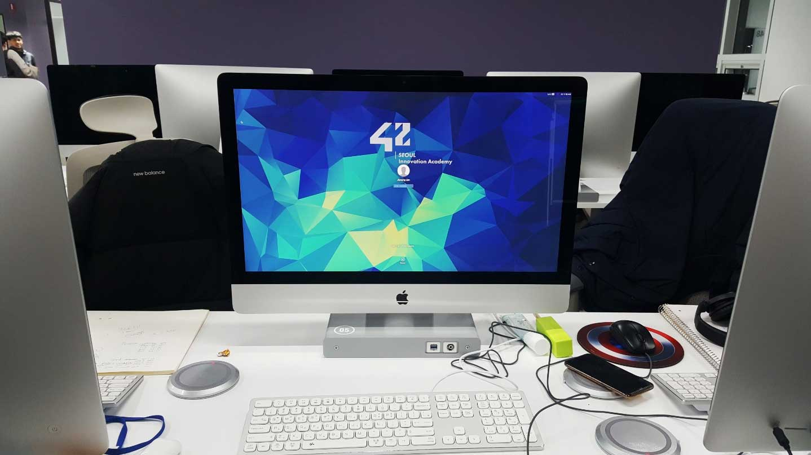

## 서론

[42SEOUL](<https://42seoul.kr/>)은 프랑스의 SW 교육 프로그램 Ecole42의 서울 캠퍼스입니다. 본론에 들어가기 앞서 TMI를 설명하자면, 공통적으로 들어가는 **42** 라는 숫자는 영화이자 책인 **은하수를 여행하는 히치하이커를 위한 안내서** 에서 찾아볼 수 있습니다. :rocket:

*이미지 출처 : [The Answer to Life is 42, but what is the Question to Life?](<https://medium.com/yesphx-stories/the-answer-to-life-is-42-but-what-is-the-question-to-life-76d495c133eb>)*

영화에서는 범우주적이고 궁극적인 질문에 대해 답을 하기 위해 만들어진 슈퍼 컴퓨터가 나오는데, 모든 것들의 존재 의미를 물어보자 750만 년의 시간 끝에 컴퓨터는 '42'라고 대답합니다. 그 컴퓨터의 대답에서 영감을 얻어 이 프로그램의 상징과도 같은 42가 만들어졌다고 합니다. 영화는 음...궁금하시다면 한 번쯤 보셔도 괜찮습니다.

수영장이나 바다에 가 본 경험이 있으신가요? 모든 준비운동을 마치고 들어간다 하더라도 예상치 못한 상황은 늘 생기기 마련이지요. 하물며 준비도 못 한 상태에서 갑자기 물살에 떠밀린다면 여러분들은 어떻게 행동하시겠어요?

 

## La Piscine이란

La Piscine은 위와 비슷한 상황에 놓인 사람들이 한 달 동안 물속에서 적응하는 방법을 배우는 기간입니다. 프랑스어로 **수영장**을 의미하는 **La Piscine**은 42SEOUL 본 교육생으로 가기 위한 한 달짜리 프로그램입니다. 피시너(Pisciner)라고 불리는 라 피신 교육생들은 첫 날부터 어리둥절하게 교육장에 들어가, 주변 눈치를 보며 컴퓨터를 만지고, 카더라와 팩트가 뒤섞인 공간에서 완벽한 패닉 상태에 놓입니다. 제가 그랬거든요.

*프로 윈도우러는 리눅스 환경부터 멘붕...*

주로 월요일부터 목요일까지는 개인 프로젝트를 나갑니다. 1,2일차엔 리눅스 명령어, 3일차부터는 C언어를 나가는데 둘 다 사전에 개념만 잡고 가도 피신에서 큰 혼란에 빠지는 일은 없을 겁니다. 참고로 점수를 얻으려면 주변 피시너 2명의 평가를 받아야만 하는데, 이 평가 또한 42시스템의 큰 특징 중 하나입니다. 이외의 내용은 겪어보시면 자연스레 알게 되실 겁니다.

금요일에는 시험을 칩니다. 평소에는 4시간 정도인데 마지막 Final Exam에서는 무려 8시간 시험을 칩니다. 시험 첫날 멘탈이 아주 많이 나갈 수 있습니다. 그래도 첫날 시험 점수는 전혀 문제가 안되니 멘탈 잘 잡고 마지막까지 최선을 다해주세요.

그리고 토, 일에는 Rush라고 불리는 팀 프로젝트를 진행합니다. 랜덤으로 2~4인이 한 팀을 이루고 이틀에 걸쳐 프로젝트를 제출하면 그다음 주에 1시간 정도 평가를 받고 점수를 얻습니다. 평가자는 상위 기수 교육생이라고 하는데 1기의 경우 상위 기수가 없어 외부멘토님들과 보칼님들이 평가해주셨습니다. 점수는 팀 중 가장 프로젝트 이해도가 낮은 팀원의 점수로 들어갑니다.

4주차에 페어 프로젝트 BSQ가 있는데 이건 Rush와는 달리 주변 피시너들의 평가를 받고 점수를 얻습니다. 문제의 난도는 높지 않으나 예외 처리할 부분이 많아 통과자가 거의 없는 프로젝트입니다.

그렇게 4주차까지 마치고, 며칠 뒤에 합불여부가 메일로 옵니다!

 

## My La Piscine

일단 제 소개를 먼저 하자면, 웹 퍼블리싱, 프론트엔드 개발 경험이 전부인 비전공자입니다. 프로젝트 난이도는 개인 역량에 따라 천차만별이지만 제 기준에서 딱 보통이었고, 실제 점수 또한 평균이었습니다. 26일 동안의 세세한 기록은 이미 다이어리에 적어놨기에, 여기에는 La Piscine이 끝나고 느꼈던 점 몇 가지만 적어보려고 합니다.

##### 4無 시스템

처음 들어갈 때, 교수도 수업도 학비도 없는 '3無'시스템에 대한 걱정이 많았습니다. 그도 그럴 것이 교실에서, 선생님의 수업을 들으며 문제를 풀었던 우리들에겐 상상할 수 없는 방식이었으니까요. 참고로 1기 La Piscine은 설날이 겹쳐서 설날도 없는 **4無** 시스템이었습니다. 네 설날에도 코딩했어요.

결론부터 얘기하자면 한 달 동안 겪어본 '3無'시스템은 만족스러웠습니다. 일정한 시간에 진행하는 수업이 아니기에 24시간 열려 있는 공간에 원할 때 있다가 가면 되고, 역량에 따라 프로젝트를 진행하면 되기 때문에 진도를 따라가기 어렵거나, 너무 쉬울 걱정도 없었습니다. 자칫 너무 프리한 거 아니야? 라는 생각이 들 수 있지만 매주 금요일 시험이 있고 주말에 팀 프로젝트가 있기 때문에 만족할만한 결과를 위해서는 자발적으로 부지런히 달려야 했습니다. 누군가의 강요 없이 이렇게 재미있게 공부할 수 있다는 걸 오랜만에 느껴본 것 같습니다.

다만 앞서 얘기했듯이 우리나라에서는 흔치 않은 교육방식이다보니 낯설어하시는 분들도 계셨지만, 평소 혼자 이것저것 탐구하는걸 좋아하는 제겐 적합한 시스템이었습니다.

##### 함께 성장하는 법

경쟁 시스템과 상대평가에 익숙해진 저에게 42의 협업 시스템은 새로웠습니다. 슬랙에는 사람들이 계속해서 알고 있는 정보와 꿀팁을 공유하고, 내 일도 아닌데 새벽까지 누군가를 가르쳐주는 모습이 이 공간에서는 자연스러웠습니다. 저 또한 모르는 문제는 혼자 싸매는 것보다 함께 고민하면 더 빨리 해결할 수 있으며, 내가 아는 것을 남에게 설명할 수 있을 때 비로소 내 지식이 된다는 사실을 알게 되었습니다. 더 신기한 점은 이러한 협업 방식이 제가 여태 겪은 경쟁 시스템보다 더 효율적이었다는 것입니다. 또 26일 동안 버틸 수 있었던 원동력이 되기도 했고요. 누군가와 함께 했을 때 생기는 시너지를 이 정도로 체감한 건 42SEOUL이 처음이었다고 생각합니다.

*평가 중 받았던 고백...:heart:*

##### 내 스탯 확인하기

게임처럼 내 스탯을 바로 확인할 수 있다면 얼마나 좋을까요. 더불어 어떤 역량을 기르면 원하는 목표에 도달할 수 있는지도요. 애석하게도 현실에 그런 스탯창은 존재하지 않으니 계속해서 나를 회고하는 일이 중요한가 봅니다. 그런 맥락에서 La Piscine을 통해 보다 제 자신에 대해 많이 알게 되었습니다. 자아성찰이라고 하기엔 부족하지만 내가 어떤 상황에서 좌절을 느끼며, 어떤 방식으로 이를 회복하고, 종합적으로 얼마나 열정을 갖고 꿈을 위해 나아갈 수 있는지를 확인할 수 있었습니다. 

또한 제가 이 정도로 열정을 가진 사람이라는 걸 처음 알았습니다. 평균 20시간이 넘어가시는 위대한 분들께는 비빌 수 없지만 그래도 본투비 올빼미인 제가 자발적으로 더 일찍 일어난 것은 처음이었거든요. 주 7일 평균 13-14시간 동안 공부한 것도 처음이었고, 약국에서 피로회복 앰플을 매일 사서 마셔본 것도 처음이었어요. 고3 때보다 더 공부했다고 생각하면 말 다 했죠. 

##### 코딩이 재밌어요 선생님...

신기한 건 그렇게 지난한 과정이었음에도 정말 재밌었다는 겁니다. 코드가 계속 안 풀리면 스트레스 받다가도 옆에 같이 머리를 싸매고 있는 동료와 수다를 떨고 나면 다시 도전할 힘이 나고, 팀 프로젝트에서 좋은 점수를 못 받아도 졌지만 잘 싸웠다며 서로 위로하는 과정에서 단순히 혼자 문제를 풀고 올라가는 것보다 더 배우는 속도가 빨랐고, 느끼는 경험치 또한 컸습니다. 아마 42에서 피어 평가 시스템, 협업 프로젝트 등을 도입하며 원했던 모습이 이런 게 아니었을까 생각했습니다. 

##### 다양한 기준

42SEOUL의 교육 방식은 게임처럼 프로젝트에서 Success를 받으면 경험치가 올라가고 일정 경험치가 쌓이면 레벨이 올라가게는 시스템입니다. 레벨이 차근차근 올라가는 모습을 보며 내가 이만큼 컸구나 하는 뿌듯함을 느낄 수 있습니다. 하지만 개인적으로 생각하는 42SEOUL의 숨겨진 차별점은 개인을 평가할 수 있는 요소가 레벨뿐만 아니라 로그 시간, 평가 피드백, 협업 능력, 인기투표(?) 등 다양하게 존재하는 점입니다. 즉 단순히 레벨만 높이는 것이 합격의 지표가 되진 않는다는 겁니다.

저 또한 합격 메일을 받고도 어떤 기준으로 합격했는지 몰라 어리둥절했습니다. 다만 평가 기준이 다양한 만큼 시험에 fail했다고 탈락하는 것도 아니고, 혼자 개인 프로젝트 모든 단계를 마스터한다고 해도 합격하는 것이 아니라는 것이 이 시스템의 특징이자, 개인의 다양한 역량을 평가할 수 있는 방법 같아 저는 긍정적으로 느꼈습니다.

 

## 작은 조언

##### Don't Panic! 

이게 뭔가 싶은 멘탈 터지는 순간이 종종 옵니다. 시기는 개인 프로젝트, 팀플, 시험 기타 등등... 집 가면서 울고 싶어질 때도 있고요. 이때 자신을 탓할 것이 아니라 라피신이 자신을 시험하는 것이라 생각하시길 바랍니다. 그리고 아주 침착하게 본인만의 방법으로 멘탈을 추스르고 다음을 준비하세요. 위기의 상황에서 어떻게 대처하는지가 라피신의 독특한 평가 요소이며 스스로 성장케 합니다.

##### 너 내 동료가 되라

인싸가 세상을 지배하지는 않지만...그래도 이곳에서 좋은 인간관계는 높은 가치를 지닙니다. 절대 혼자서 헤쳐나갈 수 없는 피신에서 든든한 동료가 되기도 하며, 매일을 견딜 수 있게 하는 힘이 되기도 합니다. 그러니 새로운 사람을 사귀는 일을 긍정적으로 생각해주시기 바랍니다. 처음엔 조용히 옆자리 피시너에게 모르는 문제나 궁금한 점을 여쭤보며 시작해보세요. 친구 사귀는 과정에 별거 있나요. 마이쮸 하나와 먼저 거는 말 한마디면 충분합니다.

##### 아주 조금의 예습

다른 건 다 모르고 가셔도 무방하지만, 내가 살면서 코딩을 한 번도 안 해봤고 C언어, 리눅스 명령어를 전혀 모른다면 약 1~2주 만이라도 미리 개념을 숙지하고 오시는 것을 추천합니다. 코딩 자체가 처음이라 초반에 많이 힘들어하던 분들이 계셨고 저 또한 만약 c언어를 모르고 갔다면 정말 많이 헤맸을 거라 생각하기 때문입니다.

참고로 저는 Psi 님의 [씹어먹는 C언어](<https://modoocode.com/231>)로 2주간 공부했습니다. 이 자리를 빌려 Psi님께 감사를 전합니다. 덕분이에요.

##### 근손실 나면 안되니까

건강이 우선입니다. 평균 13-14시간 정도 있으면서 온몸이 점점 피곤해지는 걸 느꼈고, 마지막 일주일 정도는 피로회복 앰플을 달고 살았네요ㅠ 미친 듯한 일정이 기다리고 있기 때문에 꼭 사전에 체력을 기르고 오시는 걸 추천합니다. 

그리고 개포에는 숨은 맛집이 많습니다. 가성비 좋은 스파게티 스토리도 있고, 밑반찬이 푸짐한 미도한우도 있고요. 시장이 바로 앞이라 떡볶이나 길거리 음식을 사 와서 1층 자료실이나 무중력지대에서 먹는 것도 좋습니다. 나가기 귀찮다면 배달음식도 있고요. 결론은 아무리 하던 게 잘 안돼도 삼시 세끼는 꼭 챙겨드세요!

*미도한우 육회비빔밥은 사랑입니다.:plate_with_cutlery:*

##### 즐겨요 이 순간

마지막으로 즐기시면 됩니다. 슬랙에 재밌는 채널도 많이 생길 거고(저는 노동요 공유방을 제일 좋아했습니다.), 새로운 사람들과 코딩 전우애(?)를 쌓는 재미도 생기실 거고, 하나씩 프로젝트를 성공하며 레벨이 올라가는 성취감도 느끼실 겁니다. 또한 이상한 사람이 있으면 주저 말고 보칼님들께 다이렉트 메세지를 보내시면 빠르게 조치해주실 겁니다. 이곳 42SEOUL, 그것도 La Piscine에서만 겪을 수 있는 새로운 경험들을 마음껏 누리다 가시길 바랍니다.

 

## 결론

어디까지가 조언이고, 어디까지가 스포일지 몰라 제 나름 도움이 될 법한 내용들을 몇 자 적어봤습니다. 이상 이 글을 읽으신 예비 피시너분들께서 즐거운 수영장 생활을 보내시길 바라며, 공식 홈페이지의 소개 글을 마지막으로 글을 마치겠습니다.

> 42 SEOUL은 단순 지식을 가르치는 곳이 아닙니다. 소프트웨어에 대한 경험을 나누는 방법, 멋진 동료와
> 협업하는 방법, 누군가를 위해 본인의 경험을 공유하는 방법을 배웁니다. 그리고 배우는 방법을 배웁니다.

